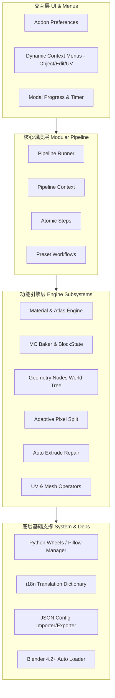
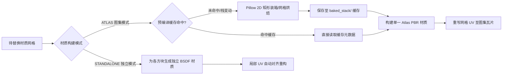
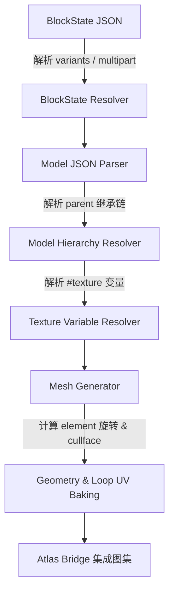
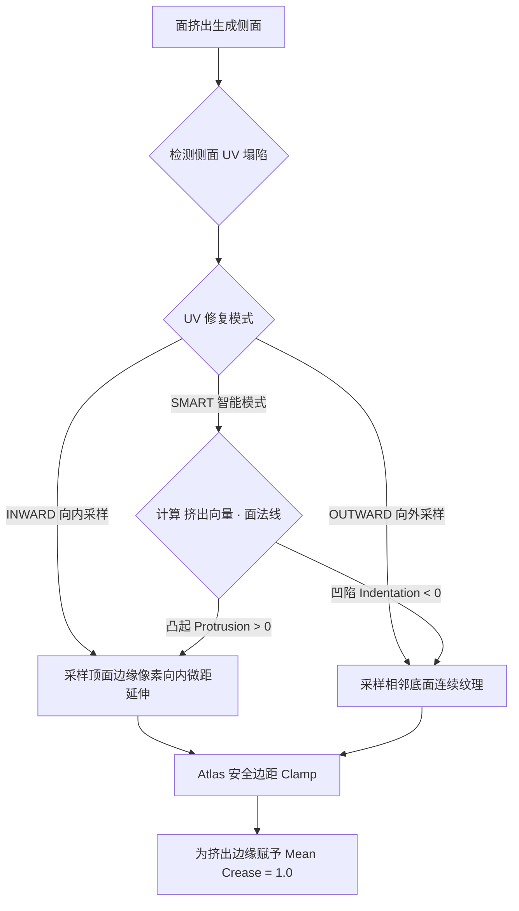
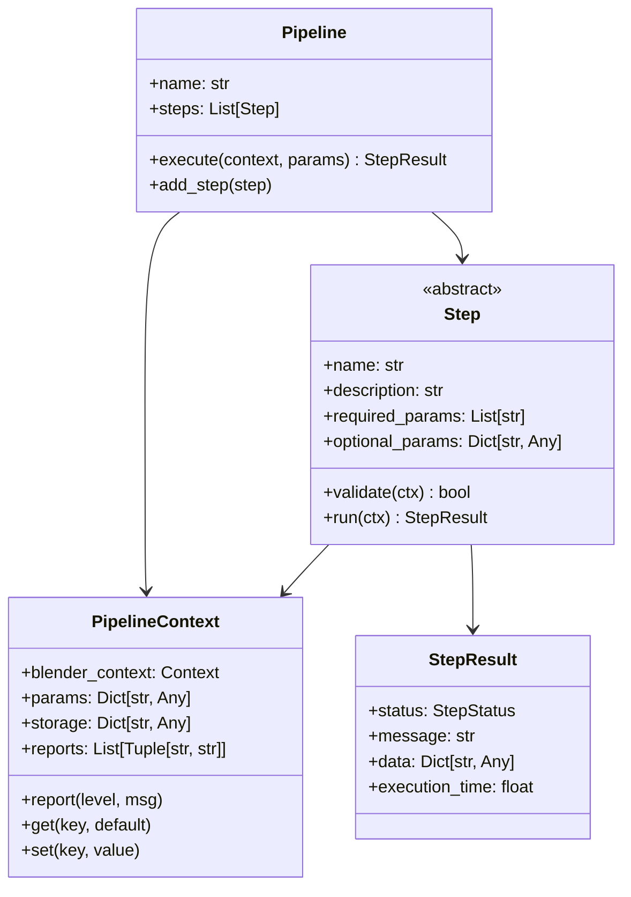

# MoziToolKit 功能全景设计与防回归技术规范文档
> **版本**：v1.0.0 & Future Releases  
> **适用范围**：MoziToolKit 全量功能体系（**注：实时同步 Live Sync 模块已按约定独立，本文档涵盖除实时同步外的全部核心业务与架构**）  
> **核心目标**：统一全项目各模块的设计理念、架构契约、算法原理、边界约束与防回归规范，杜绝后续迭代将既定设计特征（Design Features）误判为 Bug 或在重构中破坏底层数学/拓扑不变量。

---

## 目录 (Table of Contents)
1. [架构总览与防回归设计哲学](#1-架构总览与防回归设计哲学)
2. [模块一：Minecraft 材质解析、匹配与替换管线](#2-模块一minecraft-材质解析匹配与替换管线)
   - 2.1 资源包分层栈与解包缓存 (Resource Pack Stack & Cache)
     - 2.1.1 三层物理优先级栈体系 (Three-Tier Priority Stack)
     - 2.1.2 通道级细粒度独立级联回退 (Per-Channel Cascading Fallback)
     - 2.1.3 伴生贴图识别与防误判契约 (Companion Suffix Indexing Contract)
     - 2.1.4 物理输入形态与双重缓存架构 (Extraction & Bake Cache)
     - 2.1.5 原版资源路径覆盖语义与缺失资源规则 (Vanilla-Style Resolution Contract)
     - 2.1.6 缓存身份、完整性与原子发布 (Cache Validity & Atomic Publication)
   - 2.2 多导入器自适应匹配引擎 (Importer Adapters)
   - 2.3 双材质构建体系 (Atlas Mode vs Standalone Mode)
     - 2.3.1 图集预编译与视口替换生命周期解耦 (Decoupled Precompilation)
     - 2.3.2 图集零透明占位与融合装箱契约 (Zero-Placeholder Packing Contract)
     - 2.3.3 独立模式：全栈融合单方块资产库 (Standalone Mode: Stack-Synthesized Asset Library)
     - 2.3.4 双模式核心特性与选型对照
   - 2.4 图集数学模型与着色器防溢色 (Atlas UV Tiling & Anti-Bleed Math)
   - 2.5 生物群系高精度染色系统 (Biome Palettes & Colormap Tinting)
   - 2.6 逐帧动态动画材质驱动 (Animated Textures & MCMETA Driver)
   - 2.7 材质管线防回归不变量契约
     - 2.7.1 材质堆栈验收矩阵 (Required Acceptance Matrix)
3. [模块二：Minecraft 方块模型烘焙引擎 (MC Baker)](#3-模块二minecraft-方块模型烘焙引擎-mc-baker)
   - 3.1 Blockstate 变体与 Multipart 条件组合解析
   - 3.2 Block Model JSON 继承树、变量替换与几何生成
   - 3.3 剔除面 (Cullface)、UV 旋转与染色索引映射
   - 3.4 Baker 到 Atlas 图集桥接机制
   - 3.5 MC Baker 防回归不变量契约
4. [模块三：原生网格实时同步构建体系 (Direct Mesh Generation)](#4-模块三原生网格实时同步构建体系-direct-mesh-generation)
   - 4.1 Direct Mesh 架构与 16x16x16 Section 局部网格容器
   - 4.2 6向邻域遮挡剔除 (Neighbor Culling) 与拓扑焊接 (Weld Topology)
   - 4.3 毫秒级增量更新 (Incremental Delta Updates & Event Pump)
   - 4.4 Multi-Chunk 图集材质插槽分配与原生 UVMap 烘焙
   - 4.5 Direct Mesh 同步防回归不变量契约
5. [模块四：自适应像素网格切分系统 (Adaptive Pixel Split)](#5-模块四自适应像素网格切分系统-adaptive-pixel-split)
   - 5.1 1面 = 1像素的几何分辨率自适应计算
   - 5.2 动画贴图单帧正方形与 Atlas 瓦片边界推断
   - 5.3 骨骼权重 (Vertex Groups) 与网格属性双线性插值保真
   - 5.4 拓扑缝合 (Weld) 与法线平滑重构
   - 5.5 像素网格切分防回归不变量契约
6. [模块五：智能挤出与 UV 修复系统 (Auto Extrude Repair & Modeling)](#6-模块五智能挤出与-uv-修复系统-auto-extrude-repair--modeling)
   - 6.1 侧面 UV 塌陷成因与 UV 几何映射数学
   - 6.2 三种 UV 修复模式 (Smart / Inward / Outward) 的语义与边界
   - 6.3 Atlas 图集相邻面防跨界安全 Clamp 机制
   - 6.4 边缘折痕权重 (Mean Crease) 保护
   - 6.5 随机挤出 (Random Extrude) 噪声算法与工作流串联
   - 6.6 挤出修复防回归不变量契约
7. [模块六：网格与 UV 实用工具集](#7-模块六网格与-uv-实用工具集)
   - 7.1 清除自定义分割法线 (Clear Custom Normals)
   - 7.2 锐边与硬边选择 (Select Hard & Sharp Edges)
   - 7.3 UV 原地独立缩放 (Scale UV Individual - 边缘抗渗色)
   - 7.4 修复流体 UV (Repair Fluid UV)
   - 7.5 基于贴图 Alpha 通道智能选面 (Select Transparent Faces)
   - 7.6 纹理插值模式一键切换 (Texture Interpolation: Closest / Linear)
   - 7.7 网格/UV 工具防回归不变量契约
8. [模块七：模块化流水线系统 (Modular Step Pipeline)](#8-模块七模块化流水线系统-modular-step-pipeline)
   - 8.1 Step ↔ Context ↔ Pipeline 契约模型
   - 8.2 结构化执行结果 (StepResult) 与多级诊断日志
   - 8.3 非阻塞 Modal 交互与进度报告系统
   - 8.4 预设流水线编排 (Presets)
   - 8.5 流水线架构防回归不变量契约
9. [模块八：偏好设置、右键上下文菜单、扩展生态与工程规范](#9-模块八偏好设置右键上下文菜单扩展生态与工程规范)
   - 9.1 右键上下文菜单动态注册与自由重排体系
   - 9.2 偏好配置 JSON 序列化与跨环境导入导出
   - 9.3 Blender 4.2+ 扩展规范与 Python Wheels 隔离管理
   - 9.4 完整多语言国际化 (i18n) 字典体系
   - 9.5 自动化构建 (Build) 与 CI 测试套件
10. [附录：核心设计决策与常见误判特征对照表 (FAQ / Anti-Regression Table)](#10-附录核心设计决策与常见误判特征对照表-faq--anti-regression-table)

---

## 1. 架构总览与防回归设计哲学

MoziToolKit 是一套专为 **Minecraft 资产转换、Voxel 风格高保真建模、贴图烘焙与自动化流水线** 设计的 Blender 生产力工具集。



### 核心防回归原则 (Non-negotiable Invariants)
1. **数学确定性优于盲目插值**：Minecraft 的像素艺术美学建立在清晰的像素网格、最近邻插值（Nearest Neighbor）和严格的 UV 边界上。任何几何细分或 UV 变换都必须具有像素级别的数学确定性。
2. **图集安全边界（Atlas Boundary Safety）**：Atlas 图集必须时刻防范跨瓦片溢色（Tile Bleeding）与浮点漂移。着色器和几何脚本中对 UV 的变换必须严格遵循安全边距（Padding / Clamp）。
3. **外部模型容错性（External Model Tolerance）**：来自各类导出工具（jmc2obj、Mineways、Ice-Cube、Blockbench 等）的模型往往携带损坏的 Split Normals、畸变的 UV、冗余材质名称。工具集必须在清洗脏数据的同时，保留原模型的拓扑与 UV 意图。
4. **解耦与流水线化（Decoupled Pipeline）**：所有原子操作必须能作为独立的 Blender Operator 运行，也能在无 UI 的 `Pipeline` 环境中被批量编排调用。

---

## 2. 模块一：Minecraft 材质解析、匹配与替换管线

### 2.1 资源包分层栈与解包缓存 (Resource Pack Stack & Cache)

#### 2.1.1 三层物理优先级栈体系 (Three-Tier Priority Stack)
MoziToolKit 遵循 Minecraft 原生资源包堆叠思想并进行了工程化升维，采用 **三层分级栈（Three-Tier Hierarchy）** 架构管理资产来源，自顶向下（Top to Bottom）严格排序：
1. **顶层：用户材质包（`RESOURCE_PACK` - Top Layer，优先级最高）**：
   - 包含各类定制资源包、局部修改包（如矿石发光、3D 武器模型包、局部风格化材质包）或全量高精度材质包（如 Faithful 32x、Patrix 128x）。
   - 用户可以在偏好设置中自由叠加多个材质包并上下调整相对优先级。
2. **中层：Mod 归档与拓展包（`MOD_JAR` - Middle Layer）**：
   - 包含各类模组（如 Create、Botania、Twilight Forest 等）的 `.jar` 归档。提供自定义命名空间（如 `create:`）的独立方块、物品贴图与模型定义。
3. **底层：原版客户端核心（`VANILLA` - Bottom Layer，基底回退锚点）**：
   - Minecraft 官方客户端原版 JAR 包（如 `1.21.jar` / `26.2-Fabric.jar`）。
   - 作为整个渲染系统的 **绝对基底锚点（Fallback Anchor）**，提供全量标准方块/物品的基础漫反射贴图（Albedo）、默认 Model JSON 继承树与 Blockstate 变体定义。

> **与 Minecraft 原版的关系**：Minecraft 原版本质上只有一条“有序资源提供者列表”，并不认识本项目的三种包类型。`RESOURCE_PACK → MOD_JAR → VANILLA` 是 MoziToolKit 为保证用户包、模组资源和原版基底稳定共存而定义的**排序策略**，不是另一套覆盖语义。无论资源来自哪一种类型，解析时都必须遵循同一条自顶向下的资源路径查找规则；同层内允许用户调整顺序，跨层排序由系统保护，不得由解析器根据包类型改变单个资源的优先级。

```mermaid
graph TD
    subgraph PackStack [资源包优先级栈 (Top to Bottom)]
        RP1[Layer 0: 顶层发光矿石覆盖包 - 仅含 _n / _s]
        RP2[Layer 1: 中层全量 PBR 材质包 - 含高清 Albedo & 部分 _n / _s]
        MOD[Layer 2: 模组拓展 JAR - 提供 create: 等自定义命名空间]
        VANILLA[Layer 3: 底层原版客户端 JAR - 全量 Base Albedo & Models]
    end

    subgraph PerChannelResolver [通道级细粒度独立解析引擎 (Per-Channel Resolver)]
        direction TB
        AlbRes[Albedo 通道独立自顶向下穿透]
        NormRes[Normal _n 通道独立自顶向下穿透]
        SpecRes[Specular _s 通道独立自顶向下穿透]
        MetaRes[MCMETA 动画元数据通道独立穿透]
    end

    subgraph CompositeResult [预编译合成材质条目 (Composite Map)]
        CompDiamond[diamond_ore: 顶层发光 _s + 中层高清 Albedo & _n]
        CompStone[stone: 中层高清 Albedo + 中层 _n + 中层 _s]
        CompBedrock[bedrock: 底层原版 Albedo + 默认平坦法线/无发光高光]
    end

    RP1 --> PerChannelResolver
    RP2 --> PerChannelResolver
    MOD --> PerChannelResolver
    VANILLA --> PerChannelResolver

    PerChannelResolver --> CompositeResult
```

#### 2.1.2 通道级细粒度独立级联回退 (Per-Channel Cascading Fallback)
与传统将整套方块视为单一单元进行粗暴覆盖的方案不同，MoziToolKit 在 [`pack_stack.py`](file:///Users/jaxlocke/Desktop/MoziToolKit/utils/materials/pack_stack.py) 中实现了 **通道级细粒度独立穿透机制（Granular Per-Channel Composition）**：
- **四大独立解析通道**：
  1. **`albedo`**：基础漫反射色彩贴图（如 `stone.png`、`diamond_ore.png`）。
  2. **`normal`**：法线贴图（匹配 `_n.png` 或大写 `_N.png` 后缀）。
  3. **`specular`**：LabPBR 1.3 镜面/粗糙度/金属性/发光贴图（匹配 `_s.png` 或大写 `_S.png` 后缀）。
  4. **`mcmeta`**：通道文件各自可携带的逐帧动态动画与插值配置（`.png.mcmeta`）。
- **级联命中算法（First-Hit Resolution）**：
  对于任意纹理标识 `(namespace, texture_key)`，解析器自顶向下遍历材质栈，各通道分别取自 **物理提供该通道文件的最顶层资源包**：
  - 若最顶层发光包只提供了 `diamond_ore_s.png`，解析器直接捕获其 `specular` 通道；
  - 接着继续向下层穿透，若第二层 PBR 材质包提供了 `diamond_ore.png` 与 `diamond_ore_n.png`，则分别捕获其 `albedo` 与 `normal`；
  - 若某个方块（如 `bedrock`）在上层所有资源包中均无定制贴图，则 `albedo` 穿透命中底层的原版 JAR，而 `normal` 与 `specular` 标记为 `None`，并在着色器中安全回退为默认平坦法线 `(128, 128, 255)` 与标准粗糙度，**绝对不会在对应位置创建空白材质或黑色空洞**。

- **动画元数据权威规则（Animation Authority）**：
  - 当 Albedo 存在时，**Albedo 的 `.png.mcmeta` 是该材质动画帧序列、帧时长与插值的唯一权威来源**；Normal、Specular、Overlay 的图像必须对齐到此时间轴。
  - 伴生通道的 `.mcmeta` 可以被索引与保留，供对齐/诊断使用，但不得单独驱动与 Albedo 不同的 shader 时间轴。
  - 若 Albedo 没有动画元数据，则材质按静态处理；仅存在动画 PBR 伴生图、但不存在动画 Albedo 的情况不得创建独立动画调度器。

#### 2.1.3 伴生贴图识别与防误判契约 (Companion Suffix Indexing Contract)
在 [`resource_pack.py`](file:///Users/jaxlocke/Desktop/MoziToolKit/utils/materials/resource_pack.py) 的 `ZipResourcePack._build_index()` 中：
- 文件名后缀分类器严格区分材质角色：无论文件名为小写（`_n` / `_s`）还是部分第三方材质包的大写命名（`_N` / `_S`），均被剔除后缀后归纳为对应基底方块的伴生通道（`normal` / `specular`）。
- **防掩盖保障（Non-Masking Invariant）**：伴生贴图**严禁作为独立的 Albedo 实体建立索引**。若一个发光材质包中仅有 `assets/minecraft/textures/block/diamond_ore_N.png`，系统绝不会将其识别为一个名为 `diamond_ore_n` 的缺失漫反射方块，而是将其正确绑定至 `minecraft:block/diamond_ore` 的法线通道，确保漫反射通道能够顺利穿透到下层资源。

#### 2.1.4 物理输入形态与双重缓存架构 (Extraction & Bake Cache)
- **输入形态支持**：
  1. `.zip` 压缩包（标准 Minecraft 材质包）。
  2. `.jar` 归档（Minecraft 客户端核心文件 / Forge / Fabric / NeoForge 模组）。
  3. 本地解压目录（方便材质包创作者实时调试开发）。
- **解包与缓存生命周期**：
  - **临时解压缓存（OS Temp）**：ZIP/JAR 归档解压至系统临时目录（`bpy.app.tempdir/MoziToolKit/extracted/<pack_hash>/`），内置 Zip-Slip 路径穿越防御与 Zip-Bomb 压缩比安全检测，由 `pack.mcmeta` 或文件内容哈希校验，避免重复解压。
  - **持久化烘焙缓存（Persistent Cache）**：材质栈预编译产出的图集贴图与 `atlas_mapping.json` 存储于持久化数据目录（`DATAFILES/MoziToolKit/cache/baked_stack/<stack_hash>/`）。当材质栈结构或顺序未变动时，场景替换可直接复用该缓存。

#### 2.1.5 原版资源路径覆盖语义与缺失资源规则 (Vanilla-Style Resolution Contract)
**唯一的覆盖单位是完整资源路径，而不是“一个方块的一整套贴图”。** 对同一命名空间中的下列路径，必须分别执行从栈顶到栈底的 First-Hit 查找：

```text
assets/<namespace>/textures/block/diamond_ore.png    -> Albedo
assets/<namespace>/textures/block/diamond_ore_n.png  -> Normal
assets/<namespace>/textures/block/diamond_ore_s.png  -> Specular / LabPBR
```

这正是 Minecraft 原版资源覆盖的模型：上层只有在**实际提供同一资源路径的文件**时才覆盖下层；缺少该文件等价于“不覆盖”，而不是透明、删除或创建占位资源。PBR 只是将这一原则扩展到额外的伴生资源路径。

- **资源路径与大小写**：命名空间和常规资源路径遵循 Minecraft 的小写规范。仅 PBR 伴生后缀 `_n/_N`、`_s/_S` 按大小写不敏感识别；实现不得把其它大小写差异悄然当作同一资源，除非另有明确的兼容性规则与测试。
- **Albedo 是可渲染条目的前提**：只要任何层提供了 Albedo，才创建该纹理的 Atlas tile 或 Standalone material；Normal/Specular 可独立来自更高或更低层。
- **全栈均无 Albedo**：如果某路径仅存在 `_n`、`_s` 或其 `.mcmeta`，但所有层都不存在对应 Albedo，必须完全跳过该条目：不创建图集 tile、不创建独立材质、不创建透明/黑色占位图。
- **PBR 缺失不是图像缺失**：若已解析 Albedo 而 Normal/Specular 缺失，材质必须正常渲染。默认平坦法线、无发光/标准参数只能作为 shader 输入默认值存在，绝不能作为一张全尺寸 PBR 占位图写入磁盘或载入 Blender。

#### 2.1.6 缓存身份、完整性与原子发布 (Cache Validity & Atomic Publication)
- **缓存身份（Cache Key）**：缓存身份必须至少包含：按优先级排序的每个输入包的内容哈希、Atlas 格式版本、最大 Chunk 尺寸、启用的图集分类，以及任何会改变图集布局或像素输出的编译参数。仅路径相同不足以复用缓存。
- **完整性判定**：一个缓存仅当 `atlas_mapping.json` 可解析、格式版本完全匹配、每个 Chunk 的 Albedo 文件存在、且 mapping 引用的所有可选 Normal/Specular/Overlay 文件也存在时，才可被绑定到场景。
- **原子发布**：编译器必须先在同一文件系统中的临时目录生成所有 PNG 与 mapping；只有整个产物通过完整性验证后，才能以原子替换/重命名发布到正式 `<stack_hash>/...` 目录。构建取消、异常或断电不得破坏上一份完整可用的缓存。
- **陈旧缓存**：格式版本或任一缓存身份字段变化时，旧缓存必须视为不可用并重建；清理任务只能删除不再被当前栈引用的缓存，绝不能删除正在构建或当前已验证可用的缓存。

---

### 2.2 多导入器自适应匹配引擎 (Importer Adapters)
不同地图导出工具具有完全不同的材质命名与网格组织规范。匹配引擎通过策略模式实现多适配器智能探测：

| 适配器类型 | 目标工具与特征 | 关键匹配逻辑与核心设计 |
| :--- | :--- | :--- |
| **`jmc2obj`** | 原生保留连续平铺 UV（Tiling UVs），材质名通常带方块 ID 或纹理名 | 识别 `jmc2obj` 特有的纹理命名；**绝不能强制将超过 `[0, 1]` 范围的平铺 UV 暴力归一化**，必须配合图集着色器平铺节点（Tiling Node）进行局部重映射。 |
| **`Mineways`** | 将多个方块打包至地形大图，材质名带有 `TerrainExt_`、方块数值 ID 或合成材质名称 | 解析 Mineways 材质映射表，提取底层基础方块贴图，去除 `mineways_` 等内部标签。 |
| **`Ice-Cube`** | Ice-Cube 资产库材质命名规范，常带命名空间及别名 | 识别其资产库专属前缀（如 `library/`、`ice_cube_asset_library/`），做别名映射后精准定位材质。 |
| **`Generic`** | 通用 OBJ/FBX 导入模型，材质名通常包含 Blender 副本后缀（`.001`）与路径前缀 | 自动剥离 `.001`~`.999` 复制后缀、剥离 `assets/textures/block/` 路径前缀，进行模糊匹配与降级回退。 |

---

### 2.3 双材质构建体系 (Atlas Mode vs Standalone Mode)



#### 2.3.1 图集预编译与视口替换生命周期解耦 (Decoupled Precompilation)
MoziToolKit 将庞大的材质解析、通道融合与图像装箱计算全部收拢在 **预编译烘焙阶段（Precompilation Bake）**：
- **预编译执行时机**：通过 `mozi.precompile_cache` 算子触发，或在用户首次对场景执行材质替换且当前材质栈尚未烘焙时自动执行。
- **预编译产物**：为整个材质栈生成唯一的 `stack_hash`，并在磁盘上构建由 `atlas_mapping.json`、`*_albedo.png` 以及按需生成的伴生 `*_normal.png` / `*_specular.png` 构成的完整图集切片库。
- **视口替换（Instant Binding）**：当用户在 3D 视口中点击“替换材质”时，算子直接读取已持久化的 `atlas_mapping.json`，在毫秒级内完成网格 Loop UV 重映射与 Material Slot 赋予，**杜绝在视口操作时发生重复的磁盘扫描或图像重重组**。

#### 2.3.2 图集零透明占位与融合装箱契约 (Zero-Placeholder Packing Contract)
图集生成器（[`AtlasGenerator`](file:///Users/jaxlocke/Desktop/MoziToolKit/utils/materials/atlas_generator.py)）在装箱布局阶段直接以多层栈合成后的全量字典（`composite_map`）作为唯一数据源：
1. **局部材质包覆盖机制（如矿物修改包）**：
   - 假设用户仅添加了一个修改了 5 种矿石贴图的局部材质包，其余方块全部由底层原版 JAR 提供。
   - `AtlasGenerator` 在加载资源时，直接获取到“5 个来自顶层的定制矿石贴图 + 数百个来自底层原版 JAR 的常规方块贴图”。
   - **装箱排布**：装箱器将这修改后的 5 个矿石贴图与原版其他方块贴图紧密无缝地拼合在同一张 Atlas 图集内。**绝不会为未覆盖的方块生成任何透明占位、空图或黑色空洞**。
2. **全量材质包覆盖机制（如 Faithful 32x）**：
   - 若用户添加了一个覆盖全量 Minecraft 方块的材质包，所有方块的漫反射贴图均在顶层被直接命中，烘焙出的图集整张完全呈现该材质包的高清纹理。
3. **PBR 伴生图集按需分配机制（On-Demand Companion Sheets）**：
   - 图集以 `Chunk` 为单位进行空间划分。只有当某一个 Chunk 内所包含的方块中至少有一个方块具有 `_n` 或 `_s` 伴生贴图时，系统才会为该 Chunk 分配并保存对应的 `normal` / `specular` 伴生大图；
   - 对于纯原版方块构成的无 PBR Chunk，**严禁生成无意义的全尺寸法线/高光空白大图**，从而大幅节省显存占用与磁盘缓存空间。

#### 2.3.3 独立模式：全栈融合单方块资产库 (Standalone Mode: Stack-Synthesized Asset Library)
- **本节是目标实现契约**：Standalone Mode 必须最终达到本节定义的预编译资产库语义。若当前实现仍在“替换材质”阶段读取原始包文件、重新采样图片或调用通道对齐逻辑，则该实现属于未完成状态，不得通过本规范的验收。
- **核心设计定位**：
  - 独立模式并非在视口材质替换时临时去零散材质包中现场提取、动态重构；
  - 它的本质是**将多层材质栈（`User Resource Packs` + `Mod JARs` + `Vanilla JAR`）预先融合成一套虚拟/物理的“全量单方块独立资产库”**。
  - 每个方块在 Blender 中分配独立的 Principled BSDF 材质节点树，为艺术家保留最高自由度的着色器编辑能力（例如为单一方块添加 Cycles 真实置换、连接自定义噪波或着色器分支）。

- **多层覆盖与资产库合成机制 (Multi-Layer Direct Override & Synthesis)**：
  预编译独立资产库时，系统严格执行自顶向下的覆盖契约：
  1. **基底初始化**：以底层原版客户端 JAR（Bottom Layer）作为全量基底，初始化所有标准方块/物品的基础 Albedo 贴图与模型定义。
  2. **顶层直接覆盖（Top-Layer Direct Overwrite）**：
     - 若顶层包（如 Layer 0 局部矿物包）修改了某些方块的漫反射（Albedo），在合成资产库中直接以顶层贴图物理替换该方块的 Albedo 贴图；
     - 若顶层包（如 Layer 0 发光矿石包）仅提供了 `_s` 发光通道，中层包（Layer 1）提供了 `_n` 法线通道，则两者的 PBR 伴生文件与底层原版的 Albedo 贴图直接汇聚并列在资产库该方块的专属条目中；
     - 未被顶层包修改的方块（如石头、泥土、木板等），完整保留底层原版贴图。
  3. **输出标准化资产库结构**：
     预编译完成后，持久化缓存目录（`DATAFILES/MoziToolKit/cache/baked_stack/<stack_hash>/standalone/textures/`）中将包含一套**已完全融合覆盖、各通道物理就绪且对齐好的标准方块贴图库**。

- **预编译阶段全量就绪 (Precompilation Readiness)**：
  为了实现与图集模式相同的秒级响应，所有耗时的数据准备工作均在**预编译烘焙阶段（Precompilation Phase）**提前就绪：
  1. **全量解包与索引构建**：完成所有 ZIP/JAR 材质包的安全解压，并完成通道级覆盖与多命名空间全局索引建立。
  2. **多帧动画通道对齐与帧同步预烘焙（Animated Channel Alignment Pre-Bake）**：
     - 在多材质包叠加场景下，可能底层方块漫反射（Albedo）是多帧动态长条图（如 32 帧海晶灯、岩浆），而顶层发光包提供的 `_s` 发光通道是单帧静态图，或两者的帧率/帧序列不一致。
     - 预编译引擎调用 [`standalone_aligner.py`](file:///Users/jaxlocke/Desktop/MoziToolKit/utils/materials/standalone_aligner.py)，在预编译期将静态或短帧通道按纵向对齐平铺拓展至基准动画的相同尺寸与总帧数，并统一 `.mcmeta` 动画元数据，输出通道高度与帧序列严格同步的伴生条带图。
  3. **UV 对齐元数据与第一帧几何重构（UV Scaling & Frame Alignment Metadata）**：
     - 针对多帧动态方块（高宽比 $H > W$），预编译阶段预先计算各方块在单帧展示下的 UV 缩放因子 $S_v = \frac{\text{FrameHeight}}{\text{TotalHeight}}$ 与初始帧偏移，固化为独立材质元数据映射表（`standalone_mapping.json`）。
  4. **独立材质预编译缓存持久化（Standalone Baked Cache）**：
     - 融合覆盖后的独立方块贴图与伴生 PBR 贴图统一归档于持久化缓存目录（`DATAFILES/MoziToolKit/cache/baked_stack/<stack_hash>/standalone/`）。

- **视口替换阶段秒级赋予（Instant Viewport Replacement）**：
  - 当用户在视口中点击“替换材质（独立模式）”时：
    1. 算子直接从预编译缓存中检索对应方块已完成覆盖融合的独立贴图与元数据；
    2. 为各个方块创建独立材质（或复用已有材质），配置 Principled BSDF 节点树（挂载融合后的 Albedo、Normal、Specular 贴图）与原生时间轴帧驱动节点组；
    3. 根据预编译元数据直接对网格面 Loop UV 进行局部对齐与首帧归一化；
    4. **全过程零磁盘解包、零动态通道平铺、零图像重采样**，实现极致视口性能。

#### 2.3.4 双模式核心特性与选型对照

| 维度 | 图集模式 (Atlas Mode) | 独立模式 (Standalone Mode) |
| :--- | :--- | :--- |
| **材质球数量** | 极少（1 ~ 少量 Chunk 材质） | 每个方块独立（1 方块 = 1 材质） |
| **Draw Call 开销** | 极致优化，适合大规模地形与海量实例 | 较高，视口材质槽位多 |
| **可编辑性** | 统一图集 Shader，不建议手动微调单一贴图 | 极高，每个方块节点树可随意断开/串联/加置换 |
| **UV 组织形式** | 全局重映射至图集瓦片坐标 $(U_{min}, V_{min}, U_{size}, V_{size})$ | 局部 UV 保留 `[0, 1]` 空间，多帧方块按帧高缩放 |
| **动画驱动机制** | 图集 UV Decoder 节点组计算 V 轴偏移 | 独立材质节点树计算 V 轴帧偏移 |
| **预编译机制** | 预编译输出 Atlas Chunks 与 `atlas_mapping.json` | 预编译输出融合贴图库、对齐伴生图与 `standalone_mapping.json` |

---

### 2.4 图集数学模型与着色器防溢色 (Atlas UV Tiling & Anti-Bleed Math)
- **设计难点**：在图集模式下，原本 `[0, N]` 的平铺纹理（如 3x3 的草方块顶面）如果直接采样图集，会导致 UV 越界采样到邻近的其他方块贴图（跨瓦片溢色）。
- **数学解法（Mozi Atlas UV Mapping Node Group）**：
  给定图集子区域：起始坐标 $(U_{min}, V_{min})$，尺寸 $(U_{size}, V_{size})$，安全边距 $Padding$。
  对于任意输入平铺 UV 坐标 $(u, v)$：
  $$\tilde{u} = \text{fract}(u)$$
  $$\tilde{v} = \text{fract}(v)$$
  $$u_{clamped} = \text{clamp}\left(\tilde{u},\, \frac{Padding}{W_{atlas}},\, 1.0 - \frac{Padding}{W_{atlas}}\right)$$
  $$v_{clamped} = \text{clamp}\left(\tilde{v},\, \frac{Padding}{H_{atlas}},\, 1.0 - \frac{Padding}{H_{atlas}}\right)$$
  $$U_{final} = U_{min} + u_{clamped} \times U_{size}$$
  $$V_{final} = V_{min} + v_{clamped} \times V_{size}$$
  着色器节点组中严格执行此数学变换，彻底根除跨瓦片拉伸与溢色。

---

### 2.5 生物群系高精度染色系统 (Biome Palettes & Colormap Tinting)
- **设计方向**：
  - 内置 14+ 种官方生物群系预设（平原、森林、桦木林、针叶林、丛林、热带草原、恶地、沼泽、黑森林、红树林沼泽、樱花树林、雪原、沙漠、温带海洋等）。
  - **双线性插值采样**：基于生物群系的温度（Temperature）与湿度（Humidity），在高分辨率 `grass.png` / `foliage.png` 色图（Colormap）中进行双线性插值采样计算目标颜色。
  - **硬编码方块颜色**：对不受生物群系色图影响的特殊方块（如云杉树叶 `#619961`、桦木树叶 `#80A755`、睡莲 `#208030`、水体 `#3F76E4`、红石线 `#9E0101`）配置精确的 sRGB/Linear RGB 映射。
  - **Block Model JSON Tintindex 精准感知**：
    自动读取方块模型 JSON 中的 `tintindex`。例如对于草方块（Grass Block），侧面基底贴图为 `tintindex: -1`（不染色），侧面覆盖层与顶面为 `tintindex: 0`（染色）。着色器仅对带有染色标记的层进行乘法染色，防止泥土底色被错误染绿。

---

### 2.6 逐帧动态动画材质驱动 (Animated Textures & MCMETA Driver)
- **设计方向**：
  - 自动识别并解析 Minecraft 官方 `.png.mcmeta` 文件（读取 `frametime`、`frames` 序列、`interpolate` 平滑插值设置）。
  - 自动将纵向长条图（如 16x512）按帧高切分。
  - **着色器时间轴驱动节点树**：
    构建由 Blender 场景帧数驱动的节点组：
    $$\text{FrameIndex} = \text{floor}\left(\frac{\text{SceneFrame}}{\text{FrameTime}}\right) \pmod{\text{TotalFrames}}$$
    计算 UV 的 V 轴偏移，实现无需 bake 视频贴图的轻量化原生时间轴动画。

---

### 2.7 材质管线防回归不变量契约
> [!IMPORTANT]
> 1. **严禁破坏 `jmc2obj` 平铺 UV**：不要在导入或替换材质时对超出 `[0, 1]` 范围的 UV 做全局取模裁剪，必须保留平铺并在着色器内部由图集节点解包。
> 2. **草方块/树叶染色层必须遵循 `tintindex`**：绝对不能对整张材质无差别染色，否则草方块的泥土部分会呈现绿色变异。
> 3. **Pillow 依赖隔离**：材质图集生成必须通过 `utils.system.dependencies` 的受控接口调用 Pillow，禁止在未捕获 ImportError 的情况下全局顶层 `import PIL`。
> 4. **通道级独立回退不变量 (Per-Channel Fallback Invariant)**：Albedo、Normal (`_n`)、Specular (`_s`) 必须按通道独立自顶向下解析，缺失的通道各自独立回退，严禁因某个通道缺失而废弃其他有效通道。
> 5. **伴生贴图非遮蔽不变量 (PBR Companion Non-Masking Invariant)**：带 `_n`/`_N`、`_s`/`_S` 后缀的文件必须严格绑定至对应基底方块的伴生层，严禁作为独立的漫反射实体建立条目，防止遮蔽下层真实的 Albedo 贴图。
> 6. **图集零透明占位不变量 (Zero-Placeholder Atlas Invariant)**：图集装箱必须基于合成后的 Composite Map 紧凑排布，严禁为局部材质包未修改的方块分配透明占位图块。
> 7. **预编译与替换解耦不变量 (Decoupled Precompilation & Instant Binding)**：所有昂贵的多包解析与图像装箱操作必须在预编译阶段完成并持久化，材质替换算子执行期间严禁进行重复的磁盘扫描与图像合成。
> 8. **独立模式预编译就绪与帧同步不变量 (Standalone Precompilation & Frame Sync Invariant)**：独立模式的通道对齐（静态通道纵向平铺至动画总帧数）、UV 缩放元数据计算与全栈贴图融合必须在预编译阶段固化至缓存目录，视口替换时严禁现场执行图像动态拓展与对齐重构。
> 9. **Albedo 存在性不变量 (Renderable-Albedo Invariant)**：仅有 `_n`、`_s` 或其元数据、却不存在任何层 Albedo 的资源路径必须被忽略；它们绝不能成为透明 Atlas tile、空白独立材质或可匹配的普通方块条目。
> 10. **PBR 按 Chunk 按通道分配不变量 (Per-Chunk PBR Allocation Invariant)**：Chunk 中没有真实 Normal 时不得输出 Normal 文件；没有真实 Specular 时不得输出 Specular 文件。另一个 Chunk 的 PBR 使用情况不得迫使本 Chunk 产生默认占位图。
> 11. **缓存原子发布不变量 (Atomic Cache Publication Invariant)**：不完整图集不得被标记为可用或覆盖上一份完整图集；缓存绑定前必须执行格式、mapping 与文件存在性的完整性校验。

#### 2.7.1 材质堆栈验收矩阵 (Required Acceptance Matrix)
下列案例必须作为自动化测试长期保留。任何重构资源包索引、堆栈解析、图集生成、缓存或 Standalone 逻辑的变更，均必须全部通过。

| 场景 | 输入栈（从高到低） | 必须得到的结果 |
| :--- | :--- | :--- |
| Uppercase PBR 覆盖 | 顶层 `ore_N.png`；中层 `ore.png`；底层 `ore.png` | 使用中层 Albedo 与顶层 Normal；顶层 `_N` 不得成为 Albedo 条目。 |
| 三通道跨层组合 | 顶层 `ore_s.png`；中层 `ore.png` + `ore_n.png`；底层 `ore.png` | Albedo/Normal 来自中层，Specular 来自顶层。 |
| 无 Albedo 的孤立伴生图 | 任意层仅有 `ore_n.png`/`ore_s.png`，所有层无 `ore.png` | 不生成 tile、独立材质、透明图或黑色图。 |
| 无 PBR Chunk | 一个 Chunk 含 PBR，另一个 Chunk 仅含 Albedo | 仅 PBR Chunk 写出实际存在的 Normal/Specular 文件；纯 Albedo Chunk 的 `files` 仅含 `albedo`（及确有需要的 overlay）。 |
| 有序栈失效 | 交换任意两个包、修改任一包内容或影响布局的编译参数 | 不得复用旧缓存，必须产生并验证新的缓存身份。 |
| 构建中断 | 图集写入过程中取消/抛错/模拟不完整输出 | 上一份完整缓存仍可读取；不完整新缓存不得绑定。 |
| 配置主文件损坏 | 主 JSON 截断或无法解析，`.bak` 有效 | 自动从 `.bak` 恢复；资源包顺序与启用状态不丢失。 |
| Standalone 预编译 | 含动画 Albedo 与静态 PBR 的栈 | 预编译阶段生成对齐资产；替换阶段不读取原始包、不重新采样或平铺图片。 |

---

## 3. 模块二：Minecraft 方块模型烘焙引擎 (MC Baker)

`utils/mc_baker/` 实现了 Minecraft 原生模型与 BlockState 的逆向解析与 3D 几何烘焙，将数据驱动的 Minecraft JSON 资产转化为标准 3D 网格。



### 3.1 Blockstate 变体与 Multipart 条件组合解析
- **`blockstate_resolver.py`**：
  - 支持 **`variants`（变体模式）**：例如楼梯根据 `facing=east,half=bottom,shape=straight` 选择对应的 3D 模型与 Y 轴旋转。
  - 支持 **`multipart`（复合模式）**：例如栅栏（Fence）和红石线，根据周围方块的连接条件（`when: {north: "true"}`）动态叠加组合多个模型组件（Elements）。

### 3.2 Block Model JSON 继承树、变量替换与几何生成
- **`model_parser.py`**：
  - **Parent 继承链展开**：递归解析 `block/cube`、`block/cube_column` 等父级模板，向下继承 `elements` 与 `textures`。
  - **纹理变量求值**：解析 `#side`、`#all`、`#texture` 等符号引用链，最终解析出实际的贴图命名空间与路径。

### 3.3 剔除面 (Cullface)、UV 旋转与染色索引映射
- **`mesh_generator.py` & `math_utils.py`**：
  - **几何坐标系转换**：Minecraft 模型坐标系为 `[0..16, 0..16, 0..16]`，烘焙器将其规范化为 Blender 的米制中心坐标系 `[-0.5..0.5, -0.5..0.5, 0..1]`。
  - **Element 旋转计算**：支持 Minecraft 模型中围绕 `origin` 沿 X/Y/Z 轴进行的任意 $22.5^\circ$、$45^\circ$ 等角度旋转与 `rescale` 缩放变换。
  - **Cullface 标记生成**：保留各面的 `cullface` 属性（DOWN, UP, NORTH, SOUTH, WEST, EAST），供后续剔除合并算法使用。
  - **UV 映射与旋转**：根据模型中的 `uv: [u1, v1, u2, v2]` 与 `rotation: 90/180/270` 精确计算并分配每个面顶点的 UV Loop。

### 3.4 Baker 到 Atlas 图集桥接机制
- **`atlas_bridge.py`**：
  - 烘焙出的方块网格自动将其局域 UV 变换为图集纹理坐标，确保生成的方块网格能直接无缝融入全场景的统一 Atlas 材质中。

### 3.5 MC Baker 防回归不变量契约
> [!IMPORTANT]
> 1. **坐标系与原点对齐**：Minecraft `[0, 0, 0]` 为方块底面西北角，烘焙至 Blender 时必须保持中心对齐或底面原点对齐规则的一致性。
> 2. **Parent 递归深度防护**：解析 Model JSON 继承树时必须包含环路检测（Cycle Detection）与深度上限，防止畸形资源包导致无限递归崩溃。
> 3. **UV 坐标原点差异**：Minecraft 模型 UV 的 `(0, 0)` 位于左上角，而 Blender UV 的 `(0, 0)` 位于左下角，V 轴必须进行 $1.0 - v$ 的精确翻转。

---

## 4. 模块三：原生网格实时同步构建体系 (Direct Mesh Generation)

`utils/live_sync/mesh_builder.py` 替代了传统的点云与几何节点管线，直接生成干净、可编辑、高性能的 Blender 真实原生多边形网格（Direct BMesh）。

### 4.1 Direct Mesh 架构与 16x16x16 Section 局部网格容器
- **分块容器管理**：在父空物体 `Yefira_World` 下按 $16 \times 16 \times 16$ 体积块划分子网格物体（`Yefira_Section_{sec_x}_{sec_y}_{sec_z}`）。
- **坐标变换与对齐**：通过 Minecraft 到 Blender 本地坐标系的精确映射：
  $$x_{blender} = x_{mc} - \text{half\_x},\quad y_{blender} = -(z_{mc} - \text{half\_z}),\quad z_{blender} = y_{mc} - \text{min\_y} + 0.5$$
- **内存预热与就绪 (Preload Data)**：在快照到达时，通过 `preload_sync_world_data` 预先将 Palette 中的所有方块模型变体与图集 UV 在 RAM 中构建缓存，消除运行时解析开销。

### 4.2 6向邻域遮挡剔除 (Neighbor Culling) 与拓扑焊接 (Weld Topology)
- **严格6向不可见表面剔除**：在构建每个方块（Cube / Multipart / Fluid）的面时，检测其相邻方块的不透明度（`is_opaque`），仅生成暴露在空气或透明介质中的有效可见外表面。
- **拓扑焊接 (Weld Vertices)**：对相邻面共用的顶点进行距离阈值焊接（默认 `1e-4`），生成闭合水密或极简干净拓扑（单立方体仅 8 顶点 6 面，双连接方块仅 12 顶点 10 面）。

### 4.3 毫秒级增量更新 (Incremental Delta Updates & Event Pump)
- **子毫秒局部重建 (`apply_block_delta_to_world`)**：当接收到方块放置或破坏时，仅针对受影响的方块坐标及其邻域 6 个方块所在的 16x16x16 Section 网格进行局部 BMesh 增量重构，整体耗时稳定低于 `< 1.0 ms`。
- **邻居面动态复原 (Un-culling)**：当破坏一个方块时，自动将周围被其遮挡的相邻方块原本隐藏的接触面重新烘焙并缝合进网格。
- **空 Section 自动清理**：当一个 16x16x16 区块内所有方块均被清空为空气时，自动销毁并从 Blender 场景集合中解绑该 Section 子物体。

### 4.4 Multi-Chunk 图集材质插槽分配与原生 UVMap 烘焙
- **标准 UVMap 原生写入**：直接在 `bm.loops.layers.uv["UVMap"]` 中写入根据图集多 Chunk 与材质映射计算的归一化 UV 坐标，彻底摆脱材质着色器节点内部进行 UV 矩阵变换的开销与兼容性问题。
- **多图集 Chunk 材质插槽映射**：根据面对应的贴图所属 Chunk ID，自动设置 `bm_face.material_index = chunk_id`，精确支持多图集（Blocks, Animated, Items, Particles 等）协同渲染。
- **着色器面属性保留**：向面域写入 `mtk_block_x`, `mtk_block_y`, `mtk_block_z`, `mtk_face_dir`, `mtk_biome_tint_color`, `mtk_biome_tint_data`, `mtk_anim_timing`, `mtk_anim_frame_size` 等原生着色属性。

### 4.5 Direct Mesh 同步防回归不变量契约
> [!IMPORTANT]
> 1. **原生网格可编辑性保证**：生成的网格必须为真实 Blender Mesh，支持进入 Edit Mode 编辑、UV 展开修改、细分修改器与导出为 FBX/GLTF。
> 2. **增量更新耗时约束**：对于单次 1~64 块以内的 Delta 更新，必须直接调用 `apply_block_delta_to_world` 执行局部 Section 重建，单次编辑耗时不得超过 1.5ms。
> 3. **跨 Section 边界缝合一致性**：跨 Section 边界（如 $x=15$ 与 $x=16$）放置方块时，两边 Section 的邻接面剔除状态必须同步刷新。


---

## 5. 模块四：自适应像素网格切分系统 (Adaptive Pixel Split)

- **对应 Operator**：`mozi.adaptive_pixel_split` (`operators/mesh/op_adaptive_pixel_split.py`)
- **核心实现模块**：`utils/pixel_split/` (`core.py`, `uv_analyzer.py`, `subdivider.py`, `types.py`)

### 5.1 1面 = 1像素的几何分辨率自适应计算
- **设计方向**：
  - 传统 Blender 细分（Subdivide）只能按几何倍数（2/4/8 等）切分，无法感知材质贴图的真实像素网格。
  - `Adaptive Pixel Split` 自动分析目标面的 UV 边界大小与对应材质的贴图宽高（$W_{tex}, H_{tex}$），计算出该面在 UV 空间中占用的真实像素网格数：
    $$Grid_X = \max\left(1,\, \text{round}\left(UV_{width} \times \frac{W_{tex}}{PixelsPerFace}\right)\right)$$
    $$Grid_Y = \max\left(1,\, \text{round}\left(UV_{height} \times \frac{H_{tex}}{PixelsPerFace}\right)\right)$$
  - 将该面精确细分为 $Grid_X \times Grid_Y$ 的规则四边形网格，实现 **1 个 3D 面 = 1 个贴图像素**（或指定比例）。

### 5.2 动画贴图单帧正方形与 Atlas 瓦片边界推断
- **关键设计考量（避免过度切分的重大防坑点）**：
  - 如果材质是一张纵向长条图（如 16x512 的流水贴图），若直接取贴图全高（512），会导致一个面被错误切分为 16x512 个面（过度切分导致卡死）。
  - **自适应逻辑**：`uv_analyzer.py` 会自动检测纹理的长宽比与帧数元数据。对于纵向动画贴图，以单帧尺寸（通常为正方形 $16 \times 16$）作为有效高度进行细分计算。
  - 对于图集贴图（Atlas），自动根据 UV 局部跨度换算瓦片实际像素尺寸。

### 5.3 骨骼权重 (Vertex Groups) 与网格属性双线性插值保真
- **设计方向**：
  - 角色模型（如 Minecraft 皮肤模型）在切分前已经完成了骨骼绑定（Rigging）和权重绘制。
  - `subdivider.py` 在四边形切分网格生成新顶点时，对每个新顶点在其父级面的参数坐标 $(s, t) \in [0, 1]^2$ 上执行 **双线性插值（Bilinear Interpolation）**：
    $$W(s, t) = (1-s)(1-t)W_{00} + s(1-t)W_{10} + stW_{11} + (1-s)tW_{01}$$
  - 完美保留所有 Vertex Groups 权重与自定义网格属性（Color Attributes / Face Maps），切分后骨骼蒙皮动画丝毫不受破坏。

### 5.4 拓扑缝合 (Weld) 与法线平滑重构
- 切分完成后，自动对相邻共享边界执行微距顶点缝合（Weld / Merge by Distance, $dist = 10^{-4}$），清理退化边面，并重新计算面法线，确保拓扑流形完整。

### 5.5 像素网格切分防回归不变量契约
> [!IMPORTANT]
> 1. **动画贴图有效尺寸推断**：切分算子计算网格密度时，必须优先获取单帧有效尺寸，绝不能直接使用纵向长条图的绝对像素高度。
> 2. **顶点权重层必须前置 verify**：如果物体拥有 Vertex Groups，在 BMesh 操作前必须调用 `bm.verts.layers.deform.verify()`，否则新生成的顶点将丢失所有蒙皮权重。

---

## 6. 模块五：智能挤出与 UV 修复系统 (Auto Extrude Repair & Modeling)

- **对应 Operator**：`mozi.auto_extrude_repair` (`operators/mesh/op_auto_extrude_repair.py`)、`mozi.random_extrude` (`operators/mesh/op_random_extrude.py`)
- **核心实现模块**：`utils/extrude_repair/` (`core.py`, `uv_analyzer.py`, `types.py`)、`utils/mesh/random_extrude.py`

### 6.1 侧面 UV 塌陷成因与 UV 几何映射数学
- **核心痛点**：在 Blender 中挤出（Extrude）面时，新生成的侧面默认继承挤出前的边缘 UV，导致侧面 UV 高度为 0（UV 塌陷拉伸成一条线）。
- **几何修复原理**：
  算法识别出挤出的顶面（Top Face）与生成的侧面（Side Faces）。对于每个侧面，根据其底边顶点与顶边顶点的对应关系，在 UV 空间中重构一条具有物理宽度的 UV 采样带。



### 6.2 三种 UV 修复模式 (Smart / Inward / Outward) 的语义与边界
1. **`SMART`（智能模式 - 默认推荐）**：
   - 计算挤出向量与原面法线的点积：$E_{dot} = \vec{V}_{extrude} \cdot \vec{N}_{face}$。
   - $E_{dot} \ge 0$（向外凸起）：自动采用 `INWARD` 模式，侧面取样自顶面边缘。
   - $E_{dot} < 0$（向内凹陷）：自动采用 `OUTWARD` 模式，侧面取样自相邻外周面。
2. **`INWARD`（向内模式 - Minecraft 经典像素挤出）**：
   - 侧面 UV 取样自顶面边界向内延伸 0.1 个像素步长的颜色。保证挤出后的体素立体块侧面与顶面边缘像素保持完全一致的色调，绝无杂色。
3. **`OUTWARD`（向外模式 - 连续地表凹陷）**：
   - 侧面 UV 跨越到相邻面的 UV 孤岛中取样，呈现与背景地表连续的侧面纹理。

### 6.3 Atlas 图集相邻面防跨界安全 Clamp 机制
- 在 `OUTWARD` 模式下，如果相邻面位于 Atlas 图集的其他区域，无限制外延采样会导致采样到无关方块贴图。
- **安全机制**：
  1. **材质一致性校验**：`adjacent_face.material_index == top_face.material_index`，材质不匹配时立即终止外延。
  2. **UV Bounds 安全边界裁剪**：严格将侧面生成的 UV 坐标限制在相邻面 UV Bounding Box 内部（带安全 Padding），彻底杜绝跨图集溢色。

### 6.4 边缘折痕权重 (Mean Crease) 保护
- 挤出完成后，算子自动遍历挤出边界边（Boundary Edges），将其 `mean_crease` 属性设置为 `1.0`（或用户指定值）。
- **设计意图**：当模型添加细分曲面修改器（Subdivision Surface）进行平滑倒角时，被挤出的硬朗像素方块边缘不会塌陷变形。

### 6.5 随机挤出 (Random Extrude) 噪声算法与工作流串联
- **功能特性**：
  - 针对选中的面，沿其法线以随机高度批量独立挤出。
  - 提供三种高度生成算法：
    - **Uniform**：基于随机种子的均匀分布随机数。
    - **Perlin Noise**：基于顶点 3D 世界坐标的空间连续噪声（呈现平滑波浪起伏）。
    - **Cell Noise**：基于离散网格的细胞噪波（呈现阶梯状石砖起伏）。
  - **管线串联**：随机挤出完成后，无缝自动调用 `Auto Extrude Repair` 算法完成侧面 UV 修复与 Crease 标记，实现一键生成浮雕地貌。

### 6.6 挤出修复防回归不变量契约
> [!IMPORTANT]
> 1. **侧面拓扑配对顺序**：侧面四边形的 4 个顶点索引必须严格区分为 `Base A`, `Base B`, `Top B`, `Top A`，UV 赋予顺序必须保持逆时针绕序一致，禁止法线翻转。
> 2. **Atlas 边界 Clamp 不可去除**：在优化 UV 计算时，绝不能移除对 `adjacent_face` 的 UV bounds padding clamp，否则图集贴图必定在侧面出现花屏。

---

## 7. 模块六：网格与 UV 实用工具集

### 7.1 清除自定义分割法线 (Clear Custom Normals)
- **对应 Operator**：`mozi.clear_custom_normals` (`operators/mesh/op_clear_custom_normals.py`)
- **设计背景与核心价值**：
  - 从 jmc2obj、Mineways、Blockbench 等外部软件导入的 OBJ/FBX 模型，往往带有固化的 `custom_normal` 数据层或损坏的 Split Normals。这会导致在 Blender 中即便开启 Smooth Shading，模型表面依然发黑、产生撕裂硬阴影或法线计算异常。
  - **处理逻辑**：一键清除当前网格所有自定义分割法线数据（调用 `bpy.ops.mesh.customdata_custom_splitnormals_clear()`），重构标准面法线与顶点平滑法线。

### 7.2 锐边与硬边选择 (Select Hard & Sharp Edges)
- **对应 Operator**：`mozi.select_edges` (`operators/mesh/op_select_edges.py`)
- **设计方向**：
  - 基于相邻面的二面角（Dihedral Angle）阈值（如 $> 30^\circ$）或网格已标记的 `sharp` 属性，快速在 Edit Mode 中批量选中所有硬朗边界边。
  - 便于后续一键标记缝合边（Mark Seam）或赋予倒角权重（Bevel Weight）。

### 7.3 UV 原地独立缩放 (Scale UV Individual - 边缘抗渗色)
- **对应 Operator**：`mozi.scale_uv` (`operators/uv/op_scale_uv.py`)
- **核心数学与设计意图**：
  - 在低分辨率像素贴图（如 16x16）渲染时，由于 GPU 纹理采样器的双线性滤波（Bilinear Filtering）或 Mipmap 衰减，面边缘的 UV 极易采样到贴图边界外的一个半像素，产生黑色接缝线或漏色。
  - **原地独立缩放算法**：
    对于网格中的每个面 $F_i$，独立计算其自身的 UV 几何中心：
    $$C_{uv} = \frac{1}{N} \sum_{k=1}^N UV_k$$
    对该面的每个顶点 UV 进行向心微距缩放：
    $$UV'_k = C_{uv} + (UV_k - C_{uv}) \times ScaleFactor$$
    （默认 $ScaleFactor = 0.8$ 或微距 $0.999$）。每个面在自己的中心独立收缩，完全不影响相邻面的几何拓扑，彻底解决黑边渗色。

### 7.4 修复流体 UV (Repair Fluid UV)
- **对应 Operator**：`mozi.repair_fluid_uv` (`operators/uv/op_repair_fluid_uv.py`)
- **设计方向**：
  - Minecraft 中流动水体和岩浆具有斜面几何体（如 8 级水流斜坡）。地图导出工具生成的斜面 UV 经常出现上下颠倒、90 度旋转错位或横向拉伸。
  - **算法原理**：
    分析面的法线倾角与局部坐标系斜率，自动识别流体流动的主方向向量，重新校正 UV 坐标轴旋转，使其纹理流动方向与重力/下坡方向完全对齐。

### 7.5 基于贴图 Alpha 通道智能选面 (Select Transparent Faces)
- **对应 Operator**：`mozi.select_transparent_faces` (`operators/uv/op_select_transparent_faces.py`)
- **设计方向**：
  - 许多 Minecraft 树叶方块、草丛多边形或镂空模型在几何上是完整面片，但贴图大部分区域为完全透明（Alpha = 0）。
  - **采样算法**：
    提供三种采样模式：
    - `CENTER`：采样面 UV 中心点单个像素的 Alpha。
    - `CORNERS`：采样面 UV 四个角顶点的 Alpha 值。
    - `AVERAGE`：在面 UV 包围盒范围内进行多点网格采样取平均 Alpha。
  - 根据透明度阈值（Alpha Threshold）批量选出全透或半透的面，供艺术家一键删除以优化渲染多边形。

### 7.6 纹理插值模式一键切换 (Texture Interpolation: Closest / Linear)
- **对应 Operator**：`mozi.texture_interpolation` (`operators/object/op_texture_interpolation.py`)
- **设计方向**：
  - 批量递归遍历所有选中物体材质节点树中的 `ShaderNodeTexImage` 图像纹理节点。
  - 一键将其 `interpolation` 属性统一设置为 `Closest`（呈现原汁原味的清爽锐利像素风）或 `Linear`（用于平滑纹理）。

### 7.7 网格/UV 工具防回归不变量契约
> [!IMPORTANT]
> 1. **Scale UV 必须 Per-Face 独立计算中心**：绝不能将所有选中的面统一按全局 UV 中心缩放，否则会导致多面之间的相对排布被打乱。
> 2. **Clear Custom Normals 的无损性**：清除自定义法线仅清理 Split Normals 属性，绝对不能破坏网格原有的顶点坐标与 UV 贴图层。

---

## 8. 模块七：模块化流水线系统 (Modular Step Pipeline)

- **核心模块**：`pipeline/` (`pipeline.py`, `step.py`, `context.py`, `progress.py`, `modal.py`, `presets/presets.py`)

### 8.1 Step ↔ Context ↔ Pipeline 契约模型
MoziToolKit 采用高度解耦的流水线架构，所有复杂功能均拆解为原子步骤（Step）：



### 8.2 结构化执行结果 (StepResult) 与多级诊断日志
- **`StepStatus`**：定义了 `SUCCESS`、`WARNING`、`FAILED`、`CANCELLED`、`SKIPPED` 状态枚举。
- **`PipelineContext.reports`**：收集执行过程中的多级诊断信息（`INFO`, `WARNING`, `ERROR`），在 Operator 结束时统一分发至 Blender 的 `self.report()` 系统。

### 8.3 非阻塞 Modal 交互与进度报告系统
- **`modal.py` (`run_pipeline_modal`)**：
  - 在主线程以 Blender Modal Timer 驱动 Pipeline 步进执行。
  - 在 3D View 顶部或状态栏实时显示当前执行的步骤名、百分比进度条与取消按钮（支持按 `ESC` 安全中断）。
  - 避免耗时的大型材质烘焙或海量网格切分导致 Blender 界面出现假死（Spinning Wheel）。

### 8.4 预设流水线编排 (Presets)
- **`pipeline/presets/presets.py`**：
  将原子 Step 装配为端到端的高级工作流（例如 `replace_material` 流水线、`adaptive_pixel_split` 流水线）。

### 8.5 流水线架构防回归不变量契约
> [!IMPORTANT]
> 1. **Step 必须具备幂等性与参数显式契约**：每个 Step 必须通过 `required_params` 显式声明输入参数，不得依赖未声明的全局隐式状态。
> 2. **异常捕获与 Context 保护**：Step 执行发生未捕获异常时，必须由 Pipeline 捕获并打包为 `StepResult.fail(...)`，不得直接抛出导致 Blender 崩溃或处于中间未提交状态。

---

## 9. 模块八：偏好设置、右键上下文菜单、扩展生态与工程规范

### 9.1 右键上下文菜单动态注册与自由重排体系
- **实现机制**：`utils/system/menus.py`、`ui/preferences.py`、`ui/menu_*.py`
- **设计方向**：
  - 使用 `@register_menu_item(views=["mesh", "object", "uv"])` 装饰器对算子进行元数据注册。
  - **全自由偏好设置面板**：用户可在插件偏好设置中自由启用/禁用特定菜单项、通过上移/下移调整菜单项在 3D View（Object Mode, Edit Mode）和 UV Editor 右键上下文菜单中的显示顺序，并可自定义菜单条目的 Label 名称。

### 9.2 偏好配置 JSON 序列化与跨环境导入导出
- **配置持久化**：
  所有菜单顺序、启用状态、材质替换全局偏好（材质模式、生物群系预设、材质包栈路径）均被序列化保存在 Blender 配置目录下的 JSON 文件中。
- **防丢失写入契约**：
  - 配置的读-改-写操作必须在进程内串行化，避免相邻 UI 回调互相覆盖未修改字段；例如保存材质模式时必须保留完整的 `resource_packs` 列表。
  - 必须先写入同目录临时文件、`flush + fsync` 后以原子替换发布主 JSON；同时维护一份最近一次完整配置的 `.bak` 备份。
  - 主文件损坏、截断或无法解析时，必须优先读取有效 `.bak`，并报告恢复行为；不得把解析失败静默解释为空配置后覆盖用户的材质包栈。
  - 空 `resource_packs` 只能由用户显式保存或导入产生，不能是默认值回写、异常处理或迁移失败的副作用。
  - 导入配置必须先完整验证 JSON 结构，再一次性替换有效字段；无效导入不得改变当前配置。
- **一键导入导出**：
  提供 `mozi.export_config` 和 `mozi.import_config` 算子，支持一键导出为 `.json` 配置文件或从 JSON 导入，极大方便团队资产规范共享。

### 9.3 Blender 4.2+ 扩展规范与 Python Wheels 隔离管理
- **生态合规**：
  全面适配 Blender 4.2+ / 5.x 的 **Extensions Platform** 体系。
- **Python Wheels 隔离机制**：
  - 图集烘焙依赖轻量图像库 `Pillow`。
  - 在 `wheels/` 目录下准备了覆盖 Windows x64/arm64、macOS Apple Silicon、Linux x64 的预编译 `.whl` 包，并在 `blender_manifest.toml` 中严格声明。
  - 插件加载时优先探测自带 Wheel 隔离环境，杜绝污染 Blender 内置 Python 环境或发生依赖冲突。

### 9.4 完整多语言国际化 (i18n) 字典体系
- **`i18n/dictionary.py`**：
  采用统一的字典映射表，涵盖所有 Operator 标签、描述 Tooltips、偏好设置选项、错误警告与进度提示。
- **无缝切换**：深度支持简体中文（`zh_CN` / `zh_HANS`）与英文（`en_US`），随 Blender 语言设置自动实时切换。

### 9.5 自动化构建 (Build) 与 CI 测试套件
- **构建脚本 (`build.py`)**：
  - 支持单包一键构建 (`python3 build.py -o dist`)。
  - 支持分平台轻量化独立构建 (`python3 build.py -o dist --split-platforms`)，自动为特定 OS 打包对应平台的 Wheel 文件。
- **测试套件 (`tests/run_tests.py`)**：
  - 在终端中通过 Blender 无头模式执行自动化单元测试：
    ```bash
    blender -b --python tests/run_tests.py
    ```
  - 覆盖网格细分算法、UV 变换精度、材质解包与生物群系映射逻辑。

---

## 10. 附录：核心设计决策与常见误判特征对照表 (FAQ / Anti-Regression Table)

为防止后续开发维护时将**刻意为之的设计**误判为 Bug，特制定本对照表：

| 现象 / 特征 | 易误判为 | 实际设计方向与设计意图 (Intended Design) | 违背此设计的回归风险 |
| :--- | :--- | :--- | :--- |
| **草方块侧面只有上边缘变绿，下半部分是泥土原色** | ❌ 误判为：染色算法未铺满整个方块 | ✅ **正解**：严格遵循 Minecraft 原生 `tintindex`。草方块只有顶面和侧面覆盖层染色，泥土层必须保持原色。 | 若强行全局染色，草方块泥土将变绿变异，失去原版美学。 |
| **纵向长条动画贴图切分后，网格细分数为 16x16 而非 16x512** | ❌ 误判为：自适应切分高度计算截断了 | ✅ **正解**：自适应切分会自动推断动画贴图的单帧正方形尺寸（16x16）作为有效像素分辨率。 | 若按 512 全高度切分，几何面数将瞬间暴涨 32 倍导致 Blender 卡死崩溃。 |
| **`jmc2obj` 导入的模型 UV 坐标数值大于 1.0** | ❌ 误判为：UV 越界损坏，试图将其归一化至 `[0, 1]` | ✅ **正解**：`jmc2obj` 使用连续平铺 UV 表达连续地形，图集着色器节点组会通过 `fract(uv)` 自行局部映射。 | 若在几何层强制归一化，整个地形的地貌贴图平铺将被彻底打碎错乱。 |
| **UV 原地缩放 (`Scale UV`) 默认只有 0.8x 或 0.999x** | ❌ 误判为：UV 缩放为什么不铺满整个 UV 空间 | ✅ **正解**：这是专用于消除低分辨率像素贴图在边缘滤波采样时产生的渗色与黑边（Anti-Bleeding）。 | 若不缩放或全局缩放，视口和渲染中像素方块边缘将出现明显黑色接缝。 |
| **挤出修复在 Smart 模式下，凹陷侧面取相邻方块像素，凸起侧面取顶面像素** | ❌ 误判为：侧面 UV 方向不统一 | ✅ **正解**：凸起（Protrusion）需展现顶层像素立体块，凹陷（Indentation）需融入外周背景地表，方向判断完全基于法线点积。 | 若统一采用向外采样，凸起立方体的侧面将呈现杂乱的相邻地表纹理。 |
| **清除自定义分割法线后，物体表面着色发生变化** | ❌ 误判为：清理法线损坏了原模型的阴影 | ✅ **正解**：外部导入工具残留的 Split Normals 往往包含损坏的法线数据导致黑斑。清除后方可正确应用 Blender 的 Auto Smooth 与材质法线。 | 若保留损坏法线，模型在添加修改器或进入编辑模式后将出现不可逆的面阴影断层。 |
| **插件在没有 Pillow 时弹出依赖提示而非直接崩溃** | ❌ 误判为：为什么不直接在最顶部 import PIL | ✅ **正解**：遵循插件沙盒安全原则，基础建模与 UV 功能纯原生运行，高级烘焙功能做延迟加载与优雅降级。 | 若顶层直接 import，缺失依赖的用户将完全无法启用插件的基础建模工具。 |

---
*本文档为 MoziToolKit 项目核心技术规范，所有后续功能扩展与重构均须以满足上述不变量契约为前提。*
