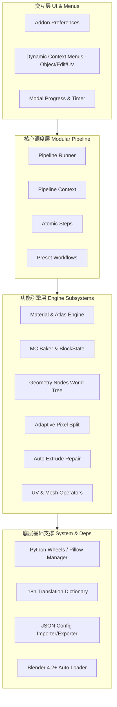

# 架构总览与防回归设计哲学

MoziToolKit 是一套专为 **Minecraft 资产转换、Voxel 风格高保真建模、贴图烘焙与自动化流水线** 设计的 Blender 生产力工具集。

## 核心防回归原则 (Non-negotiable Invariants)

1. **数学确定性优于盲目插值**：Minecraft 的像素艺术美学建立在清晰的像素网格、最近邻插值（Nearest Neighbor）和严格的 UV 边界上。任何几何细分或 UV 变换都必须具有像素级别的数学确定性。
2. **图集安全边界（Atlas Boundary Safety）**：Atlas 图集必须时刻防范跨瓦片溢色（Tile Bleeding）与浮点漂移。着色器和几何脚本中对 UV 的变换必须严格遵循安全边距（Padding / Clamp）。
3. **外部模型容错性（External Model Tolerance）**：来自各类导出工具（jmc2obj、Mineways、Ice-Cube、Blockbench 等）的模型往往携带损坏的 Split Normals、畸变的 UV、冗余材质名称。工具集必须在清洗脏数据的同时，保留原模型的拓扑与 UV 意图。
4. **解耦与流水线化（Decoupled Pipeline）**：所有原子操作必须能作为独立的 Blender Operator 运行，也能在无 UI 的 `Pipeline` 环境中被批量编排调用。
