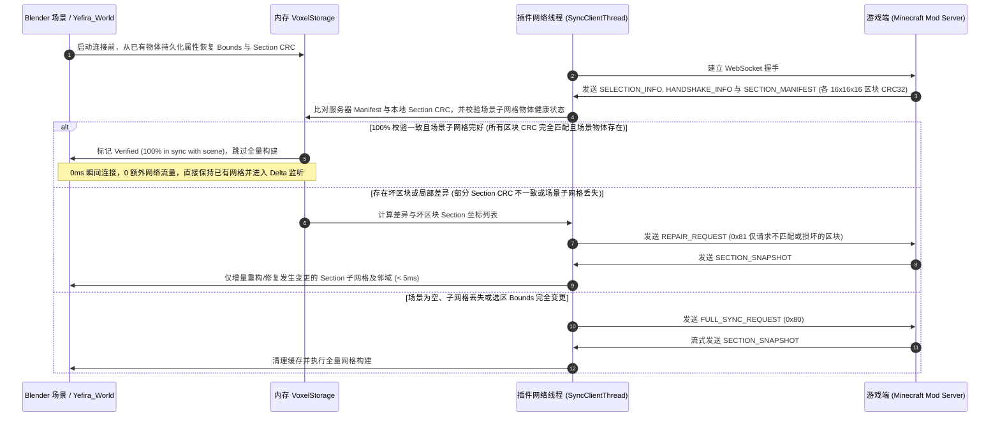
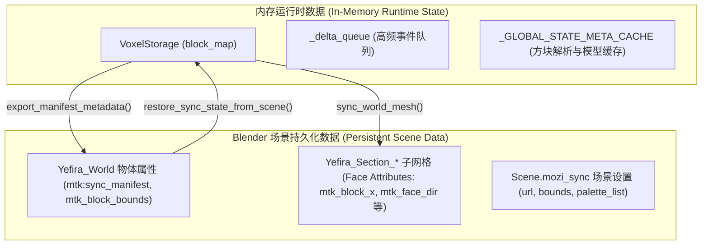

# 模块：实时同步系统架构与数据规范 (Live Sync Architecture & Data Specifications)

MoziToolKit 实时同步模块（Live Sync）基于高性能异步 WebSocket 二进制流与主线程高频事件泵（Event Pump），实现 Minecraft (Yefira Mod) 与 Blender 之间亚毫秒级的方块数据实时双向协同与网格渲染。

---

## 1. 实时同步与材质系统约定 (Material & Live Sync Convention)

为确保实时同步网格在不同材质模式、资源包切换及多工程协作下的稳定性与一致性，实时同步模块与材质系统严格遵循以下约定：

### 1.1 材质与网格面级标识规范 (Attributes & Provenance)
所有由实时同步系统使用或引用的图集材质及生成的 Direct Mesh，严格遵循以下标准：
- **材质级属性**：
  - **`mtk:atlas_chunk_id`** (`int` / `str`)：标识当前材质所绑定的纹理图集 Chunk 索引（例如 Chunk `0` 代表基础方块，Chunk `1` 代表逐帧动画或特定扩展块）。
  - **`mtk:pack_hash`** (`str`)：标识编译生成该材质时的资源包组合哈希（Stack Hash / Cache Key）。
  - **`mtk:atlas_mapping`** (`str` / JSON)：存储图集 UV 映射表与纹理位置元数据。
- **网格面级来源契约 (`mtk_source_texture_key`)**：
  - Direct Mesh 生成器在为每个多边形面烘焙几何时，自动写入面属性 `mtk_source_texture_key`（例如 `"minecraft:block/stone"`）。
  - **价值与跨模块共享**：使得实时同步生成的网格可以直接被“替换材质”管线无损识别并转换为独立模式/高清材质包；同时在用户误删节点树时，可通过 `reconstruct_materials_from_mesh_provenance` 瞬间自动复原材质与槽位。

### 1.2 材质生命周期与零冗余复用原则
1. **优先复用原则**：在构建或更新世界网格（`Yefira_World` 及 `Yefira_Section_*`）时，`LiveSyncMaterialManager` 优先检索 `bpy.data.materials` 中已有的同名或同 Chunk ID 材质，**严禁在场景中无序生成 `MC_Atlas_Chunk_0.001` 等冗余副本**。
2. **用户着色器节点保护**：若用户已在着色器编辑器中调整了材质节点（例如添加法线贴图、修改粗糙度或连接自定义着色器），同步更新过程仅修改网格拓扑、面材质插槽索引（`material_index`）及原生面属性（如 `mtk_biome_tint_color`），**绝不强制覆写或重置用户的节点树**。
3. **材质插槽严格按序对齐**：世界根物体与各 Section 网格物体的材质插槽严格按 `chunk_id` 升序排列（即第 $i$ 个材质槽对应 Chunk ID 为 $i$ 的图集材质）。

### 1.3 材质生命周期分层与冷热隔离机制 (Phase 1 vs Phase 2 Lifecycle)
为彻底杜绝高频微更新卡顿并确保工程跨版本复用的材质正确性，材质系统严格划分为**冷阶段**与**热阶段**：

- **冷阶段 (Phase 1: Handshake & Rebuild)**：
  - **触发时机**：用户点击“连接”(`op_sync_connect`)、“重建网格”(`op_sync_rebuild`)、或打开旧 `.blend` 工程时。
  - **职责**：调用 `validate_and_sync_scene_materials(target_obj)`，计算当前偏好设置中激活的 `target_pack_hash`，并与场景内已有材质哈希比对。
  - **行为**：若用户重新编译了材质包导致哈希不一致，自动触发材质槽全量升级与网格索引重绑；若哈希一致，保留现有材质快速进入热阶段。
- **热阶段 (Phase 2: Live Stream & Delta Engine @ 66Hz)**：
  - **触发时机**：连接建立后的方块放置/破坏、红石脉冲、流体扩散等微更新事件循环。
  - **职责**：纯内存直通。`get_cached_atlas_params` 通过材质 C 内存指针（`mat.as_pointer()`）实现纳秒级（< 0.0001ms）缓存命中。
  - **红线禁令**：**绝对禁止**在热阶段主线程调用 `get_configured_pack_stack()`、扫描磁盘 ZIP 文件、计算 SHA256 哈希或重置 `_GLOBAL_STATE_META_CACHE` 烘焙模型缓存。
  - **UI 隔离**：高频更新仅对 `VIEW_3D` 视口标记 `tag_redraw`，抑制 `PROPERTIES` 属性面板重绘，杜绝 Blender 内部依赖图重算风暴。

---

## 2. 连接时场景已有物体读取与增量校验机制 (Handshake & Validation)

当插件与游戏端建立连接时，插件避免无条件推翻场景重建，而是通过**握手校验（Handshake Validation）**流程实现智能增量协同。



### 核心校验与零卡顿准则：
- **数据层（Data Plane）与视图层（View Plane）解耦校验**：
  - **网格剔除面（View Plane）**：为优化视口与渲染性能，Direct Mesh 会执行邻域遮挡剔除，内部方块不生成多边形面。
  - **体素全量数据（Data Plane）**：服务端计算的 CRC32 与客户端内存中的 `VoxelStorage` 均忠实记录 3D 空间内的所有方块状态（包括内部被遮挡的方块）。
  - **校验原理**：握手校验直接比对 **Data Plane** 的 Section CRC32 与 Bounds，只要数据层 100% 一致且场景中网格物体完好，即可在数学上严格证明当前网格无需任何重新计算。
- **服务端发包时序保证**：
  - 服务端在发送数据时，严格保证 **`SELECTION_INFO` → `SECTION_MANIFEST` → `FULL_SNAPSHOT`** 的顺序。
  - 客户端优先处理 Manifest 清单，在 0 毫秒内完成比对；若一致，后续到达的 Snapshot 自动触发短路跳过。
- **快照内容幂等性短路保护 (`is_snapshot_identical`)**：
  - 即使在极端网络抖动或旧版本服务端下先收到 `FULL_SNAPSHOT`，客户端会首先进行快速位级数据比对；
  - 若方块数据与当前 `VoxelStorage` 完全一致，**瞬间跳过网格重建与着色器缓存清理**，彻底消除“卡一下”的卡顿体感。

### 核心校验准则：
- **场景物体优先恢复**：若内存为空但场景中存在 `Yefira_World`，连接时先调用 `restore_sync_state_from_scene()` 从物体自定义属性（`mtk:sync_manifest`）恢复边界与区块哈希。
- **全量快照跳过标志 (`_skip_next_full_snapshot`)**：一旦通过 Manifest 确认 100% 一致，立即设置跳过标志，避免服务器初次连接推送的 `FULL_SNAPSHOT` 重复执行昂贵的全场景 BMesh 重构。

---

## 3. “刷新” (Refresh) 与 “重建” (Rebuild) 按钮职责划分 (Button Boundary)

为彻底解决操作职责模糊的问题，实时同步模块明确划分了**网络/数据层**与**本地几何/材质层**的边界：

| 维度 | **刷新数据 (Refresh Data)** | **重建网格 (Rebuild Mesh)** |
| :--- | :--- | :--- |
| **所属层级** | **网络与数据源层 (Network & Data Source)** | **本地渲染与几何层 (Local Mesh & Shading)** |
| **对应操作符** | `mozi.sync_refresh` | `mozi.sync_rebuild_world` |
| **网络行为** | **发起网络通信**：向服务器重新请求完整快照或重新握手校验。 | **完全离线执行**：不发送任何网络数据包。 |
| **内存体素处理** | 重新从服务器下载并覆盖内存中的 `VoxelStorage` 体素状态。 | **保留当前内存体素**：仅依据本地已有体素重新计算。 |
| **网格与材质行为** | 数据更新后根据差量或快照自动触发增量同步。 | 清理 BMesh 缓存与材质管理器，强制重新计算 6 面遮挡剔除、拓扑微距焊接、UV 映射及材质插槽。 |
| **主要应用场景** | 1. 游戏内进行了外部批量填充或命令修改；<br>2. 网络波动出现丢包，需与游戏服务端强制重新对齐；<br>3. 重新建立数据拉取。 | 1. 用户更换了资源包（Resource Pack）；<br>2. 用户修改了材质着色节点或微调了着色属性；<br>3. 用户手动进入 Edit Mode 修改了模型想一键还原；<br>4. 调整了 Filter Air（过滤空气块）开关。 |

---

## 4. 内存体素数据 vs 场景持久化数据模型 (In-Memory vs Persistent Data)

实时同步系统采用分层数据生命周期管理：



### 4.1 内存运行时模型
- **`VoxelStorage`**：纯 Python 堆内存哈希表，提供 $O(1)$ 的方块状态查询、快速 6 向邻居碰撞判定、生物群系映射字典（`biome_map: Dict[Tuple[int, int, int], str]`）、基于 $5\times 5$ 邻域加权的群系混合算法（`get_smoothed_biome_data`）与区块 CRC32 实时哈希计算。
- **`_delta_queue`**：线程安全的非阻塞事件队列，以 200Hz（5ms）的泵频在 Blender 主线程中排队消费，确保 UI 流畅无卡顿。

### 4.2 场景持久化模型
- **`Yefira_World` 自定义属性**：
  - `mtk:sync_manifest`：包含 `min_x/y/z`, `size_x/y/z`, `generation` 及每个 Section 坐标对应的 CRC32 映射字典。
  - `mtk_block_bounds`：当前同步区域的 6 维整型包围盒 `[min_x, min_y, min_z, size_x, size_y, size_z]`。
- **Mesh 面属性 (Loop & Face Attributes)**：
  - `mtk_block_x`, `mtk_block_y`, `mtk_block_z`：每个面对应的 Minecraft 绝对世界坐标。
  - `mtk_face_dir`：面的朝向索引（0: East, 1: West, 2: Up, 3: Down, 4: South, 5: North）。
  - `mtk_colormap_uv`：生物群系平滑混合计算后的色图 UV 采样坐标向量 $(U_{\text{blend}}, V_{\text{blend}}, 0.0)$，连接至材质中的 `MC_Biome_Colormap_Decoder` 节点组。
  - `mtk_biome_tint_color`, `mtk_biome_tint_data`：生物群系染色向量（Linear RGBA，支持水体平滑过渡）与类型权重数据。

---

## 6. 代码模块化与子系统划分 (Modular Architecture)

为保持代码清晰与易维护性，实时同步几何与材质构建子系统解耦为如下独立职责模块与包结构：

### 6.1 核心包结构划分
- **存储与会话 (`utils/live_sync/storage/` & `session/`)**：
  - **`storage/voxel_storage.py`**：内存体素堆存储、包围盒管理、5x5 邻域加权平滑群系查询（`get_smoothed_biome_data`）与 16x16x16 Section 脏区块追踪。
  - **`session/session_manager.py`**：连接生命周期管理单例、握手 CRC 校验、场景持久化状态读取与主线程事件泵（Main-Thread Event Pump）。
- **分类与状态解析 (`utils/live_sync/classifier/`)**：
  - **`classifier/classifier.py`**：方块状态解析、模型朝向转换与语义分类（`BlockTypeEnum`: Cube, Prop, Fluid, Translucent, Air）。
  - **`classifier/hot_states.py`**：高频红石、火把、门窗等热点方块状态预提取与极速分类字典。
- **网格构建与缓存 (`utils/live_sync/meshing/`)**：
  - **`meshing/cache.py`**：方块状态元数据缓存（`CachedStateMeta`）、L1/L2 预热机制与闲时空闲帧预计算调度。
  - **`meshing/geometry.py`**：BMesh 几何生成、6 面遮挡剔除、顶点微距焊接与着色器面属性写入。
  - **`meshing/fluid.py`**：流体动力学网格生成器（水/岩浆表面张力、4 角高度插值、流动方向向量与斜坡 UV 旋转）。
  - **`meshing/hierarchy.py`**：场景物体层级组织器（管理 `MTK_LiveSync_World` 根容器 Empty、`Section` 集合以及孤立区块修剪）。
  - **`meshing/world_mesh.py`**：顶层编排器，提供 `build_world_mesh`、`sync_world_mesh` 和 `apply_block_delta_to_world`。
- **材质管理与协议 (`utils/live_sync/material/` & `protocol/`)**：
  - **`material/manager.py`** 与 **`binding.py`**：`LiveSyncMaterialManager` 材质槽位管理单例、Section 插槽同步与材质索引动态重新绑定。
  - **`protocol/client.py`**：异步 WebSocket 二进制客户端线程（`SyncClientThread`），处理 VarInt 解码与心跳应答。

### 6.2 实时同步操作符全景 (Operators Reference)
- **`mozi.sync_connect`**：建立 WebSocket 连接并执行 Manifest 握手增量校验。
- **`mozi.sync_disconnect`**：断开当前实时同步会话，重置网络线程。
- **`mozi.sync_refresh`**：发起全量数据同步请求（`0x80 FULL_SYNC_REQUEST`），重新拉取体素。
- **`mozi.sync_rebuild_world`**：完全离线重建视口几何、拓扑焊接与材质插槽。
- **`mozi.sync_clear_history`**：清空增量变更历史记录（Delta History）。
- **`mozi.add_yefira_world`**：在场景中新建指定的 Yefira 容器根节点。
- **`mozi.sync_select_root`**：在 3D 视口中快速选定当前活动的世界根节点。
- **`mozi.sync_stream_runner`**：模态定时器流式接收器（`op_sync_stream_modal.py`），驱动视口 Header 进度条平滑更新。


---

## 7. 线程安全与防回归工程规范 (Concurrency & Anti-Regression Guidelines)

> [!IMPORTANT]
> 1. **非空区块与流式目标基数对齐（Non-Empty Stream Alignment）**：
>    - 游戏服务端在流式传输时（`streamNonEmptySectionSnapshots`）仅发送包含实体方块的非空区块（`server_crc != EMPTY_SECTION_CRC`），纯空气区块跳过不发；
>    - 客户端设置 `_stream_total_sections` 时，必须以 `non_empty_manifest_count = sum(1 for crc in sections if crc != EMPTY_SECTION_CRC)` 为准，并在事件泵中配置双条件排空机制，绝不允许进度条卡在 91% 等中间状态。
> 2. **跨线程字典快照安全（Thread-Safe Snapshotting）**：
>    - 客户端后台网络线程（`SyncClientThread`）高频写入 `VoxelStorage.block_map` 与 `_section_map`；
>    - Blender 主线程在执行网格生成（`sync_world_mesh`）与状态统计时，必须调用 `storage.get_unique_states()`、`get_all_sections()`、`get_section_blocks()` 等返回浅拷贝快照的方法，严禁在迭代中直接遍历动态变化的字典视图，彻底规避 `RuntimeError: dictionary changed size during iteration`。
> 3. **运行时属性不可持久化（`SKIP_SAVE` 约束）**：
>    - 连接状态（`is_connected`、`connection_status`、`validation_info`）属于运行时动态会话，必须在 PropertyGroup 中声明 `options={'SKIP_SAVE'}`，并在 `load_post` 钩子中重置为断开，禁止污染 `.blend` 文件。
> 4. **断点续接 0 耗时校验（0ms Instant Validation）**：
>    - 重新打开 `.blend` 文件后发起连接，只要游戏服务端场景未发生变动，必须通过 CRC 校验与 `_known_empty_sections` 记录实现 0 耗时即时验证，不得触发冗余全量重建或误报坏区块。
> 5. **操作职责严格隔离**：
>    - “刷新 (Refresh)”：负责网络请求全量快照，必须带有 `_pending_full_sync_request` 守卫以防递归死循环；
>    - “重建 (Rebuild)”：负责本地离线重新计算网格与面剔除，不发送任何网络请求。
> 6. **服务端异常隔离与原子发送守卫（Server Fault-Isolation & Safe Sending）**：
>    - Minecraft 服务端在 `WebSocketServerManager` 中重写 `onWebsocketPing` 与 `onWebsocketPong`，安全处理协议心跳应答，防止客户端并发断开导致 `WebsocketNotConnectedException` 击穿解码 Worker 线程；
>    - 针对所有广播分发与 `END_SERVER_TICK` 队列刷新，采用 `sendSafe` 与 `List.copyOf(clients)` 迭代守卫，自动剔除死连接，杜绝网络层异常导致游戏服务端崩溃。
> 7. **选区变更原子熔断与队列即时排空（Preemptive Stream Cancellation Invariant）**：
>    - 当用户在构建中途再次移动/缩放选区时，服务端必须通过 `activeBroadcastStreamId` 与 `activeBroadcastFuture.cancel(true)` 原子中断前序任务循环；
>    - 客户端收到新选区时必须在主线程执行前瞬间清空 `stream_section_queue`，丢弃所有失效任务，杜绝多选区并发计算导致的 CPU 飙升与掉帧。
> 8. **流式结束终极接缝面自愈闭环（Final Stream Boundary Pass Invariant）**：
>    - 在流式传输中途，队列因网络微小间隔暂时变空时，严禁提前清空 `_dirty_sections`；
>    - 必须在服务端全部流发送完毕后，对所有跨区块接触的接缝 Section 统一执行闭合自愈，确保首次同步完成瞬间接缝面 100% 精确剔除。

---

## 8. 选区动态增量重构与自愈架构 (Dynamic Resizing & Seam Healing Architecture)

```
+----------------------------------------------------------------------------------------------------+
|                                    选区变动 (Selection Moved / Resized)                            |
+----------------------------------------------------------------------------------------------------+
                                                  |
                    +-----------------------------+-----------------------------+
                    |                                                           |
           [3D 重叠空间交集 > 0]                                       [完全无重叠远距离跳转]
                    |                                                           |
  +---------------------------------------+                   +-----------------------------------+
  | 1. 保留重叠区 block_map / CRC 数据   |                   | 退化为 storage.clear() 全量重构  |
  | 2. 剪枝超出新边界的体素与 Section     |                   +-----------------------------------+
  | 3. prune 销毁移出边界的场景 Mesh 物体 |
  | 4. 重新计算新边界接缝处 Section CRC  |
  | 5. 标记接缝 Section 到 _dirty_sections|
  +---------------------------------------+
                    |
+----------------------------------------------------------------------------------------------------+
| 边界接缝面剔除自愈 (Face Restoring & Culling)                                                      |
| - 选区缩小: 失去相邻区块的方块，自动将内部遮挡面补全恢复为暴露外表面 (Face Restored)               |
| - 选区扩大: 接入新区块相邻方块后，自动将原有暴露外表面剔除 (Face Culled)                          |
| - 流式结束: 终极 Reconcile Pass 确保跨 Section 接触面 100% 闭合，无需手动 Rebuild Mesh             |
+----------------------------------------------------------------------------------------------------+
```


