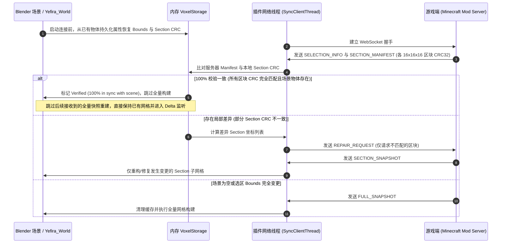
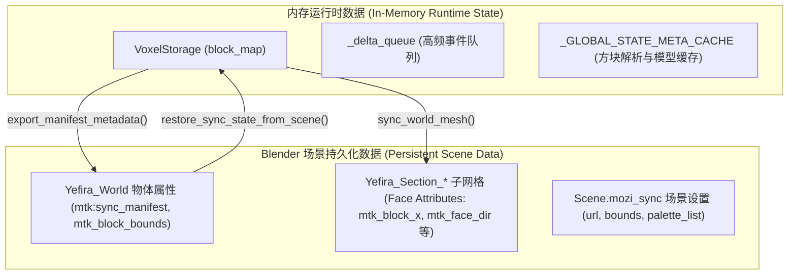

# 模块：实时同步系统架构与数据规范 (Live Sync Architecture & Data Specifications)

MoziToolKit 实时同步模块（Live Sync）基于高性能异步 WebSocket 二进制流与主线程高频事件泵（Event Pump），实现 Minecraft (Yefira Mod) 与 Blender 之间亚毫秒级的方块数据实时双向协同与网格渲染。

---

## 1. 实时同步与材质系统约定 (Material & Live Sync Convention)

为确保实时同步网格在不同材质模式、资源包切换及多工程协作下的稳定性与一致性，实时同步模块与材质系统严格遵循以下约定：

### 1.1 材质与网格面级标识规范 (Attributes & Provenance)
所有由实时同步系统使用或引用的图集材质及生成的 Direct Mesh，严格遵循以下标准：
- **材质级属性**：
  - **`mtk:atlas_chunk_id`** (`int` / `str`)：标识当前材质所绑定的纹理图集 Chunk 索引（例如 Chunk `0` 代表基础方块，Chunk `1` 代表逐帧动画或特定扩展块）。
  - **`mtk:pack_hash`** (`str`)：标识编译生成该材质时的资源包组合哈希（Stack Hash / Cache Key）。
  - **`mtk:atlas_mapping`** (`str` / JSON)：存储图集 UV 映射表与纹理位置元数据。
- **网格面级来源契约 (`mtk_source_texture_key`)**：
  - Direct Mesh 生成器在为每个多边形面烘焙几何时，自动写入面属性 `mtk_source_texture_key`（例如 `"minecraft:block/stone"`）。
  - **价值与跨模块共享**：使得实时同步生成的网格可以直接被“替换材质”管线无损识别并转换为独立模式/高清材质包；同时在用户误删节点树时，可通过 `reconstruct_materials_from_mesh_provenance` 瞬间自动复原材质与槽位。

### 1.2 材质生命周期与零冗余复用原则
1. **优先复用原则**：在构建或更新世界网格（`Yefira_World` 及 `Yefira_Section_*`）时，`LiveSyncMaterialManager` 优先检索 `bpy.data.materials` 中已有的同名或同 Chunk ID 材质，**严禁在场景中无序生成 `MC_Atlas_Chunk_0.001` 等冗余副本**。
2. **用户着色器节点保护**：若用户已在着色器编辑器中调整了材质节点（例如添加法线贴图、修改粗糙度或连接自定义着色器），同步更新过程仅修改网格拓扑、面材质插槽索引（`material_index`）及原生面属性（如 `mtk_biome_tint_color`），**绝不强制覆写或重置用户的节点树**。
3. **材质插槽严格按序对齐**：世界根物体与各 Section 网格物体的材质插槽严格按 `chunk_id` 升序排列（即第 $i$ 个材质槽对应 Chunk ID 为 $i$ 的图集材质）。

---

## 2. 连接时场景已有物体读取与增量校验机制 (Handshake & Validation)

当插件与游戏端建立连接时，插件避免无条件推翻场景重建，而是通过**握手校验（Handshake Validation）**流程实现智能增量协同。

### 核心校验与零卡顿准则：
- **数据层（Data Plane）与视图层（View Plane）解耦校验**：
  - **网格剔除面（View Plane）**：为优化视口与渲染性能，Direct Mesh 会执行邻域遮挡剔除，内部方块不生成多边形面。
  - **体素全量数据（Data Plane）**：服务端计算的 CRC32 与客户端内存中的 `VoxelStorage` 均忠实记录 3D 空间内的所有方块状态（包括内部被遮挡的方块）。
  - **校验原理**：握手校验直接比对 **Data Plane** 的 Section CRC32 与 Bounds，只要数据层 100% 一致且场景中网格物体完好，即可在数学上严格证明当前网格无需任何重新计算。
- **服务端发包时序保证**：
  - 服务端在发送数据时，严格保证 **`SELECTION_INFO` → `SECTION_MANIFEST` → `FULL_SNAPSHOT`** 的顺序。
  - 客户端优先处理 Manifest 清单，在 0 毫秒内完成比对；若一致，后续到达的 Snapshot 自动触发短路跳过。
- **快照内容幂等性短路保护 (`is_snapshot_identical`)**：
  - 即使在极端网络抖动或旧版本服务端下先收到 `FULL_SNAPSHOT`，客户端会首先进行快速位级数据比对；
  - 若方块数据与当前 `VoxelStorage` 完全一致，**瞬间跳过网格重建与着色器缓存清理**，彻底消除“卡一下”的卡顿体感。

### 核心校验准则：
- **场景物体优先恢复**：若内存为空但场景中存在 `Yefira_World`，连接时先调用 `restore_sync_state_from_scene()` 从物体自定义属性（`mtk:sync_manifest`）恢复边界与区块哈希。
- **全量快照跳过标志 (`_skip_next_full_snapshot`)**：一旦通过 Manifest 确认 100% 一致，立即设置跳过标志，避免服务器初次连接推送的 `FULL_SNAPSHOT` 重复执行昂贵的全场景 BMesh 重构。

---

## 3. “刷新” (Refresh) 与 “重建” (Rebuild) 按钮职责划分 (Button Boundary)

为彻底解决操作职责模糊的问题，实时同步模块明确划分了**网络/数据层**与**本地几何/材质层**的边界：

| 维度 | **刷新数据 (Refresh Data)** | **重建网格 (Rebuild Mesh)** |
| :--- | :--- | :--- |
| **所属层级** | **网络与数据源层 (Network & Data Source)** | **本地渲染与几何层 (Local Mesh & Shading)** |
| **对应操作符** | `mozi.sync_refresh` | `mozi.sync_rebuild_world` |
| **网络行为** | **发起网络通信**：向服务器重新请求完整快照或重新握手校验。 | **完全离线执行**：不发送任何网络数据包。 |
| **内存体素处理** | 重新从服务器下载并覆盖内存中的 `VoxelStorage` 体素状态。 | **保留当前内存体素**：仅依据本地已有体素重新计算。 |
| **网格与材质行为** | 数据更新后根据差量或快照自动触发增量同步。 | 清理 BMesh 缓存与材质管理器，强制重新计算 6 面遮挡剔除、拓扑微距焊接、UV 映射及材质插槽。 |
| **主要应用场景** | 1. 游戏内进行了外部批量填充或命令修改； 2. 网络波动出现丢包，需与游戏服务端强制重新对齐； 3. 重新建立数据拉取。 | 1. 用户更换了资源包（Resource Pack）； 2. 用户修改了材质着色节点或微调了着色属性； 3. 用户手动进入 Edit Mode 修改了模型想一键还原； 4. 调整了 Filter Air（过滤空气块）开关。 |

---

## 4. 内存体素数据 vs 场景持久化数据模型 (In-Memory vs Persistent Data)

实时同步系统采用分层数据生命周期管理：

### 4.1 内存运行时模型
- **`VoxelStorage`**：纯 Python 堆内存哈希表，提供 $O(1)$ 的方块状态查询、快速 6 向邻居碰撞判定与区块 CRC32 实时哈希计算。
- **`_delta_queue`**：线程安全的非阻塞事件队列，以 200Hz（5ms）的泵频在 Blender 主线程中排队消费，确保 UI 流畅无卡顿。

### 4.2 场景持久化模型
- **`Yefira_World` 自定义属性**：
  - `mtk:sync_manifest`：包含 `min_x/y/z`, `size_x/y/z`, `generation` 及每个 Section 坐标对应的 CRC32 映射字典。
  - `mtk_block_bounds`：当前同步区域的 6 维整型包围盒 `[min_x, min_y, min_z, size_x, size_y, size_z]`。
- **Mesh 面属性 (Loop & Face Attributes)**：
  - `mtk_block_x`, `mtk_block_y`, `mtk_block_z`：每个面对应的 Minecraft 绝对世界坐标。
  - `mtk_face_dir`：面的朝向索引（0: East, 1: West, 2: Up, 3: Down, 4: South, 5: North）。
  - `mtk_biome_tint_color`, `mtk_biome_tint_data`：生物群系染色向量与权重数据。

---

## 5. 防回归与工程规范总结
> [!IMPORTANT]
> 1. **断点续接无损性**：重新打开 `.blend` 文件后发起连接，只要游戏服务端场景未发生变动，必须通过 CRC 校验实现 0 耗时即时验证，不得触发冗余全量重建。
> 2. **材质插槽不漂移**：任何增量更新或重建操作，均不得改变已有材质插槽与 `chunk_id` 的映射关系。
> 3. **职责隔离**：“刷新”管网络，“重建”管网格，两者代码逻辑与 UI 按钮严格解耦。
