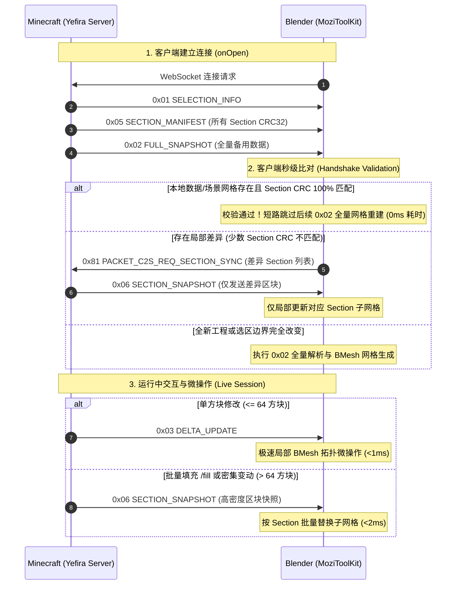

# 协议技术规范：Minecraft <-> DCC 实时同步二进制传输协议 (Live Sync Binary Protocol Specification)

## 1. 协议概述与设计哲学 (Overview & Design Philosophy)

MoziToolKit 与 Yefira Minecraft Fabric Mod 之间通过高性能异步 WebSocket 二进制流进行实时双向协同。本协议专为**极低延迟（Sub-millisecond）**、**高吞吐量**以及**极大规模体素世界协同**而设计。

### 核心设计原则：
1. **握手校验优先（Handshake-first & Zero-Cost Reconnection）**：连接时优先发送清单（Manifest），若客户端本地数据与场景网格 100% 匹配，立即短路跳过全量构建，实现 0ms 瞬间连接。
2. **释放时提交选区（Commit-on-Release）**：在游戏内通过 Gizmo 拖拽调整选区时，拖拽期间仅在本地渲染绿色预览框，鼠标松开确认后原子提交网络广播，杜绝每帧广播引发的网络风暴。
3. **数据层与视图层解耦校验（Data Plane vs. View Plane）**：CRC32 是对 16x16x16 空间内全部体素状态流计算的（Data Plane），即使视口网格剔除了被完全遮挡的内部方块（View Plane），两端的 CRC32 依然具有数学上的绝对一致性。
4. **单方块微操作与大批量更新自动分流**：
   - $\le 64$ 方块：走轻量级 `DELTA_UPDATE`（单方块 BMesh 局部拓扑插拔）；
   - $> 64$ 方块或大范围 `/fill`：自动升级为 `SECTION_SNAPSHOT`（基于 Palette 调色板的高压缩二进制区块快照），Blender 直接按 16x16x16 子网格批量替换，毫秒级完成。
5. **超大规模选区与调试世界自适应分块流式传输（Chunked Section Streaming）**：
   - 针对超大选区或调试模式世界（Debug World，包含上千种方块状态），服务端不再下发数十兆的巨型全量单包（杜绝 1009 Frame Too Big 异常）；
   - 自动转为下发 `0x01 SELECTION_INFO` + `0x05 SECTION_MANIFEST`，随后以极轻量的 `0x06 SECTION_SNAPSHOT`（单包仅几 KB，空区块智能剪枝）进行流式推送与分批修复，内存占用极低且实现秒级渐进式加载。

---

## 2. 二进制帧头格式 (Frame Header)

所有二进制数据包均采用 **Little-Endian（小端序）** 编码，且以固定的 4 字节魔数头部开头：

```
+----------------+----------------+--------------------+--------------------+
| Byte 0: 'M'    | Byte 1: 'C'    | Byte 2: Version    | Byte 3: Packet Type|
| (0x4D)         | (0x43)         | (0x02)             | (0x01 ~ 0x81)      |
+----------------+----------------+--------------------+--------------------+
```

---

## 3. 数据包类型全清单 (Packet Types)

| 包类型 ID | 名称 (Name) | 方向 | 描述 (Description) |
| :--- | :--- | :--- | :--- |
| **`0x01`** | `PACKET_SELECTION_INFO` | S $\rightarrow$ C | 广播当前选区包围盒坐标（Min Pos & Size） |
| **`0x02`** | `PACKET_FULL_SNAPSHOT` | S $\rightarrow$ C | 全量选区方块快照（包含全量 Palette 与 3D 体素索引阵列） |
| **`0x03`** | `PACKET_DELTA_UPDATE` | S $\rightarrow$ C | 单方块或微量方块增量变更列表 |
| **`0x05`** | `PACKET_SECTION_MANIFEST` | S $\rightarrow$ C | 选区内所有 16x16x16 区块（Section）的 CRC32 校验清单 |
| **`0x06`** | `PACKET_SECTION_SNAPSHOT` | S $\rightarrow$ C | 单个 16x16x16 区块的压缩快照（用于局部修复或密集批量变更） |
| **`0x07`** | `PACKET_HANDSHAKE_INFO` | S $\rightarrow$ C | 握手同步元信息包（总区块数、非空区块数、方块体积、维度名称及流式标识） |
| **`0x80`** | `PACKET_C2S_REQ_FULL_SYNC` | C $\rightarrow$ S | 客户端主动请求全量快照（Full Sync） |
| **`0x81`** | `PACKET_C2S_REQ_SECTION_SYNC` | C $\rightarrow$ S | 客户端主动请求指定坐标的 Section 局部修复快照 |
| **`0x82`** | `PACKET_C2S_SYNC_CONFIG` | C $\rightarrow$ S | 客户端同步配置更新（Throttle 模式、Target FPS 等） |

---

## 4. 详细包结构说明 (Packet Payload Structures)

### 4.1 `0x01` SELECTION_INFO (选区信息)
```
Offset | Type   | Description
-------+--------+---------------------------------------
0..3   | Header | Magic (0x4D, 0x43), Version (0x02), Type (0x01)
4..7   | int32  | Min X (世界绝对坐标)
8..11  | int32  | Min Y
12..15 | int32  | Min Z
16..19 | int32  | Size X (选区宽度)
20..23 | int32  | Size Y (选区高度)
24..27 | int32  | Size Z (选区深度)
```

### 4.2 `0x05` SECTION_MANIFEST (区块校验清单)
```
Offset | Type   | Description
-------+--------+---------------------------------------
0..3   | Header | Magic (0x4D, 0x43), Version (0x02), Type (0x05)
4..7   | uint32 | Server Sequence ID (服务程序序列号)
8..9   | uint16 | Section Count (区块总数 N)
10..   | Array  | N 个 Section 校验条目:
       |   int32  - Section X (sec_x = x >> 4)
       |   int32  - Section Y (sec_y = y >> 4)
       |   int32  - Section Z (sec_z = z >> 4)
       |   uint32 - Section CRC32 校验码
```

### 4.3 `0x06` SECTION_SNAPSHOT (单区块调色板快照)
```
Offset | Type   | Description
-------+--------+---------------------------------------
0..3   | Header | Magic (0x4D, 0x43), Version (0x02), Type (0x06)
4..7   | int32  | Section X
8..11  | int32  | Section Y
12..15 | int32  | Section Z
16..19 | int32  | Start X (区块在选区内的起始坐标)
20..23 | int32  | Start Y
24..27 | int32  | Start Z
28..31 | int32  | Size X (通常为 16，边界处截断)
32..35 | int32  | Size Y
36..39 | int32  | Size Z
40..41 | uint16 | Palette Count (调色板条目数 P)
--     | List   | P 个 UTF-8 字符串 (uint16 length + string bytes)
--     | uint8  | Index Format (1 = uint8 索引, 2 = uint16 索引)
--     | Array  | (SizeX * SizeY * SizeZ) 个体素调色板索引
```

### 4.4 `0x07` HANDSHAKE_INFO (握手与同步元信息)
```
Offset | Type   | Description
-------+--------+---------------------------------------
0..3   | Header | Magic (0x4D, 0x43), Version (0x02), Type (0x07)
4..5   | uint16 | Total Section Count (选区覆盖区块总数)
6..7   | uint16 | Non-Empty Section Count (含有效方块待流式传输的区块数)
8..11  | uint32 | Total Volume (方块总体积)
12..13 | uint16 | Dimension String Length (D)
14..   | bytes  | UTF-8 Dimension Name (如 "minecraft:overworld")
--     | uint16 | Flags (Bit 0: Streaming Mode, Bit 1: Compressed)
```

### 4.5 `0x03` DELTA_UPDATE (增量变更包)
```
Offset | Type   | Description
-------+--------+---------------------------------------
0..3   | Header | Magic (0x4D, 0x43), Version (0x02), Type (0x03)
4..7   | int32  | Min X
8..11  | int32  | Min Y
12..15 | int32  | Min Z
16..19 | uint32 | Sequence ID
20..21 | uint16 | Change Count (变更数量 C)
--     | List   | C 个变更条目:
       |   uint16 - Relative X
       |   uint16 - Relative Y
       |   uint16 - Relative Z
       |   uint16 - State String Length
       |   bytes  - UTF-8 BlockState String
```

---

## 5. 握手与生命周期时序图 (Handshake & Sync Sequence)



---

## 6. 异常处理与自愈机制 (Resilience & Self-Healing)
1. **网络重连数据幂等**：重连时客户端自动执行 `is_snapshot_identical` 校验，未发生实质改变的 Snapshot 绝不触发任何网格拓扑计算。
2. **场景网格丢失恢复**：若内存数据存在但视口物体被用户意外删除，点击 **Rebuild Mesh (`mozi.sync_rebuild_world`)** 可在完全离线状态下瞬时从内存 `VoxelStorage` 重新生成全部多边形。
