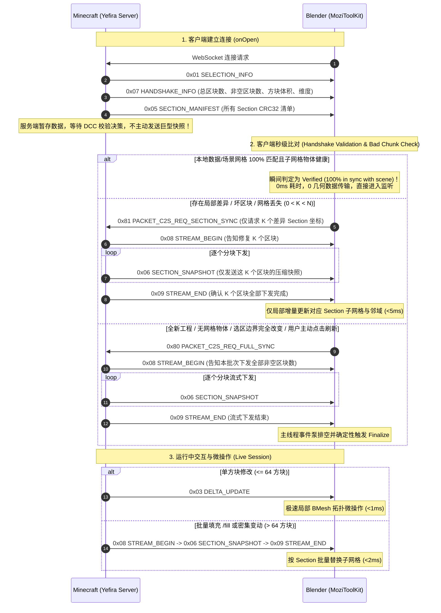

# 协议技术规范：Minecraft <-> DCC 实时同步二进制传输协议 (Live Sync Binary Protocol Specification)

## 1. 协议概述与设计哲学 (Overview & Design Philosophy)

MoziToolKit 与 Yefira Minecraft Fabric Mod 之间通过高性能异步 WebSocket 二进制流进行实时双向协同。本协议专为**极低延迟（Sub-millisecond）**、**高吞吐量**以及**极大规模体素世界协同**而设计。

### 核心设计原则：
1. **握手校验优先（Handshake-first & Zero-Cost Reconnection）**：连接时优先发送清单（Manifest），若客户端本地数据与场景网格 100% 匹配，立即短路跳过全量构建，实现 0ms 瞬间连接。
2. **释放时提交选区（Commit-on-Release）**：在游戏内通过 Gizmo 拖拽调整选区时，拖拽期间仅在本地渲染绿色预览框，鼠标松开确认后原子提交网络广播，杜绝每帧广播引发的网络风暴。
3. **数据层与视图层解耦校验（Data Plane vs. View Plane）**：CRC32 是对 16x16x16 空间内全部体素状态流计算的（Data Plane），即使视口网格剔除了被完全遮挡的内部方块（View Plane），两端的 CRC32 依然具有数学上的绝对一致性。
4. **单方块微操作与大批量更新自动分流**：
   - $\le 64$ 方块：走轻量级 `DELTA_UPDATE`（单方块 BMesh 局部拓扑插拔）；
   - $> 64$ 方块或大范围 `/fill`：自动升级为 `SECTION_SNAPSHOT`（基于 Palette 调色板的高压缩二进制区块快照），Blender 直接按 16x16x16 子网格批量替换，毫秒级完成。
5. **超大规模选区与调试世界自适应分块流式传输（Chunked Section Streaming）**：
   - 针对超大选区或调试模式世界（Debug World，包含上千种方块状态），服务端不再下发数十兆的巨型全量单包（杜绝 1009 Frame Too Big 异常）；
   - 自动转为下发 `0x01 SELECTION_INFO` + `0x05 SECTION_MANIFEST`，随后以极轻量的 `0x06 SECTION_SNAPSHOT`（单包仅几 KB，空区块智能剪枝）进行流式推送与分批修复，内存占用极低且实现秒级渐进式加载。

---

## 2. 二进制帧头格式 (Frame Header)

所有二进制数据包均采用 **Little-Endian（小端序）** 编码，且以固定的 4 字节魔数头部开头：

```
+----------------+----------------+--------------------+--------------------+
| Byte 0: 'M'    | Byte 1: 'C'    | Byte 2: Version    | Byte 3: Packet Type|
| (0x4D)         | (0x43)         | (0x01)             | (0x01 ~ 0x82)      |
+----------------+----------------+--------------------+--------------------+
```

---

## 3. 数据包类型全清单 (Packet Types)

| 包类型 ID | 名称 (Name) | 方向 | 描述 (Description) |
| :--- | :--- | :--- | :--- |
| **`0x01`** | `PACKET_SELECTION_INFO` | S $\rightarrow$ C | 广播当前选区包围盒坐标（Min Pos & Size） |
| **`0x02`** | `PACKET_FULL_SNAPSHOT` | S $\rightarrow$ C | 全量选区方块快照（包含全量 Palette 与 3D 体素索引阵列） |
| **`0x03`** | `PACKET_DELTA_UPDATE` | S $\rightarrow$ C | 单方块或微量方块增量变更列表 |
| **`0x05`** | `PACKET_SECTION_MANIFEST` | S $\rightarrow$ C | 选区内所有 16x16x16 区块（Section）的 CRC32 校验清单 |
| **`0x06`** | `PACKET_SECTION_SNAPSHOT` | S $\rightarrow$ C | 单个 16x16x16 区块的压缩快照（用于局部修复或密集批量变更） |
| **`0x07`** | `PACKET_HANDSHAKE_INFO` | S $\rightarrow$ C | 握手同步元信息包（总区块数、非空区块数、方块体积、维度名称及流式标识） |
| **`0x08`** | `PACKET_STREAM_BEGIN` | S $\rightarrow$ C | 流式传输启动包（携带 Stream ID、待下发的有效区块总数与标志位） |
| **`0x09`** | `PACKET_STREAM_END` | S $\rightarrow$ C | 流式传输完成包（携带 Stream ID、实际推送成功的区块总数与状态码） |
| **`0x80`** | `PACKET_C2S_REQ_FULL_SYNC` | C $\rightarrow$ S | 客户端主动请求全量快照（Full Sync） |
| **`0x81`** | `PACKET_C2S_REQ_SECTION_SYNC` | C $\rightarrow$ S | 客户端主动请求指定坐标的 Section 局部修复快照 |
| **`0x82`** | `PACKET_C2S_SYNC_CONFIG` | C $\rightarrow$ S | 客户端同步配置更新（Throttle 模式、Target FPS 等） |

---

## 4. 详细包结构说明 (Packet Payload Structures)

### 4.1 `0x01` SELECTION_INFO (选区信息)
```
Offset | Type   | Description
-------+--------+---------------------------------------
0..3   | Header | Magic (0x4D, 0x43), Version (0x01), Type (0x01)
4..7   | int32  | Min X (世界绝对坐标)
8..11  | int32  | Min Y
12..15 | int32  | Min Z
16..19 | int32  | Size X (选区宽度)
20..23 | int32  | Size Y (选区高度)
24..27 | int32  | Size Z (选区深度)
```

### 4.2 `0x02` FULL_SNAPSHOT (全量选区快照)
```
Offset | Type   | Description
-------+--------+---------------------------------------
0..3   | Header | Magic (0x4D, 0x43), Version (0x01), Type (0x02)
4..7   | int32  | Min X (世界绝对坐标)
8..11  | int32  | Min Y
12..15 | int32  | Min Z
16..19 | int32  | Size X (选区宽度)
20..23 | int32  | Size Y (选区高度)
24..27 | int32  | Size Z (选区深度)
28..29 | uint16 | Block Palette Count (方块调色板条目数 P)
--     | List   | P 个 UTF-8 JSON 字符串 (uint16 length + string bytes)
--     | uint8  | Block Index Format (1 = uint8 索引, 2 = uint16 索引)
--     | Array  | (SizeX * SizeY * SizeZ) 个体素方块调色板索引
--     | uint16 | Biome Palette Count (生物群系调色板条目数 B，可选扩展)
--     | List   | B 个 UTF-8 群系 ID (uint16 length + string bytes，如 "minecraft:forest")
--     | uint8  | Biome Index Format (若 B > 1: 1 = uint8 索引, 2 = uint16 索引)
--     | Array  | (若 B > 1) (SizeX * SizeY * SizeZ) 个生物群系调色板索引 (若 B == 1 省略索引流，全量默认为 0)
```

### 4.3 `0x05` SECTION_MANIFEST (区块校验清单)
```
Offset | Type   | Description
-------+--------+---------------------------------------
0..3   | Header | Magic (0x4D, 0x43), Version (0x01), Type (0x05)
4..7   | uint32 | Server Sequence ID (服务程序序列号)
8..9   | uint16 | Section Count (区块总数 N)
10..   | Array  | N 个 Section 校验条目:
       |   int32  - Section X (sec_x = x >> 4)
       |   int32  - Section Y (sec_y = y >> 4)
       |   int32  - Section Z (sec_z = z >> 4)
       |   uint32 - Section CRC32 校验码
```

### 4.4 `0x06` SECTION_SNAPSHOT (单区块调色板快照)
```
Offset | Type   | Description
-------+--------+---------------------------------------
0..3   | Header | Magic (0x4D, 0x43), Version (0x01), Type (0x06)
4..7   | int32  | Section X
8..11  | int32  | Section Y
12..15 | int32  | Section Z
16..19 | int32  | Start X (区块在选区内的起始坐标)
20..23 | int32  | Start Y
24..27 | int32  | Start Z
28..31 | int32  | Size X (通常为 16，边界处截断)
32..35 | int32  | Size Y
36..39 | int32  | Size Z
40..41 | uint16 | Block Palette Count (方块调色板条目数 P)
--     | List   | P 个 UTF-8 字符串 (uint16 length + string bytes)
--     | uint8  | Block Index Format (1 = uint8 索引, 2 = uint16 索引)
--     | Array  | (SizeX * SizeY * SizeZ) 个体素方块调色板索引
--     | uint16 | Biome Palette Count (生物群系调色板条目数 B，可选扩展)
--     | List   | B 个 UTF-8 群系 ID (uint16 length + string bytes)
--     | uint8  | Biome Index Format (若 B > 1: 1 = uint8 索引, 2 = uint16 索引)
--     | Array  | (若 B > 1) (SizeX * SizeY * SizeZ) 个生物群系调色板索引 (若 B == 1 省略索引流，全量默认为 0)
```

### 4.5 `0x07` HANDSHAKE_INFO (握手与同步元信息)
```
Offset | Type   | Description
-------+--------+---------------------------------------
0..3   | Header | Magic (0x4D, 0x43), Version (0x01), Type (0x07)
4..5   | uint16 | Total Section Count (选区覆盖区块总数)
6..7   | uint16 | Non-Empty Section Count (含有效方块待流式传输的区块数)
8..11  | uint32 | Total Volume (方块总体积)
12..13 | uint16 | Dimension String Length (D)
14..   | bytes  | UTF-8 Dimension Name (如 "minecraft:overworld")
--     | uint16 | Flags (Bit 0: Streaming Mode, Bit 1: Compressed)
```

### 4.6 `0x03` DELTA_UPDATE (增量变更包)
```
Offset | Type   | Description
-------+--------+---------------------------------------
0..3   | Header | Magic (0x4D, 0x43), Version (0x01), Type (0x03)
4..7   | int32  | Min X
8..11  | int32  | Min Y
12..15 | int32  | Min Z
16..19 | uint32 | Sequence ID
20..21 | uint16 | Change Count (变更数量 C)
--     | List   | C 个变更条目:
       |   uint16 - Relative X
       |   uint16 - Relative Y
       |   uint16 - Relative Z
       |   uint16 - State String Length
       |   bytes  - UTF-8 BlockState String
```

### 4.7 生物群系传输与平滑过渡协议规范 (Biome Blending Specification)
1. **零冗余单群系压缩优化**：当快照区域完全处于单一生物群系时（$B = 1$），协议仅下发群系名称，省略体积庞大的索引流，实现极致压缩。
2. **完全向后兼容（Backward Compatibility）**：若数据包尾部未附带群系数据（旧版本模组或测试 Mock），DCC 端自动安全截断并回退至默认群系 `"minecraft:plains"`。
3. **DCC 端的平滑混合核（Biome Blending Kernel）**：
   - 客户端在生成网格面时，以方块 $(x, z)$ 为中心采集 $5\times 5$（半径 $r=2$）邻域内各方块的生物群系；
   - 提取各群系的温度 $T$ 与湿度 $H$，按高斯/距离反比权重 $\omega_i = \frac{1}{1 + d_i}$ 计算加权色图坐标：
     $$U_{\text{blend}} = \sum \omega_i \cdot (1.0 - T_i), \quad V_{\text{blend}} = \sum \omega_i \cdot (H_i \cdot T_i)$$
   - 将 $(U_{\text{blend}}, V_{\text{blend}}, 0.0)$ 写入面属性 `mtk_colormap_uv`，配合着色器 `MC_Biome_Colormap_Decoder` 实现原版一致的草地与树叶群系交界平滑过渡；
   - 水体面通过邻域水色加权插值后写入 `mtk_biome_tint_color`，实现水体颜色的渐变过渡。

### 4.8 `0x08` STREAM_BEGIN (流式传输开始)
```
Offset | Type   | Description
-------+--------+---------------------------------------
0..3   | Header | Magic (0x4D, 0x43), Version (0x01), Type (0x08)
4..7   | uint32 | Stream ID (当前流式会话全局递增 ID)
8..11  | uint32 | Total Sections (本批次待下发的有效非空区块总数)
12..13 | uint16 | Flags (预留标志位，默认 0)
```

### 4.9 `0x09` STREAM_END (流式传输结束)
```
Offset | Type   | Description
-------+--------+---------------------------------------
0..3   | Header | Magic (0x4D, 0x43), Version (0x01), Type (0x09)
4..7   | uint32 | Stream ID (与 STREAM_BEGIN 对应的流会话 ID)
8..11  | uint32 | Sent Sections (服务端实际成功下发的区块总数)
12..13 | uint16 | Status (状态码: 0 = SUCCESS, 1 = ABORTED/CANCELLED)
```

---

## 5. 握手与生命周期时序图 (Handshake & Sync Sequence)



---

## 6. 异常处理与自愈机制 (Resilience & Self-Healing)
1. **网络重连数据幂等**：重连时客户端自动执行 `is_snapshot_identical` 校验，未发生实质改变的 Snapshot 绝不触发任何网格拓扑计算。
2. **场景网格丢失恢复**：若内存数据存在但视口物体被用户意外删除，点击 **Rebuild Mesh (`mozi.sync_rebuild_world`)** 可在完全离线状态下瞬时从内存 `VoxelStorage` 重新生成全部多边形。
3. **断线重试次数约束与手动取消**：
   - 当遇到网络波动或连接异常断开时，客户端自动执行指数退避重连；
   - **重连尝试上限为 5 次**。若连续重试超过 5 次仍无法建立连接，客户端立即终止重连，并将状态标记为 `DISCONNECTED (Failed after 5 attempts)`；
   - 在连接尝试或反复重连的过程中，UI 面板上的“Connect”按钮动态切换为“**Cancel Connection**”，允许用户随时一键手动中止连接与重试循环。
4. **WebSocket 协议层心跳与异常隔离 (Ping/Pong & Send-Safe Invariant)**：
   - **双向心跳安全响应**：DCC 端 `SyncClientThread` 维持标准 WebSocket Ping 心跳（`ping_interval=20s`）。服务端针对 Ping 帧进行原子 Pong 响应，并在底层重写 `onWebsocketPing` 与 `onWebsocketPong`，自动捕获处理客户端在重连或中断期间引发的 `WebsocketNotConnectedException`，彻底杜绝 Worker 线程解码异常外溢；
   - **原子发送安全守卫（`sendSafe`）**：服务端针对所有广播（Manifest, Section Snapshot, Delta Update）及 Tick 级队列刷写（`flushQueuedDeltaUpdates`）采用无锁副本快照遍历与 `sendSafe` 守卫，一旦检测到死连接立即执行上下文注销，确保服务端 Tick 主线程绝不因网络层断连发生崩服。
5. **确定性流式生命周期与心跳守护状态机 (Deterministic Stream Lifecycle)**：
   - **摒弃静默超时盲猜**：大选区同步与批量修复不再依靠纯静默超时（Settle Timeout）猜测传输终点，而是由服务端的 `0x08 STREAM_BEGIN` 与 `0x09 STREAM_END` 形成闭环；
   - **双条件排空完成判定**：客户端仅在 `server_stream_finished == True` **且** `stream_section_queue` 积压全部消费构建完毕时才触发 `_finalize_stream_sync`，确保进度条与构网 100% 精确完成；
   - **心跳守护级断线容灾**：在 `server_stream_finished == False` 的流式下发过程中，客户端绝不因中间数据包的时间间隔提前终止，仅当底层 WebSocket 发生物理断开或长达 45 秒没有任何网络数据/心跳时才触发超时容灾与模态锁释放。


