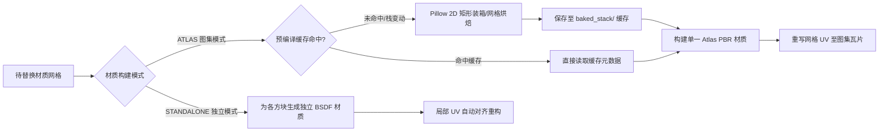

# 模块一：Minecraft 材质解析、匹配与替换管线

## 1. 资源包分层栈与解包缓存 (Resource Pack Stack & Cache)

### 1.1 三层物理优先级栈体系 (Three-Tier Priority Stack)
MoziToolKit 遵循 Minecraft 原生资源包堆叠思想并进行了工程化升维，采用 **三层分级栈（Three-Tier Hierarchy）** 架构管理资产来源，自顶向下（Top to Bottom）严格排序：
1. **顶层：用户材质包（`RESOURCE_PACK` - Top Layer，优先级最高）**：
   - 包含各类定制资源包、局部修改包（如矿石发光、3D 武器模型包、局部风格化材质包）或全量高精度材质包（如 Faithful 32x、Patrix 128x）。
   - 用户可以在偏好设置中自由叠加多个材质包并上下调整相对优先级。
2. **中层：Mod 归档与拓展包（`MOD_JAR` - Middle Layer）**：
   - 包含各类模组（如 Create、Botania、Twilight Forest 等）的 `.jar` 归档。提供自定义命名空间（如 `create:`）的独立方块、物品贴图与模型定义。
3. **底层：原版客户端核心（`VANILLA` - Bottom Layer，基底回退锚点）**：
   - Minecraft 官方客户端原版 JAR 包（如 `1.21.jar` / `26.2-Fabric.jar`）。
   - 作为整个渲染系统的 **绝对基底锚点（Fallback Anchor）**，提供全量标准方块/物品的基础漫反射贴图（Albedo）、默认 Model JSON 继承树与 Blockstate 变体定义。

> **与 Minecraft 原版的关系**：Minecraft 原版本质上只有一条“有序资源提供者列表”，并不认识本项目的三种包类型。`RESOURCE_PACK → MOD_JAR → VANILLA` 是 MoziToolKit 为保证用户包、模组资源和原版基底稳定共存而定义的**排序策略**，不是另一套覆盖语义。无论资源来自哪一种类型，解析时都必须遵循同一条自顶向下的资源路径查找规则；同层内允许用户调整顺序，跨层排序由系统保护，不得由解析器根据包类型改变单个资源的优先级。

```mermaid
graph TD
    subgraph PackStack [资源包优先级栈 (Top to Bottom)]
        RP1[Layer 0: 顶层发光矿石覆盖包 - 仅含 _n / _s]
        RP2[Layer 1: 中层全量 PBR 材质包 - 含高清 Albedo & 部分 _n / _s]
        MOD[Layer 2: 模组拓展 JAR - 提供 create: 等自定义命名空间]
        VANILLA[Layer 3: 底层原版客户端 JAR - 全量 Base Albedo & Models]
    end

    subgraph PerChannelResolver [通道级细粒度独立解析引擎 (Per-Channel Resolver)]
        direction TB
        AlbRes[Albedo 通道独立自顶向下穿透]
        NormRes[Normal _n 通道独立自顶向下穿透]
        SpecRes[Specular _s 通道独立自顶向下穿透]
        MetaRes[MCMETA 动画元数据通道独立穿透]
    end

    subgraph CompositeResult [预编译合成材质条目 (Composite Map)]
        CompDiamond[diamond_ore: 顶层发光 _s + 中层高清 Albedo & _n]
        CompStone[stone: 中层高清 Albedo + 中层 _n + 中层 _s]
        CompBedrock[bedrock: 底层原版 Albedo + 默认平坦法线/无发光高光]
    end

    RP1 --> PerChannelResolver
    RP2 --> PerChannelResolver
    MOD --> PerChannelResolver
    VANILLA --> PerChannelResolver

    PerChannelResolver --> CompositeResult
```

### 1.2 通道级细粒度独立级联回退 (Per-Channel Cascading Fallback)
与传统将整套方块视为单一单元进行粗暴覆盖的方案不同，MoziToolKit 在 [`pack_stack.py`](file:///Users/jaxlocke/Desktop/MoziToolKit/utils/materials/pack_stack.py) 中实现了 **通道级细粒度独立穿透机制（Granular Per-Channel Composition）**：
- **四大独立解析通道**：
  1. **`albedo`**：基础漫反射色彩贴图（如 `stone.png`、`diamond_ore.png`）。
  2. **`normal`**：法线贴图（匹配 `_n.png` 或大写 `_N.png` 后缀）。
  3. **`specular`**：LabPBR 1.3 镜面/粗糙度/金属性/发光贴图（匹配 `_s.png` 或大写 `_S.png` 后缀）。
  4. **`mcmeta`**：通道文件各自可携带的逐帧动态动画与插值配置（`.png.mcmeta`）。
- **级联命中算法（First-Hit Resolution）**：
  对于任意纹理标识 `(namespace, texture_key)`，解析器自顶向下遍历材质栈，各通道分别取自 **物理提供该通道文件的最顶层资源包**：
  - 若最顶层发光包只提供了 `diamond_ore_s.png`，解析器直接捕获其 `specular` 通道；
  - 接着继续向下层穿透，若第二层 PBR 材质包提供了 `diamond_ore.png` 与 `diamond_ore_n.png`，则分别捕获其 `albedo` 与 `normal`；
  - 若某个方块（如 `bedrock`）在上层所有资源包中均无定制贴图，则 `albedo` 穿透命中底层的原版 JAR，而 `normal` 与 `specular` 标记为 `None`，并在着色器中安全回退为默认平坦法线 `(128, 128, 255)` 与标准粗糙度，**绝对不会在对应位置创建空白材质或黑色空洞**。

- **动画元数据权威规则（Animation Authority）**：
  - 当 Albedo 存在时，**Albedo 的 `.png.mcmeta` 是该材质动画帧序列、帧时长与插值的唯一权威来源**；Normal、Specular、Overlay 的图像必须对齐到此时间轴。
  - 伴生通道的 `.mcmeta` 可以被索引与保留，供对齐/诊断使用，但不得单独驱动与 Albedo 不同的 shader 时间轴。
  - 若 Albedo 没有动画元数据，则材质按静态处理；仅存在动画 PBR 伴生图、但不存在动画 Albedo 的情况不得创建独立动画调度器。

### 1.3 伴生贴图识别与防误判契约 (Companion Suffix Indexing Contract)
在 [`resource_pack.py`](file:///Users/jaxlocke/Desktop/MoziToolKit/utils/materials/resource_pack.py) 的 `ZipResourcePack._build_index()` 中：
- 文件名后缀分类器严格区分材质角色：无论文件名为小写（`_n` / `_s`）还是部分第三方材质包的大写命名（`_N` / `_S`），均被剔除后缀后归纳为对应基底方块的伴生通道（`normal` / `specular`）。
- **防掩盖保障（Non-Masking Invariant）**：伴生贴图**严禁作为独立的 Albedo 实体建立索引**。若一个发光材质包中仅有 `assets/minecraft/textures/block/diamond_ore_N.png`，系统绝不会将其识别为一个名为 `diamond_ore_n` 的缺失漫反射方块，而是将其正确绑定至 `minecraft:block/diamond_ore` 的法线通道，确保漫反射通道能够顺利穿透到下层资源。

### 1.4 物理输入形态与双重缓存架构 (Extraction & Bake Cache)
- **输入形态支持**：
  1. `.zip` 压缩包（标准 Minecraft 材质包）。
  2. `.jar` 归档（Minecraft 客户端核心文件 / Forge / Fabric / NeoForge 模组）。
  3. 本地解压目录（方便材质包创作者实时调试开发）。
- **解包与缓存生命周期**：
  - **临时解压缓存（OS Temp）**：ZIP/JAR 归档解压至系统临时目录（`bpy.app.tempdir/MoziToolKit/extracted/<pack_hash>/`），内置 Zip-Slip 路径穿越防御与 Zip-Bomb 压缩比安全检测，由 `pack.mcmeta` 或文件内容哈希校验，避免重复解压。
  - **持久化烘焙缓存（Persistent Cache）**：材质栈预编译产出的图集贴图与 `atlas_mapping.json` 存储于持久化数据目录（`DATAFILES/MoziToolKit/cache/baked_stack/<stack_hash>/`）。当材质栈结构或顺序未变动时，场景替换可直接复用该缓存。

### 1.5 原版资源路径覆盖语义与缺失资源规则 (Vanilla-Style Resolution Contract)
**唯一的覆盖单位是完整资源路径，而不是“一个方块的一整套贴图”。** 对同一命名空间中的下列路径，必须分别执行从栈顶到栈底的 First-Hit 查找：

```text
assets/<namespace>/textures/block/diamond_ore.png    -> Albedo
assets/<namespace>/textures/block/diamond_ore_n.png  -> Normal
assets/<namespace>/textures/block/diamond_ore_s.png  -> Specular / LabPBR
```

这正是 Minecraft 原版资源覆盖的模型：上层只有在**实际提供同一资源路径的文件**时才覆盖下层；缺少该文件等价于“不覆盖”，而不是透明、删除或创建占位资源。PBR 只是将这一原则扩展到额外的伴生资源路径。

- **资源路径与大小写**：命名空间和常规资源路径遵循 Minecraft 的小写规范。仅 PBR 伴生后缀 `_n/_N`、`_s/_S` 按大小写不敏感识别；实现不得把其它大小写差异悄然当作同一资源，除非另有明确的兼容性规则与测试。
- **Albedo 是可渲染条目的前提**：只要任何层提供了 Albedo，才创建该纹理的 Atlas tile 或 Standalone material；Normal/Specular 可独立来自更高或更低层。
- **全栈均无 Albedo**：如果某路径仅存在 `_n`、`_s` 或其 `.mcmeta`，但所有层都不存在对应 Albedo，必须完全跳过该条目：不创建图集 tile、不创建独立材质、不创建透明/黑色占位图。
- **PBR 缺失不是图像缺失**：若已解析 Albedo 而 Normal/Specular 缺失，材质必须正常渲染。默认平坦法线、无发光/标准参数只能作为 shader 输入默认值存在，绝不能作为一张全尺寸 PBR 占位图写入磁盘或载入 Blender。

### 1.6 缓存身份、完整性与原子发布 (Cache Validity & Atomic Publication)
- **缓存身份（Cache Key）**：缓存身份必须至少包含：按优先级排序的每个输入包的内容哈希、Atlas 格式版本、最大 Chunk 尺寸、启用的图集分类，以及任何会改变图集布局或像素输出的编译参数。仅路径相同不足以复用缓存。
- **完整性判定**：一个缓存仅当 `atlas_mapping.json` 可解析、格式版本完全匹配、每个 Chunk 的 Albedo 文件存在、且 mapping 引用的所有可选 Normal/Specular/Overlay 文件也存在时，才可被绑定到场景。
- **原子发布**：编译器必须先在同一文件系统中的临时目录生成所有 PNG 与 mapping；只有整个产物通过完整性验证后，才能以原子替换/重命名发布到正式 `<stack_hash>/...` 目录。构建取消、异常或断电不得破坏上一份完整可用的缓存。
- **陈旧缓存**：格式版本或任一缓存身份字段变化时，旧缓存必须视为不可用并重建；清理任务只能删除不再被当前栈引用的缓存，绝不能删除正在构建或当前已验证可用的缓存。

---

## 2. 多导入器自适应匹配引擎 (Importer Adapters)
不同地图导出工具具有完全不同的材质命名与网格组织规范。匹配引擎通过策略模式实现多适配器智能探测：

| 适配器类型 | 目标工具与特征 | 关键匹配逻辑与核心设计 |
| :--- | :--- | :--- |
| **`jmc2obj`** | 原生保留连续平铺 UV（Tiling UVs），材质名通常带方块 ID 或纹理名 | 识别 `jmc2obj` 特有的纹理命名；**绝不能强制将超过 `[0, 1]` 范围的平铺 UV 暴力归一化**，必须配合图集着色器平铺节点（Tiling Node）进行局部重映射。 |
| **`Mineways`** | 将多个方块打包至地形大图，材质名带有 `TerrainExt_`、方块数值 ID 或合成材质名称 | 解析 Mineways 材质映射表，提取底层基础方块贴图，去除 `mineways_` 等内部标签。 |
| **`Ice-Cube`** | Ice-Cube 资产库材质命名规范，常带命名空间及别名 | 识别其资产库专属前缀（如 `library/`、`ice_cube_asset_library/`），做别名映射后精准定位材质。 |
| **`Generic`** | 通用 OBJ/FBX 导入模型，材质名通常包含 Blender 副本后缀（`.001`）与路径前缀 | 自动剥离 `.001`~`.999` 复制后缀、剥离 `assets/textures/block/` 路径前缀，进行模糊匹配与降级回退。 |

---

## 3. 双材质构建体系 (Atlas Mode vs Standalone Mode)



### 3.1 图集预编译与视口替换生命周期解耦 (Decoupled Precompilation)
MoziToolKit 将庞大的材质解析、通道融合与图像装箱计算全部收拢在 **预编译烘焙阶段（Precompilation Bake）**：
- **预编译执行时机**：通过 `mozi.precompile_cache` 算子触发，或在用户首次对场景执行材质替换且当前材质栈尚未烘焙时自动执行。
- **预编译产物**：为整个材质栈生成唯一的 `stack_hash`，并在磁盘上构建由 `atlas_mapping.json`、`*_albedo.png` 以及按需生成的伴生 `*_normal.png` / `*_specular.png` 构成的完整图集切片库。
- **视口替换（Instant Binding）**：当用户在 3D 视口中点击“替换材质”时，算子直接读取已持久化的 `atlas_mapping.json`，在毫秒级内完成网格 Loop UV 重映射与 Material Slot 赋予，**杜绝在视口操作时发生重复的磁盘扫描或图像重重组**。

### 3.2 图集零透明占位与融合装箱契约 (Zero-Placeholder Packing Contract)
图集生成器（[`AtlasGenerator`](file:///Users/jaxlocke/Desktop/MoziToolKit/utils/materials/atlas_generator.py)）在装箱布局阶段直接以多层栈合成后的全量字典（`composite_map`）作为唯一数据源：
1. **局部材质包覆盖机制（如矿物修改包）**：
   - 假设用户仅添加了一个修改了 5 种矿石贴图的局部材质包，其余方块全部由底层原版 JAR 提供。
   - `AtlasGenerator` 在加载资源时，直接获取到“5 个来自顶层的定制矿石贴图 + 数百个来自底层原版 JAR 的常规方块贴图”。
   - **装箱排布**：装箱器将这修改后的 5 个矿石贴图与原版其他方块贴图紧密无缝地拼合在同一张 Atlas 图集内。**绝不会为未覆盖的方块生成任何透明占位、空图或黑色空洞**。
2. **全量材质包覆盖机制（如 Faithful 32x）**：
   - 若用户添加了一个覆盖全量 Minecraft 方块的材质包，所有方块的漫反射贴图均在顶层被直接命中，烘焙出的图集整张完全呈现该材质包的高清纹理。
3. **PBR 伴生图集按需分配机制（On-Demand Companion Sheets）**：
   - 图集以 `Chunk` 为单位进行空间划分。只有当某一个 Chunk 内所包含的方块中至少有一个方块具有 `_n` 或 `_s` 伴生贴图时，系统才会为该 Chunk 分配并保存对应的 `normal` / `specular` 伴生大图；
   - 对于纯原版方块构成的无 PBR Chunk，**严禁生成无意义的全尺寸法线/高光空白大图**，从而大幅节省显存占用与磁盘缓存空间。

### 3.3 独立模式：全栈融合单方块资产库 (Standalone Mode: Stack-Synthesized Asset Library)
- **本节是目标实现契约**：Standalone Mode 必须最终达到本节定义的预编译资产库语义。若当前实现仍在“替换材质”阶段读取原始包文件、重新采样图片或调用通道对齐逻辑，则该实现属于未完成状态，不得通过本规范的验收。
- **核心设计定位**：
  - 独立模式并非在视口材质替换时临时去零散材质包中现场提取、动态重构；
  - 它的本质是**将多层材质栈（`User Resource Packs` + `Mod JARs` + `Vanilla JAR`）预先融合成一套虚拟/物理的“全量单方块独立资产库”**。
  - 每个方块在 Blender 中分配独立的 Principled BSDF 材质节点树，为艺术家保留最高自由度的着色器编辑能力（例如为单一方块添加 Cycles 真实置换、连接自定义噪波或着色器分支）。

- **多层覆盖与资产库合成机制 (Multi-Layer Direct Override & Synthesis)**：
  预编译独立资产库时，系统严格执行自顶向下的覆盖契约：
  1. **基底初始化**：以底层原版客户端 JAR（Bottom Layer）作为全量基底，初始化所有标准方块/物品的基础 Albedo 贴图与模型定义。
  2. **顶层直接覆盖（Top-Layer Direct Overwrite）**：
     - 若顶层包（如 Layer 0 局部矿物包）修改了某些方块的漫反射（Albedo），在合成资产库中直接以顶层贴图物理替换该方块的 Albedo 贴图；
     - 若顶层包（如 Layer 0 发光矿石包）仅提供了 `_s` 发光通道，中层包（Layer 1）提供了 `_n` 法线通道，则两者的 PBR 伴生文件与底层原版的 Albedo 贴图直接汇聚并列在资产库该方块的专属条目中；
     - 未被顶层包修改的方块（如石头、泥土、木板等），完整保留底层原版贴图。
  3. **输出标准化资产库结构**：
     预编译完成后，持久化缓存目录（`DATAFILES/MoziToolKit/cache/baked_stack/<stack_hash>/standalone/textures/`）中将包含一套**已完全融合覆盖、各通道物理就绪且对齐好的标准方块贴图库**。

- **预编译阶段全量就绪 (Precompilation Readiness)**：
  为了实现与图集模式相同的秒级响应，所有耗时的数据准备工作均在**预编译烘焙阶段（Precompilation Phase）**提前就绪：
  1. **全量解包与索引构建**：完成所有 ZIP/JAR 材质包的安全解压，并完成通道级覆盖与多命名空间全局索引建立。
  2. **多帧动画通道对齐与帧同步预烘焙（Animated Channel Alignment Pre-Bake）**：
     - 在多材质包叠加场景下，可能底层方块漫反射（Albedo）是多帧动态长条图（如 32 帧海晶灯、岩浆），而顶层发光包提供的 `_s` 发光通道是单帧静态图，或两者的帧率/帧序列不一致。
     - 预编译引擎调用 [`standalone_aligner.py`](file:///Users/jaxlocke/Desktop/MoziToolKit/utils/materials/standalone_aligner.py)，在预编译期将静态或短帧通道按纵向对齐平铺拓展至基准动画的相同尺寸与总帧数，并统一 `.mcmeta` 动画元数据，输出通道高度与帧序列严格同步的伴生条带图。
  3. **UV 对齐元数据与第一帧几何重构（UV Scaling & Frame Alignment Metadata）**：
     - 针对多帧动态方块（高宽比 $H > W$），预编译阶段预先计算各方块在单帧展示下的 UV 缩放因子 $S_v = \frac{\text{FrameHeight}}{\text{TotalHeight}}$ 与初始帧偏移，固化为独立材质元数据映射表（`standalone_mapping.json`）。
  4. **独立材质预编译缓存持久化（Standalone Baked Cache）**：
     - 融合覆盖后的独立方块贴图与伴生 PBR 贴图统一归档于持久化缓存目录（`DATAFILES/MoziToolKit/cache/baked_stack/<stack_hash>/standalone/`）。

- **视口替换阶段秒级赋予（Instant Viewport Replacement）**：
  - 当用户在视口中点击“替换材质（独立模式）”时：
    1. 算子直接从预编译缓存中检索对应方块已完成覆盖融合的独立贴图与元数据；
    2. 为各个方块创建独立材质（或复用已有材质），配置 Principled BSDF 节点树（挂载融合后的 Albedo、Normal、Specular 贴图）与原生时间轴帧驱动节点组；
    3. 根据预编译元数据直接对网格面 Loop UV 进行局部对齐与首帧归一化；
    4. **全过程零磁盘解包、零动态通道平铺、零图像重采样**，实现极致视口性能。

### 3.4 双模式核心特性与选型对照

| 维度 | 图集模式 (Atlas Mode) | 独立模式 (Standalone Mode) |
| :--- | :--- | :--- |
| **材质球数量** | 极少（1 ~ 少量 Chunk 材质） | 每个方块独立（1 方块 = 1 材质） |
| **Draw Call 开销** | 极致优化，适合大规模地形与海量实例 | 较高，视口材质槽位多 |
| **可编辑性** | 统一图集 Shader，不建议手动微调单一贴图 | 极高，每个方块节点树可随意断开/串联/加置换 |
| **UV 组织形式** | 全局重映射至图集瓦片坐标 $(U_{min}, V_{min}, U_{size}, V_{size})$ | 局部 UV 保留 `[0, 1]` 空间，多帧方块按帧高缩放 |
| **动画驱动机制** | 图集 UV Decoder 节点组计算 V 轴偏移 | 独立材质节点树计算 V 轴帧偏移 |
| **预编译机制** | 预编译输出 Atlas Chunks 与 `atlas_mapping.json` | 预编译输出融合贴图库、对齐伴生图与 `standalone_mapping.json` |

### 3.5 面级身份契约与节点树自愈恢复 (Mesh Face Provenance & Auto-Recovery)
- **核心契约（`mtk_source_texture_key`）**：
  无论是静态模型导入、材质替换管线还是实时同步 Direct Mesh 生成，系统均向网格写入标准的面域字符串属性 `mtk_source_texture_key`（例如 `"minecraft:block/stone"`）。
- **节点树删除无损自愈能力**：
  当用户或脚本将物体的材质槽完全清空、或者在 Shader Editor 中删除了全部节点时，系统能够纯粹依据网格面属性中固化的 `mtk_source_texture_key` 与 `mtk_atlas_chunk_id`，调用 `reconstruct_materials_from_mesh_provenance` 算子：
  1. 瞬间重新分配所有材质槽并对齐多边形面的 `material_index`；
  2. 自动重新生成 Principled BSDF / 图集着色器节点树并绑定贴图；
  3. 实现 100% 离线、零数据损失的原地自愈。

---

## 4. 图集数学模型与着色器防溢色 (Atlas UV Tiling & Anti-Bleed Math)
- **设计难点**：在图集模式下，原本 `[0, N]` 的平铺纹理（如 3x3 的草方块顶面）如果直接采样图集，会导致 UV 越界采样到邻近的其他方块贴图（跨瓦片溢色）。
- **数学解法（Mozi Atlas UV Mapping Node Group）**：
  给定图集子区域：起始坐标 $(U_{min}, V_{min})$，尺寸 $(U_{size}, V_{size})$，安全边距 $Padding$。
  对于任意输入平铺 UV 坐标 $(u, v)$：
  $$\tilde{u} = \text{fract}(u)$$
  $$\tilde{v} = \text{fract}(v)$$
  $$u_{clamped} = \text{clamp}\left(\tilde{u},\, \frac{Padding}{W_{atlas}},\, 1.0 - \frac{Padding}{W_{atlas}}\right)$$
  $$v_{clamped} = \text{clamp}\left(\tilde{v},\, \frac{Padding}{H_{atlas}},\, 1.0 - \frac{Padding}{H_{atlas}}\right)$$
  $$U_{final} = U_{min} + u_{clamped} \times U_{size}$$
  $$V_{final} = V_{min} + v_{clamped} \times V_{size}$$
  着色器节点组中严格执行此数学变换，彻底根除跨瓦片拉伸与溢色。

---

## 5. 生物群系高精度染色系统 (Biome Palettes & Colormap Tinting)
- **设计方向**：
  - 内置 14+ 种官方生物群系预设（平原、森林、桦木林、针叶林、丛林、热带草原、恶地、沼泽、黑森林、红树林沼泽、樱花树林、雪原、沙漠、温带海洋等）。
  - **双线性插值采样**：基于生物群系的温度（Temperature）与湿度（Humidity），在高分辨率 `grass.png` / `foliage.png` 色图（Colormap）中进行双线性插值采样计算目标颜色。
  - **硬编码方块颜色**：对不受生物群系色图影响的特殊方块（如云杉树叶 `#619961`、桦木树叶 `#80A755`、睡莲 `#208030`、水体 `#3F76E4`、红石线 `#9E0101`）配置精确的 sRGB/Linear RGB 映射。
  - **Block Model JSON Tintindex 精准感知**：
    自动读取方块模型 JSON 中的 `tintindex`。例如对于草方块（Grass Block），侧面基底贴图为 `tintindex: -1`（不染色），侧面覆盖层与顶面为 `tintindex: 0`（染色）。着色器仅对带有染色标记的层进行乘法染色，防止泥土底色被错误染绿。

---

## 6. 逐帧动态动画材质驱动 (Animated Textures & MCMETA Driver)
- **设计方向**：
  - 自动识别并解析 Minecraft 官方 `.png.mcmeta` 文件（读取 `frametime`、`frames` 序列、`interpolate` 平滑插值设置）。
  - 自动将纵向长条图（如 16x512）按帧高切分。
  - **着色器时间轴驱动节点树**：
    构建由 Blender 场景帧数驱动的节点组：
    $$\text{FrameIndex} = \text{floor}\left(\frac{\text{SceneFrame}}{\text{FrameTime}}\right) \pmod{\text{TotalFrames}}$$
    计算 UV 的 V 轴偏移，实现无需 bake 视频贴图的轻量化原生时间轴动画。

---

## 7. 材质管线防回归不变量契约
> [!IMPORTANT]
> 1. **严禁破坏 `jmc2obj` 平铺 UV**：不要在导入或替换材质时对超出 `[0, 1]` 范围的 UV 做全局取模裁剪，必须保留平铺并在着色器内部由图集节点解包。
> 2. **草方块/树叶染色层必须遵循 `tintindex`**：绝对不能对整张材质无差别染色，否则草方块的泥土部分会呈现绿色变异。
> 3. **Pillow 依赖隔离**：材质图集生成必须通过 `utils.system.dependencies` 的受控接口调用 Pillow，禁止在未捕获 ImportError 的情况下全局顶层 `import PIL`。
> 4. **通道级独立回退不变量 (Per-Channel Fallback Invariant)**：Albedo、Normal (`_n`)、Specular (`_s`) 必须按通道独立自顶向下解析，缺失的通道各自独立回退，严禁因某个通道缺失而废弃其他有效通道。
> 5. **伴生贴图非遮蔽不变量 (PBR Companion Non-Masking Invariant)**：带 `_n`/`_N`、`_s`/`_S` 后缀的文件必须严格绑定至对应基底方块的伴生层，严禁作为独立的漫反射实体建立条目，防止遮蔽下层真实的 Albedo 贴图。
> 6. **图集零透明占位不变量 (Zero-Placeholder Atlas Invariant)**：图集装箱必须基于合成后的 Composite Map 紧凑排布，严禁为局部材质包未修改的方块分配透明占位图块。
> 7. **预编译与替换解耦不变量 (Decoupled Precompilation & Instant Binding)**：所有昂贵的多包解析与图像装箱操作必须在预编译阶段完成并持久化，材质替换算子执行期间严禁进行重复的磁盘扫描与图像合成。
> 8. **独立模式预编译就绪与帧同步不变量 (Standalone Precompilation & Frame Sync Invariant)**：独立模式的通道对齐（静态通道纵向平铺至动画总帧数）、UV 缩放元数据计算与全栈贴图融合必须在预编译阶段固化至缓存目录，视口替换时严禁现场执行图像动态拓展与对齐重构。
> 9. **Albedo 存在性不变量 (Renderable-Albedo Invariant)**：仅有 `_n`、`_s` 或其元数据、却不存在任何层 Albedo 的资源路径必须被忽略；它们绝不能成为透明 Atlas tile、空白独立材质或可匹配的普通方块条目。
> 10. **PBR 按 Chunk 按通道分配不变量 (Per-Chunk PBR Allocation Invariant)**：Chunk 中没有真实 Normal 时不得输出 Normal 文件；没有真实 Specular 时不得输出 Specular 文件。另一个 Chunk 的 PBR 使用情况不得迫使本 Chunk 产生默认占位图。
> 11. **缓存原子发布不变量 (Atomic Cache Publication Invariant)**：不完整图集不得被标记为可用或覆盖上一份完整图集；缓存绑定前必须执行格式、mapping 与文件存在性的完整性校验。

### 7.1 材质堆栈验收矩阵 (Required Acceptance Matrix)
下列案例必须作为自动化测试长期保留。任何重构资源包索引、堆栈解析、图集生成、缓存或 Standalone 逻辑的变更，均必须全部通过。

| 场景 | 输入栈（从高到低） | 必须得到的结果 |
| :--- | :--- | :--- |
| Uppercase PBR 覆盖 | 顶层 `ore_N.png`；中层 `ore.png`；底层 `ore.png` | 使用中层 Albedo 与顶层 Normal；顶层 `_N` 不得成为 Albedo 条目。 |
| 三通道跨层组合 | 顶层 `ore_s.png`；中层 `ore.png` + `ore_n.png`；底层 `ore.png` | Albedo/Normal 来自中层，Specular 来自顶层。 |
| 无 Albedo 的孤立伴生图 | 任意层仅有 `ore_n.png`/`ore_s.png`，所有层无 `ore.png` | 不生成 tile、独立材质、透明图或黑色图。 |
| 无 PBR Chunk | 一个 Chunk 含 PBR，另一个 Chunk 仅含 Albedo | 仅 PBR Chunk 写出实际存在的 Normal/Specular 文件；纯 Albedo Chunk 的 `files` 仅含 `albedo`（及确有需要的 overlay）。 |
| 有序栈失效 | 交换任意两个包、修改任一包内容或影响布局的编译参数 | 不得复用旧缓存，必须产生并验证新的缓存身份。 |
| 构建中断 | 图集写入过程中取消/抛错/模拟不完整输出 | 上一份完整缓存仍可读取；不完整新缓存不得绑定。 |
| 配置主文件损坏 | 主 JSON 截断或无法解析，`.bak` 有效 | 自动从 `.bak` 恢复；资源包顺序与启用状态不丢失。 |
| Standalone 预编译 | 含动画 Albedo 与静态 PBR 的栈 | 预编译阶段生成对齐资产；替换阶段不读取原始包、不重新采样或平铺图片。 |

---

## 8. 材质子系统模块化划分 (Subsystem Decomposition)

为消除巨石单文件与高耦合，材质系统划分为清晰的子模块架构：

### 8.1 图集生成引擎 (`utils/materials/atlas/`)
- **`image_utils.py`**：Pillow 图像安全读取（Zip-Slip 与文件句柄管理）、尺寸越界校验、透明度与 Alpha 模式分析（Opaque/Cutout/Translucent）及动画判定。
- **`model_resolver.py`**：Minecraft 模型 JSON 继承树递归解析与 `#variable` 引用展开、6 面立方体纹理映射。
- **`chunk_packer.py`**：2D 矩形装箱（Rect Bin Packing）、网格分片装箱（Grid Packing）、垂直逐帧动画切条（Animation Columns）及图集映射元数据烘焙。
- **`generator.py`**：顶层 `AtlasGenerator` 调度器，执行多包资产聚合与原子发布。

### 8.2 导入器匹配与 UV 解算 (`utils/materials/matching/`)
- **`mineways_table.py`**：Mineways 1200+ 项静态 Tile 表与图集命名模式常量。
- **`mineways_atlas.py`**：Mineways 图集识别、面多边形 UV 反向解算与局部 UV 还原逻辑。
- **`jmc2obj.py`**：jmc2obj 材质与 UV 坐标系匹配。

### 8.3 Yefira 图集着色器集成 (`utils/materials/yefira/`)
- **`face_lut.py`**：Minecraft 方块状态 6 面查找表（Face LUT）、染色映射表、动画查找表及 UV 旋转映射表生成器。
- **`atlas_integration.py`**：Yefira Master 图集着色器节点树构建、材质插槽分配与图集元数据提取。
