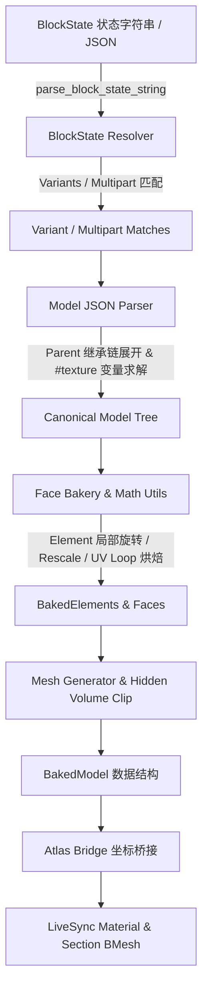

# 模块二：Minecraft 方块模型烘焙引擎 (MC Baker)

`utils/mc_baker/` 实现了 Minecraft 原生模型与 BlockState 的无头逆向解析与 3D 几何烘焙，将数据驱动的 Minecraft JSON 资产与 BlockState 状态机精准转化为标准的 Blender 3D 网格与原生 UV 映射。



---

## 1. BlockState 状态机与变体条件组合解析

### 1.1 状态字符串规范化解析 (`blockstate_resolver.py`)
- **函数**：[`parse_block_state_string(state_str)`](file:///Users/jaxlocke/Desktop/MoziToolKit/utils/mc_baker/blockstate_resolver.py#L20-L43)
- **输入示例**：`"minecraft:observer[facing=north,powered=false]"`
- **输出元组**：`("minecraft:observer", {"facing": "north", "powered": "false"})`
- 自动补充缺失的 `minecraft:` 命名空间，严格剥离属性方括号并解析为属性键值字典。

### 1.2 变体匹配机制 (Variants vs. Multipart)
1. **`variants`（单一变体映射）**：
   - 字典键可为精确属性匹配（如 `"facing=east,half=bottom,shape=straight"`）或空字符串 `""`（代表无条件默认模型）。
   - 解析器支持属性任意无序组合匹配，命中后提取对应的 `model`、`x`（X 轴旋转，通常为 $0, 90, 180, 270^\circ$）、`y`（Y 轴旋转）及 `uvlock` 布尔标记。
2. **`multipart`（复合多部件组装）**：
   - 处理栅栏（Fence）、墙体（Wall）、红石线（Redstone Wire）等根据周围 6 向邻居动态组合的模型。
   - 条件求值器支持：
     - **`OR` 条件列表**：`"when": {"OR": [{"north": "true"}, {"up": "true"}]}`，命中任一项即应用。
     - **`AND` 字典复合条件**：`"when": {"north": "low", "waterlogged": "false"}`，必须所有键值严格匹配。
     - **管道符多值匹配**：`"facing": "north|south"`。
     - **无条件部件**：无 `when` 字段的部件作为基础核心，始终被激活烘焙。

---

## 2. Block Model JSON 继承树与纹理变量求值

### 2.1 递归继承树展开 (`model_parser.py`)
- **Parent 继承链**：递归遍历 `parent` 模板（如 `block/cube` $\rightarrow$ `block/cube_column` $\rightarrow$ `block/block`）。
- **环路防护与深度上限**：维护 `visited` 集合，防止恶意的循环引用 JSON 引发 Python 递归栈溢出。
- **元素与贴图继承**：子模型优先使用自身定义的 `textures` 与 `elements`；若缺省则沿继承链向上回溯，直到基底父模板。

### 2.2 `#texture` 变量解析链与现代 1.21+ 格式兼容
- **变量求解算法**：递归解析 `#all` $\rightarrow$ `#side` $\rightarrow$ `minecraft:block/stone` 符号链。
- **1.21+ 对象贴图兼容**：不仅支持传统纯字符串路径，亦无缝解析 modern 1.21+ 字典结构：
  ```json
  {"sprite": "minecraft:block/oak_planks", "force_translucent": true}
  ```

### 2.3 内置特殊方块 Fallback (`obj_loader.py` & `BUILTIN_MODELS`)
对于原版中依赖实体渲染器（Block Entity Renderer）的无 JSON 静态模型方块（如钟 `bell`、箱子 `chest` 等），MC Baker 内置了标准几何定义与 OBJ Fallback 加载器，确保无需启动游戏即可烘焙出完整模型。

---

## 3. 几何变换数学模型与面烘焙 (`math_utils.py`)

### 3.1 坐标系归一化与原点对齐
- **Minecraft 坐标空间**：每个方块定义于 $[0, 16] \times [0, 16] \times [0, 16]$ 局域网格中。
- **归一化空间**：烘焙为 $[0.0, 1.0]$ 空间：
  $$(x', y', z') = \left(\frac{x}{16.0}, \frac{y}{16.0}, \frac{z}{16.0}\right)$$

### 3.2 局部 Element 旋转与 Rescale 缩放
- **旋转轴与角度**：支持沿 X / Y / Z 轴围绕 `origin` 点旋转 $\pm 22.5^\circ$ 或 $\pm 45^\circ$。
- **Rescale 几何保真计算**：
  若模型标记 `"rescale": true`，在对角线投影下为了保持像素等宽，顶点的垂直扩展因子为：
  $$S = \frac{1}{\cos(\theta)} = \sec(\theta)$$
  绕旋转轴正交平面应用该比例放大，完美还原原版 Minecraft 几何光影。

### 3.3 面朝向 Extents 与 UV Loop 映射
Minecraft 26.2 原版 `FaceInfo` 严格定义了 6 个面的标准顶点缠绕顺序（Winding Order）与 UV 顶点映射：
- **`down` (-Y)**: `[(MIN_X, MIN_Y, MAX_Z), (MIN_X, MIN_Y, MIN_Z), (MAX_X, MIN_Y, MIN_Z), (MAX_X, MIN_Y, MAX_Z)]`
- **`up` (+Y)**: `[(MIN_X, MAX_Y, MIN_Z), (MIN_X, MAX_Y, MAX_Z), (MAX_X, MAX_Y, MAX_Z), (MAX_X, MAX_Y, MIN_Z)]`
- **`north` (-Z)**: `[(MAX_X, MAX_Y, MIN_Z), (MAX_X, MIN_Y, MIN_Z), (MIN_X, MIN_Y, MIN_Z), (MIN_X, MAX_Y, MIN_Z)]`
- **`south` (+Z)**: `[(MIN_X, MAX_Y, MAX_Z), (MIN_X, MIN_Y, MAX_Z), (MAX_X, MIN_Y, MAX_Z), (MAX_X, MAX_Y, MAX_Z)]`
- **`west` (-X)**: `[(MIN_X, MAX_Y, MIN_Z), (MIN_X, MIN_Y, MIN_Z), (MIN_X, MIN_Y, MAX_Z), (MIN_X, MAX_Y, MAX_Z)]`
- **`east` (+X)**: `[(MAX_X, MAX_Y, MAX_Z), (MAX_X, MIN_Y, MAX_Z), (MAX_X, MIN_Y, MIN_Z), (MAX_X, MAX_Y, MIN_Z)]`

- **UV 翻转与旋转公式**：
  由于 Blender UV 坐标系原点位于左下角，而 Minecraft 模型 JSON UV 原点位于左上角：
  $$V_{blender} = 1.0 - V_{mc}$$
  若面指定了 `rotation: 90/180/270` 或 BlockState 施加了整体 `x`/`y` 旋转，通过 `calculate_uv_rotation` 执行顺时针顶点索引循环移位。

---

## 4. 内部重叠体积剔除与网格生成 (`mesh_generator.py`)

### 4.1 复合方块内部重合面裁剪 (`_face_pieces_excluding_hidden_volume`)
- **楼梯与多 Element 内部伪面问题**：在楼梯（Stairs）或复杂方块中，多个 Element 相互拼接时，各自底面或侧面会完全嵌入相邻 Element 内部。
- **2D 矩形求差集算法 (`_subtract_rect`)**：
  将重合面投影到轴对齐二维平面，与相邻外包围盒求几何差集：
  $$\text{Remainder} = \text{Rect}_{face} \setminus \text{Rect}_{neighbor}$$
  仅保留暴露在外的可见子面片，并按插值重构局部 UV，彻底消除模型内部多余的无效面与 Z-fighting 撕裂。

---

## 5. Atlas 图集桥接与全局缓存 (`atlas_bridge.py` & `state_baker.py`)

### 5.1 Atlas 坐标空间映射 (`AtlasBridge`)
- 通过 `AtlasAddressResolver` 将烘焙模型各面的贴图标识（`"minecraft:block/oak_planks"`）换算为全局 Atlas 的 Chunk 材质槽位索引（`chunk_id`）与归一化 UV 矩阵。
- 输出结构体 [`ResolvedAtlasFace`](file:///Users/jaxlocke/Desktop/MoziToolKit/utils/mc_baker/atlas_bridge.py#L14-L27) 包含：
  - `direction`: 对应 6 向面名称。
  - `material_id`: 目标材质槽位。
  - `tile_col` / `tile_row`: 图集瓦片行列索引。
  - `uv_bounds`: 局域裁剪包围盒。
  - `tint_index`: 生物群系染色索引。
  - `source_texture_key`: 来源贴图键。

### 5.2 全局 StateBaker 单例与发光方块识别
- **全局缓存**：`_GLOBAL_STATE_BAKER` 缓存所有已解析的 BlockState 网格几何，同一种方块变体在整个生命周期内仅烘焙一次。
- **发光特性判断 (`is_block_emissive`)**：
  根据内置 `EMISSIVE_BLOCKS` 白名单与 `lit=true` / `charges>0` / `power>0` 状态属性（如点亮的红石灯、充能的重生锚），精确标识网格的 `is_emissive` 属性与发光强度。

---

## 6. MC Baker 防回归不变量契约

> [!IMPORTANT]
> 1. **UV V轴翻转的一致性**：所有从 JSON 解析的 UV 坐标在构建到 Blender 面之前，必须严格执行 $1.0 - v$ 映射，严禁在未翻转状态下直接塞入 BMesh。
> 2. **Cullface 不得越界裁剪非共面表面**：只有当 Cullface 指定的方向与相邻方块物理相切共面时方可标记剔除，非满立方体（如台阶侧面）绝对不能误标记外层 Cullface。
> 3. **Multipart AND/OR 嵌套优先级**：Multipart 条件计算中，`OR` 列表内包含多个条件分支，任一分支满足即为 True；单分支内多键值必须同时满足（AND 关系）。
