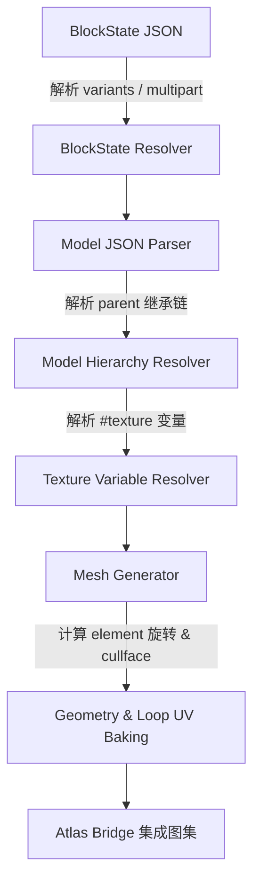

# 模块二：Minecraft 方块模型烘焙引擎 (MC Baker)

`utils/mc_baker/` 实现了 Minecraft 原生模型与 BlockState 的逆向解析与 3D 几何烘焙，将数据驱动的 Minecraft JSON 资产转化为标准 3D 网格。

## 1. Blockstate 变体与 Multipart 条件组合解析
- **`blockstate_resolver.py`**：
  - 支持 **`variants`（变体模式）**：例如楼梯根据 `facing=east,half=bottom,shape=straight` 选择对应的 3D 模型与 Y 轴旋转。
  - 支持 **`multipart`（复合模式）**：例如栅栏（Fence）和红石线，根据周围方块的连接条件（`when: {north: "true"}`）动态叠加组合多个模型组件（Elements）。

## 2. Block Model JSON 继承树、变量替换与几何生成
- **`model_parser.py`**：
  - **Parent 继承链展开**：递归解析 `block/cube`、`block/cube_column` 等父级模板，向下继承 `elements` 与 `textures`。
  - **纹理变量求值**：解析 `#side`、`#all`、`#texture` 等符号引用链，最终解析出实际的贴图命名空间与路径。

## 3. 剔除面 (Cullface)、UV 旋转与染色索引映射
- **`mesh_generator.py` & `math_utils.py`**：
  - **几何坐标系转换**：Minecraft 模型坐标系为 `[0..16, 0..16, 0..16]`，烘焙器将其规范化为 Blender 的米制中心坐标系 `[-0.5..0.5, -0.5..0.5, 0..1]`。
  - **Element 旋转计算**：支持 Minecraft 模型中围绕 `origin` 沿 X/Y/Z 轴进行的任意 $22.5^\circ$、$45^\circ$ 等角度旋转与 `rescale` 缩放变换。
  - **Cullface 标记生成**：保留各面的 `cullface` 属性（DOWN, UP, NORTH, SOUTH, WEST, EAST），供后续剔除合并算法使用。
  - **UV 映射与旋转**：根据模型中的 `uv: [u1, v1, u2, v2]` 与 `rotation: 90/180/270` 精确计算并分配每个面顶点的 UV Loop。

## 4. Baker 到 Atlas 图集桥接机制
- **`atlas_bridge.py`**：
  - 烘焙出的方块网格自动将其局域 UV 变换为图集纹理坐标，确保生成的方块网格能直接无缝融入全场景的统一 Atlas 材质中。

## 5. MC Baker 防回归不变量契约
> [!IMPORTANT]
> 1. **坐标系与原点对齐**：Minecraft `[0, 0, 0]` 为方块底面西北角，烘焙至 Blender 时必须保持中心对齐或底面原点对齐规则的一致性。
> 2. **Parent 递归深度防护**：解析 Model JSON 继承树时必须包含环路检测（Cycle Detection）与深度上限，防止畸形资源包导致无限递归崩溃。
> 3. **UV 坐标原点差异**：Minecraft 模型 UV 的 `(0, 0)` 位于左上角，而 Blender UV 的 `(0, 0)` 位于左下角，V 轴必须进行 $1.0 - v$ 的精确翻转。
