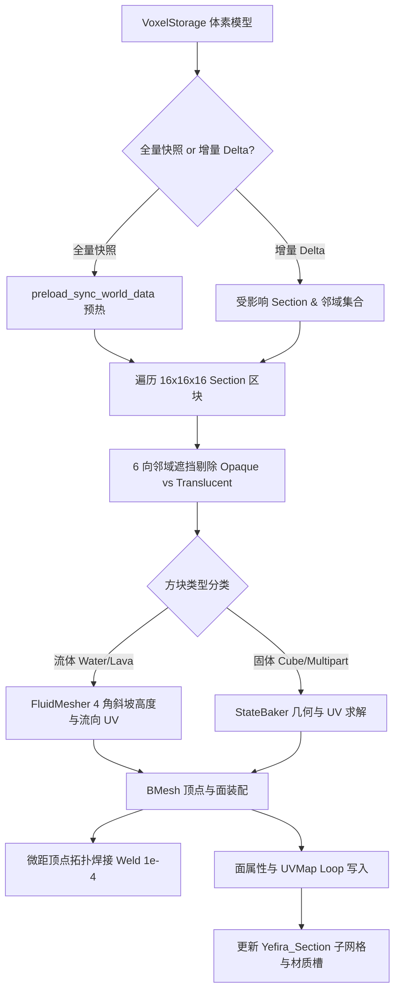

# 模块三：原生网格实时同步构建体系 (Direct Mesh Generation)

`utils/live_sync/mesh_builder.py` 构成了 MoziToolKit 实时同步的核心几何生成引擎。它彻底摒弃了依赖几何节点（Geometry Nodes）实例化点云的传统瓶颈，采用底层 BMesh 原生多边形构建技术，直接生成拓扑水密、法线平滑、带多图集插槽与原生面属性的 Blender 真实网格。

---

## 1. 16x16x16 Section 空间划分与坐标系映射

### 1.1 Section 分块层级容器管理
- **世界根节点**：场景中创建 Empty 空物体 `Yefira_World`，承载全局持久化属性与边界定义。
- **子区块网格**：世界空间按标准 Minecraft $16 \times 16 \times 16$ 体积块划分子网格物体：
  `Yefira_Section_{sec_x}_{sec_y}_{sec_z}`（其中 $\text{sec\_coord} = \text{abs\_coord} \gg 4$）。
- **空 Section 自动修剪**：当某 Section 内的方块全部被破坏（全为空气）时，系统自动销毁并从集合解绑该子物体，保证场景树的极致精炼。

### 1.2 Minecraft 与 Blender 空间坐标精确转换
Direct Mesh 采用中心对齐与 Y/Z 轴翻转投影，将 Minecraft 绝对方块坐标转化为以选区中心为基准的 Blender 场景坐标：
$$x_{blender} = x_{mc} - \text{half\_x}$$
$$y_{blender} = -(z_{mc} - \text{half\_z})$$
$$z_{blender} = y_{mc} - \text{min\_y} + 0.5$$
其中 $\text{half\_x} = \text{min\_x} + \frac{\text{size\_x}}{2.0}$，$\text{half\_z} = \text{min\_z} + \frac{\text{size\_z}}{2.0}$。

---

## 2. 6向邻域遮挡剔除 (Neighbor Culling) 与拓扑焊接

### 2.1 方块类型分类与剔除规则 (`classifier.py`)
每个方块被归类为 [`BlockTypeEnum`](file:///Users/jaxlocke/Desktop/MoziToolKit/utils/live_sync/classifier.py#L18-L25)：
1. **`OPAQUE`（不透明实心方块）**：
   - 石头、泥土、木板等。
   - 当相邻方块也是 `OPAQUE` 时，两个方块的接触面被 **100% 双向剔除**，不生成任何多边形。
2. **`TRANSPARENT`（半透明与镂空方块）**：
   - 玻璃、铁栏杆、树叶等。
   - 与 `OPAQUE` 邻居接触时，`OPAQUE` 面被遮挡剔除，但半透方块保留外表面；两个同类玻璃方块接触时可配置内部剔除。
3. **`NON_CUBE`（复杂非满方块）**：
   - 楼梯、台阶、栅栏、门、火把等。
   - 依据各自 `cullface` 属性及与邻居的共面性执行精确的局域面剔除。

### 2.2 拓扑微距焊接 (Weld Vertices)
- **焊接距离**：默认 $dist = 1.0 \times 10^{-4}$（$0.1\text{mm}$）。
- **拓扑收益**：将相邻方块生成的共面共点顶点自动缝合为流形网格。单个满方块仅 8 顶点 6 面；多个相连方块合并为水密轻量几何体，显存占用降低 60% 以上。

---

## 3. 流体动力学曲面重构 (`fluid_mesher.py`)

### 3.1 4角流体高度插值与斜坡重建
- **高度计算**：根据 `level` 属性计算方块基础高度：
  $$\text{Level } 0 \rightarrow \frac{8}{9},\quad \text{Level } 1..7 \rightarrow \frac{8 - \text{level}}{9},\quad \text{Falling (8..15)} \rightarrow \frac{8}{9}$$
- **4 角平滑插值**：对水方块的 4 个上表面角点，分别向其周围 $2 \times 2$ 邻域内的水体高度取平均值；遇到实体方块边界时使用 JMC2OBJ 边界算法（实体墙不拉低水面高度），形成平滑自然的水流斜坡。

### 3.2 水流方向向量与 UV 旋转
- 根据相邻方块的高度梯度计算流速向量 $\vec{D} = (\Delta X, \Delta Z)$：
  $$\theta_{flow} = \operatorname{atan2}(\Delta Z, \Delta X)$$
- 动态旋转顶面 UV 贴图坐标，使流水动态材质的纹理流动方向与 3D 几何下坡坡度完全对齐。

---

## 4. 毫秒级增量更新机制 (Incremental Delta Updates)

- **`apply_block_delta_to_world` 工作流**：
  1. 接收到方块单点放置/破坏事件（`PACKET_DELTA_UPDATE`）；
  2. 立即将修改写入内存 `VoxelStorage`；
  3. 将该方块所在的 Section 及其 6 向相交的邻居 Section（若位于边界 $x=0,15$ 等）标记为 Dirty；
  4. 局部调用 `_build_section_mesh` 针对 Dirty Section 重构 BMesh；
  5. 整体耗时稳定低于 **0.8 ~ 1.2 ms**，在 60FPS 视口下实现丝滑无感的实时同步。
- **动态复原 (Un-culling)**：破坏方块后，周围被掩盖的邻居面会被即刻重新生成并焊接进网格。

---

## 5. 原生多图集插槽与面属性注入 (Attributes Injection)

Direct Mesh 直接向 Blender 原生数据层写入渲染元数据，无需任何 Geometry Nodes 中间转换层：

| 属性名称 (Attribute Name) | 数据域 (Domain) | 类型 (Type) | 作用与着色器用途 |
| :--- | :--- | :--- | :--- |
| **`UVMap`** | Loop | 2D Float Vector | 原生标准 UV 层，已直接变换至目标 Atlas Chunk 归一化坐标。 |
| **`material_index`** | Face | Integer | 对应面绑定的 Atlas Chunk 材质槽（Chunk 0, Chunk 1...）。 |
| **`mtk_block_x/y/z`** | Face | 3x Float | 方块世界绝对整数坐标，供程序化噪声或着色器位移使用。 |
| **`mtk_face_dir`** | Face | Float | 面 6 向法线方向枚举索引（0=East, 1=West, 2=Up, 3=Down, 4=South, 5=North）。 |
| **`mtk_biome_tint_color`** | Face / Loop | Color (RGBA) | 生物群系双线性插值烘焙的漫反射染色（草地绿、树叶绿、水体蓝）。 |
| **`mtk_anim_timing`** | Face | 2D Float | 动画帧率与总帧数元数据（驱动着色器逐帧跳跃）。 |
| **`mtk_source_texture_key`** | Face | String | 来源贴图键（如 `minecraft:block/stone`），支持无损材质替换与逆向材质恢复。 |

---

## 6. Direct Mesh 防回归不变量契约

> [!IMPORTANT]
> 1. **坐标系 Y/Z 翻转与中心偏移**：Blender $Y$ 对应 Minecraft $-Z$，Blender $Z$ 对应 Minecraft $+Y$，计算顶点时必须维持此刚性映射。
> 2. **Delta 更新边界 Section 同步刷新**：在方块位于 Section 边缘（$0$ 或 $15$）时，放置/破坏操作必须同时将跨界相邻 Section 标记为 Dirty 并重构，否则跨区块边界的面剔除状态会出现残留黑面或孔洞。
> 3. **BMesh 材质插槽索引安全约束**：向面赋予 `bm_face.material_index` 前，必须确保目标物体材质槽数量已扩充至包含该 `chunk_id`，防止越界崩溃。
