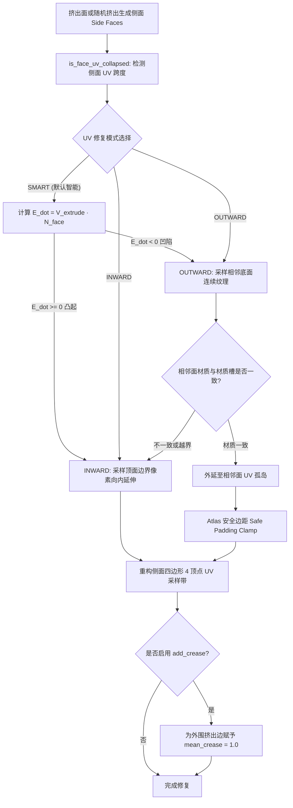

# 模块五：智能挤出与 UV 修复系统 (Auto Extrude Repair & Modeling)

- **对应 Operator**：
  - `mozi.auto_extrude_repair` ([`operators/mesh/op_auto_extrude_repair.py`](file:///Users/jaxlocke/Desktop/MoziToolKit/operators/mesh/op_auto_extrude_repair.py))
  - `mozi.random_extrude` ([`operators/mesh/op_random_extrude.py`](file:///Users/jaxlocke/Desktop/MoziToolKit/operators/mesh/op_random_extrude.py))
- **核心实现模块**：`utils/extrude_repair/` ([`core.py`](file:///Users/jaxlocke/Desktop/MoziToolKit/utils/extrude_repair/core.py), [`uv_analyzer.py`](file:///Users/jaxlocke/Desktop/MoziToolKit/utils/extrude_repair/uv_analyzer.py), [`types.py`](file:///Users/jaxlocke/Desktop/MoziToolKit/utils/extrude_repair/types.py))、`utils/mesh/random_extrude.py`

---

## 1. 侧面 UV 塌陷成因与修复几何学

### 1.1 塌陷物理成因 (Collapsed Side UVs)
在 Blender 中对面执行挤出（`bmesh.ops.extrude_discrete_faces` 或标准 Extrude）时，新生成的侧面多边形（Side Faces）默认直接继承挤出前底面边缘的 UV 坐标。这导致侧面在沿挤出法线方向的 UV 跨度完全为 0（即在 UV 空间退化为一条线），渲染时侧面呈现严重的拉伸与条纹伪影。

### 1.2 拓扑配对与顶点绕序规范
对于每个生成的侧面四边形，算法将其 4 个顶点严格分为：
- `v_base_a`、`v_base_b`：位于挤出基底的两个顶点。
- `v_top_b`、`v_top_a`：沿法线挤出的顶面对应顶点。
- UV 赋予必须遵循与面法线完全一致的逆时针缠绕顺序，确保侧面法线朝外。

---

## 2. 三种 UV 修复模式的判定与采样机制

### 2.1 `SMART`（智能模式 - 默认与生产推荐）
- **有符号投影判据**：
  计算挤出位移向量 $\vec{V}_{extrude}$ 与顶面原法线 $\vec{N}_{face}$ 的点积：
  $$E_{dot} = \vec{V}_{extrude} \cdot \vec{N}_{face}$$
- **分支行为**：
  - 若 $E_{dot} \ge -10^{-6}$（**向外凸起 Protrusion**）：自动进入 `INWARD` 模式，侧面取样自顶面边缘向内微距延伸的像素。
  - 若 $E_{dot} < -10^{-6}$（**向内凹陷 Indentation**）：自动进入 `OUTWARD` 模式，侧面取样自相邻底面连续延伸的纹理。

### 2.2 `INWARD`（向内采样模式 - 独立像素立体块）
- **采样算法**：
  在顶面边缘的 UV 坐标基础上，沿垂直于该边向面内中心的法线方向位移 0.1 个像素步长：
  $$\vec{UV}_{top} = \vec{UV}_{base} + \vec{UV}_{inward\_dir} \times (0.1 \times \text{PixelStep})$$
- **视觉效果**：侧面完美继承顶面边缘的对应颜色，使得挤出生成的体素小方块具有立体一致的质感。

### 2.3 `OUTWARD`（向外采样模式 - 连续地表凹槽）
- **采样算法**：
  跨越底边进入相邻面（`adjacent_face`）的 UV 孤岛内部采样。
- **材质一致性校验**：
  系统严格检查 `adjacent_face.material_index == top_face.material_index`。若相邻面属于不同方块材质，立即安全回退为 `INWARD` 采样，防止不同方块之间产生花屏混色。

---

## 3. Atlas 图集安全裁剪 (Safe Padding Clamp)

在图集贴图（Atlas）环境中，若在 `OUTWARD` 模式下外延采样未受控制，UV 很容易跨出该方块瓦片的边界，采样到相邻瓦片的杂乱像素。
- **安全边界裁剪模型**：
  提取相邻面的 UV 局部包围盒 `[min_u, max_u, min_v, max_v]`，并施加基于像素步长（`PixelStep`）的安全边距 Padding：
  $$\text{Safe\_Min}_u = \min(u) + \operatorname{Pad}_u,\quad \text{Safe\_Max}_u = \max(u) - \operatorname{Pad}_u$$
  $$\text{Safe\_Min}_v = \min(v) + \operatorname{Pad}_v,\quad \text{Safe\_Max}_v = \max(v) - \operatorname{Pad}_v$$
  将侧面生成的所有 UV 坐标严格 Clamp 在安全矩形内，彻底杜绝 Atlas 跨界溢色。

---

## 4. 边缘折痕保护 (Mean Crease Protection)

- **`add_crease` 与 `crease_val`**（默认 `1.0`）：
  遍历所有挤出顶面的外轮廓边界边，将其 `edge.crease` 或 `mean_crease` 赋予 `1.0`。
- **设计价值**：当用户为模型添加细分曲面（Subdivision Surface）或倒角（Bevel）修改器时，像素方块的硬朗边缘不会被坍塌抹平，依然保持 Minecraft 标志性的清晰几何棱角。

---

## 5. 随机挤出生成器 (`utils/mesh/random_extrude.py`)

- **功能特性**：一键对选中的所有面沿各自法线以离散/连续随机高度批量独立挤出，并无缝串联 UV 修复与 Crease 标记。
- **三种噪波高度生成算法**：
  1. **`RANDOM`（均匀分布）**：标准独立伪随机数生成，呈现破碎参差的高低差。
  2. **`PERLIN`（3D 空间连续柏林噪声）**：
     基于顶点 3D 世界坐标采样柏林噪声：
     $$\text{Pos} = (P_{centerMedian} + \vec{SeedVec}) \times \text{NoiseScale}$$
     呈现起伏连绵的梯田或波浪地貌。
  3. **`CELL`（细胞网格噪声）**：
     基于空间离散网格采样 Voronoi 细胞噪波，呈现平整分块的石砖与浮雕地表。

---

## 6. 挤出修复防回归不变量契约

> [!IMPORTANT]
> 1. **Atlas 边界 Clamp 严禁移除**：在优化 UV 计算时，绝对不能移除针对 `adjacent_face` 的 UV bounds safe padding clamp，否则在图集材质下凹陷面侧面必定出现花屏。
> 2. **法线点积阈值稳定性**：Smart 模式下的方向点积判据必须使用浮点安全阈值（`-1e-6`），防止共面或微小数值波动导致模式跳跃。
> 3. **Crease 仅赋予外边界边**：折痕权重只能赋给挤出顶面的外轮廓边界边，绝对不能赋给相邻侧面之间的垂直拼接边，以免影响侧面平滑法线。
