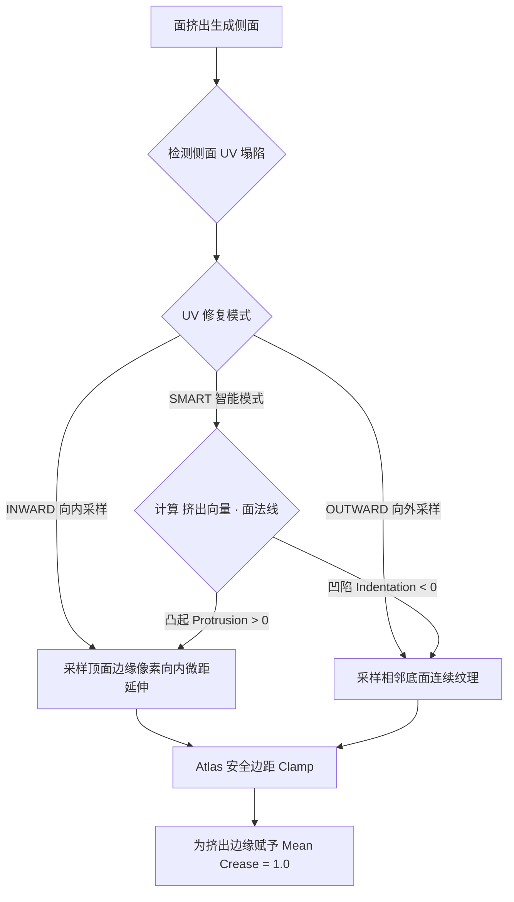

# 模块五：智能挤出与 UV 修复系统 (Auto Extrude Repair & Modeling)

- **对应 Operator**：`mozi.auto_extrude_repair` (`operators/mesh/op_auto_extrude_repair.py`)、`mozi.random_extrude` (`operators/mesh/op_random_extrude.py`)
- **核心实现模块**：`utils/extrude_repair/` (`core.py`, `uv_analyzer.py`, `types.py`)、`utils/mesh/random_extrude.py`

## 1. 侧面 UV 塌陷成因与 UV 几何映射数学
- **核心痛点**：在 Blender 中挤出（Extrude）面时，新生成的侧面默认继承挤出前的边缘 UV，导致侧面 UV 高度为 0（UV 塌陷拉伸成一条线）。
- **几何修复原理**：
  算法识别出挤出的顶面（Top Face）与生成的侧面（Side Faces）。对于每个侧面，根据其底边顶点与顶边顶点的对应关系，在 UV 空间中重构一条具有物理宽度的 UV 采样带。

## 2. 三种 UV 修复模式 (Smart / Inward / Outward) 的语义与边界
1. **`SMART`（智能模式 - 默认推荐）**：
   - 计算挤出向量与原面法线的点积：$E_{dot} = \vec{V}_{extrude} \cdot \vec{N}_{face}$。
   - $E_{dot} \ge 0$（向外凸起）：自动采用 `INWARD` 模式，侧面取样自顶面边缘。
   - $E_{dot} < 0$（向内凹陷）：自动采用 `OUTWARD` 模式，侧面取样自相邻外周面。
2. **`INWARD`（向内模式 - Minecraft 经典像素挤出）**：
   - 侧面 UV 取样自顶面边界向内延伸 0.1 个像素步长的颜色。保证挤出后的体素立体块侧面与顶面边缘像素保持完全一致的色调，绝无杂色。
3. **`OUTWARD`（向外模式 - 连续地表凹陷）**：
   - 侧面 UV 跨越到相邻面的 UV 孤岛中取样，呈现与背景地表连续的侧面纹理。

## 3. Atlas 图集相邻面防跨界安全 Clamp 机制
- 在 `OUTWARD` 模式下，如果相邻面位于 Atlas 图集的其他区域，无限制外延采样会导致采样到无关方块贴图。
- **安全机制**：
  1. **材质一致性校验**：`adjacent_face.material_index == top_face.material_index`，材质不匹配时立即终止外延。
  2. **UV Bounds 安全边界裁剪**：严格将侧面生成的 UV 坐标限制在相邻面 UV Bounding Box 内部（带安全 Padding），彻底杜绝跨图集溢色。

## 4. 边缘折痕权重 (Mean Crease) 保护
- 挤出完成后，算子自动遍历挤出边界边（Boundary Edges），将其 `mean_crease` 属性设置为 `1.0`（或用户指定值）。
- **设计意图**：当模型添加细分曲面修改器（Subdivision Surface）进行平滑倒角时，被挤出的硬朗像素方块边缘不会塌陷变形。

## 5. 随机挤出 (Random Extrude) 噪声算法与工作流串联
- **功能特性**：
  - 针对选中的面，沿其法线以随机高度批量独立挤出。
  - 提供三种高度生成算法：
    - **Uniform**：基于随机种子的均匀分布随机数。
    - **Perlin Noise**：基于顶点 3D 世界坐标的空间连续噪声（呈现平滑波浪起伏）。
    - **Cell Noise**：基于离散网格的细胞噪波（呈现阶梯状石砖起伏）。
  - **管线串联**：随机挤出完成后，无缝自动调用 `Auto Extrude Repair` 算法完成侧面 UV 修复与 Crease 标记，实现一键生成浮雕地貌。

## 6. 挤出修复防回归不变量契约
> [!IMPORTANT]
> 1. **侧面拓扑配对顺序**：侧面四边形的 4 个顶点索引必须严格区分为 `Base A`, `Base B`, `Top B`, `Top A`，UV 赋予顺序必须保持逆时针绕序一致，禁止法线翻转。
> 2. **Atlas 边界 Clamp 不可去除**：在优化 UV 计算时，绝不能移除对 `adjacent_face` 的 UV bounds padding clamp，否则图集贴图必定在侧面出现花屏。
