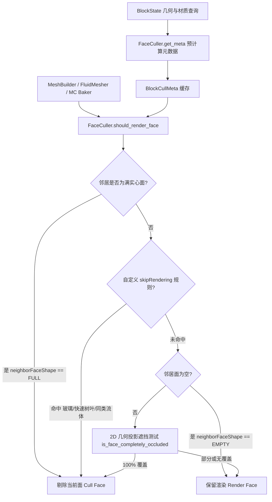

# 面剔除系统 (Unified Face Culling System)

MoziToolKit 的面剔除系统（`utils.culling`）为实时同步（Live Sync）和模型烘焙（MC Baker）提供对齐 Minecraft 1.21+ 原版规范的高性能 6 向邻域遮挡剔除与 2D 几何投影裁剪。

---

## 1. 架构总览

面剔除系统基于 Minecraft 原版底层 `Block.shouldRenderFace` 与 `BlockBehaviour.skipRendering` 逆向算法设计，统一了实时同步区块构建、流体曲面重建及离线网格烘焙的面可见性判定。



---

## 2. 原版 Minecraft 机制对齐

在 Minecraft 原版（反编译自 Fabric 1.21+ 原版 JAR）中，面剔除的核心逻辑分为三层：

### 2.1 基础遮挡判定 (`Block.shouldRenderFace`)
```java
public static boolean shouldRenderFace(BlockState state, BlockState neighborState, Direction face) {
    VoxelShape neighborFaceShape = neighborState.getFaceOcclusionShape(face.getOpposite());
    if (neighborFaceShape == Shapes.block()) {
        return false; // 邻居是完整实心面 -> 剔除
    }
    if (state.skipRendering(neighborState, face)) {
        return false; // 自定义跳过渲染规则
    }
    if (neighborFaceShape == Shapes.empty()) {
        return true;  // 邻居面无遮挡 -> 渲染
    }
    VoxelShape stateFaceShape = state.getFaceOcclusionShape(face);
    if (stateFaceShape == Shapes.empty()) {
        return true;
    }
    // 2D 形状布尔差集: state 形状减去 neighbor 形状是否非空
    return Shapes.joinIsNotEmpty(stateFaceShape, neighborFaceShape, BooleanOp.ONLY_FIRST);
}
```

---

## 3. 核心方块分类与剔除规则

系统将所有方块状态映射为 [`CullCategory`](../../utils/culling/types.py)：

### 3.1 SOLID_OPAQUE (实心不透明方块)
- **典型方块**：石头、泥土、木板、深层岩、圆石等。
- **规则**：
  - 6 个方向均具备满面遮挡（`full_face_mask = 0b111111`）。
  - 两块相邻的实心方块接触面 **双向剔除**。
  - 接触玻璃、树叶、流体或空气时，实心面 **正常渲染**。

### 3.2 GLASS_TRANSLUCENT (玻璃与半透明方块)
- **典型方块**：普通玻璃、16色染色玻璃、遮光玻璃、冰、蓝冰、粘液块、蜂蜜块、细雪。
- **规则**：
  - **同类/同组接触**：`skipRendering = True`，互相剔除内部接触面，避免多层半透重叠。
  - **接触实心方块**：由于实心方块具有完整遮挡，玻璃方块 **剔除贴合面**（不向实心石头内部多画一层无用的玻璃）；而实心方块由于玻璃无遮挡，**正常渲染其实体面**（玩家透过玻璃能正常看到石头表面）。
  - **染色玻璃模式**：
    - `GlassCullMode.GROUP`（默认）：所有玻璃（无色及各色染色玻璃）之间均互相剔除内表面。
    - `GlassCullMode.SAME_BLOCK`（原版严格模式）：仅同颜色玻璃之间剔除，不同颜色玻璃之间保留分界面。

### 3.3 CUTOUT_LEAVES (透空树叶方块)
- **典型方块**：橡树树叶、白桦树叶、丛林树叶、金合欢树叶、红树林树叶、杜鹃树叶等。
- **规则**：
  - **Single-Face 模式 (`LeavesCullMode.SINGLE_FACE`，默认)**：同类树叶接触时，根据世界坐标确定性仅保留一面，消除 Z-fighting 与双重面开销，同时保持树叶内部充实不空洞。
  - **Fancy 模式 (`LeavesCullMode.FANCY`)**：同类树叶接触 `skipRendering = False`，保留内部双向叶片多边形。
  - **Fast 模式 (`LeavesCullMode.FAST`)**：同类树叶接触时完全互相剔除，表现为不透明外壳。
  - **接触实心方块（原木/石头）**：叶片贴合面被实心方块完全剔除。

### 3.4 PARTIAL_SHAPE (局部与非满方块)
- **典型方块**：台阶（Slab）、楼梯（Stairs）、活板门（Trapdoor）、地毯（Carpet）、雪层（Snow Layer）、铁栏杆（Iron Bars）、栅栏（Fence）、墙（Wall）。
- **规则**：
  - 系统提取 3D 构件在 6 个外边界面的 2D 矩形投影（`FaceOcclusionRect`），并在无显式模型时基于方块属性（如 `layers`、连接朝向）推导参数化外形。
  - **积雪相互剔除**：铺地同高度积雪之间，侧面接触的 2D 矩形完全重合覆盖，接触侧面相互剔除；与顶点焊接（Vertex Welding）配合后生成完美连续的流形曲面，彻底消除次表面散射（SSS）计算导致的黑缝。
  - **铁栏杆与栅栏截面剔除**：相连的铁栏杆与栅栏在方块边界延伸出的横梁端部带有 `cullface`，相接时 2D 投影 100% 覆盖并相互剔除，消除两方块交界面处的黑色叠面与 Z-fighting。
  - **接触实心方块**：
    - 下半台阶或积雪底面贴合实心方块时，贴合底面被实心方块完全剔除；
    - **积雪覆盖下的实心方块**：实心方块（如草方块、石头）顶面被积雪完全覆盖时（`direction == 'up'`），顶面被剔除，使积雪外侧面与实心方块侧面在顶点焊接（Vertex Welding）下缝合为连续无缝的 2-流形曲面，彻底消除雪地接触处的 T-junction 非流形暗缝；
    - 其它非完整方块（如栅栏、铁栏杆、地毯、活板门等）上方的接触面：实心方块顶面保持渲染，避免出现镂空。
  - 模型的非外接表面（如火把棍、花草十字交叉面、箱子盖等）永不剔除。

### 3.5 FLUID (流体水与岩浆)
- **典型方块**：水、流动水、岩浆、流动岩浆。
- **规则**：
  - 相同流体类型之间接触时，接触面互相剔除。
  - 流体接触实心底面与侧面时，贴实心方块的流体面被剔除。
  - 流体顶面在上方有同类流体时被剔除。

---

## 4. API 快速上手

```python
from utils.culling import get_shared_face_culler, LeavesCullMode, GlassCullMode

# 获取共享面剔除引擎
culler = get_shared_face_culler(
    leaves_cull_mode=LeavesCullMode.FANCY,
    glass_cull_mode=GlassCullMode.GROUP,
)

# 获取方块状态剔除元数据
meta_stone = culler.get_meta("minecraft:stone")
meta_glass = culler.get_meta("minecraft:glass")
meta_leaves = culler.get_meta("minecraft:oak_leaves")

# 评估面可见性 (True = 渲染, False = 剔除)
render_stone = culler.should_render_face(meta_stone, meta_glass, direction="east") # True (石头面对玻璃可见)
render_glass = culler.should_render_face(meta_glass, meta_stone, direction="west") # False (玻璃面对石头剔除)
```

---

## 5. 性能指标

- **元数据缓存**：内置 LRU 状态元数据缓存，单次方块状态分类与 6 面投影计算耗时 $< 0.5\,\mu\text{s}$。
- **位掩码快速路径**：满实心方块及空气方块通过 6-bit 掩码快速短路返回，无需执行 2D 矩形计算。
- **实时同步增量基准**：在 20 次随机方块破坏/放置的连续压力测试中，单次编辑完整更新网格并完成 6 向面剔除的平均耗时稳定在 **0.816 ms**。
