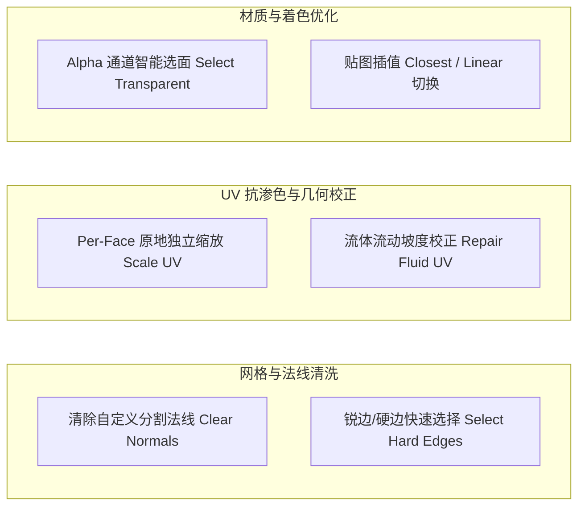

# 模块六：网格与 UV 实用工具集 (Mesh & UV Utilities)

MoziToolKit 提供了一套专为 Minecraft 与体素几何资产优化的原生编辑与清洗工具集，深度解决外部地图导出器（jmc2obj、Mineways、Blockbench 等）引入的脏法线、UV 渗色、流体倒置与透明面冗余问题。

---

## 1. 清除自定义分割法线 (Clear Custom Normals)

- **对应 Operator**：`mozi.clear_custom_normals` ([`operators/mesh/op_clear_custom_normals.py`](file:///Users/jaxlocke/Desktop/MoziToolKit/operators/mesh/op_clear_custom_normals.py))
- **设计背景与核心价值**：
  - 从外部工具导入的 OBJ/FBX 模型往往携带残留的 `custom_normal` 数据层或损坏的 Split Normals。这会导致在 Blender 中即便开启 Auto Smooth，模型表面依然出现发黑的阴影断层或反向光照。
- **底层执行流程**：
  1. 遍历选中的 Mesh 物体；
  2. 若物体存在 `mesh.attributes["custom_normal"]`，安全移除该属性层；
  3. 执行 `bpy.ops.mesh.customdata_custom_splitnormals_clear()`，彻底清除破损法线缓存；
  4. 重置标准面法线与平滑顶点法线，使材质法线贴图（Normal Map）能够 100% 正确计算。

---

## 2. 锐边与硬边选择 (Select Hard & Sharp Edges)

- **对应 Operator**：`mozi.select_hard_edges` ([`operators/mesh/op_select_edges.py`](file:///Users/jaxlocke/Desktop/MoziToolKit/operators/mesh/op_select_edges.py))
- **算法与参数**：
  - **`sharp_angle`**（默认 $30.0^\circ$）：二面角（Dihedral Angle）判定阈值。
  - **多重硬边检测判据 (`is_hard_edge`)**：
    1. **边界边（Boundary Edges）**：仅连接 1 个面的开边界边（`len(edge.link_faces) == 1`）；
    2. **标记锐边（Sharp Flag）**：已显式标记 `edge.smooth == False` 的边；
    3. **二面角超标**：连接 2 个面且两面法线夹角 $\theta > \text{sharp\_angle}$ 的边。
- **应用场景**：一键批量选中所有机械与方块转折边，便于后续统一赋予 `mark_seam`（缝合边）或设置倒角权重（Bevel Weight）。

---

## 3. UV 原地独立缩放 (Scale UV Faces - 边缘抗渗色)

- **对应 Operator**：`mozi.scale_uv` ([`operators/uv/op_scale_uv.py`](file:///Users/jaxlocke/Desktop/MoziToolKit/operators/uv/op_scale_uv.py))
- **核心数学与抗渗色原理**：
  - 在低分辨率像素贴图（如 $16 \times 16$）渲染时，GPU 纹理过滤（Mipmap 或 Bilinear 采样）常导致边界顶点采样到贴图边缘外的黑色背景或相邻像素，产生黑色接缝线（Seam Bleeding）。
- **原地独立向心缩放算法**：
  对于网格中的每个选定面 $F_i$，独立计算其自身的 UV 几何多边形中心：
  $$C_{uv} = \frac{1}{N} \sum_{k=1}^N \vec{UV}_k$$
  对该面的每个顶点 UV 进行向心独立微距缩放：
  $$\vec{UV}'_k = C_{uv} + (\vec{UV}_k - C_{uv}) \times \text{ScaleFactor}$$
- **参数推荐**：
  - `scale_factor = 0.8`：明显收缩，适用于特定像素风格隔离。
  - `scale_factor = 0.999`：微距收缩，视觉无感但彻底消除亚像素浮点溢色。
  - **`selection_scope`**：支持 `AUTO`（有选区缩选区，无选区缩全量）、`SELECTED`、`ALL`。

---

## 4. 修复流体 UV (Repair Fluid UV)

- **对应 Operator**：`mozi.repair_fluid_uv` ([`operators/uv/op_repair_fluid_uv.py`](file:///Users/jaxlocke/Desktop/MoziToolKit/operators/uv/op_repair_fluid_uv.py))
- **问题成因**：
  Minecraft 流动水体和岩浆具有梯级斜面几何（如 8 级水流斜坡）。地图导出工具生成的斜面侧面 UV 经常出现上下颠倒、90 度旋转错位或横向拉伸。
- **校正算法 (`utils/mesh/fluid_uv.py`)**：
  1. 计算斜面在 3D 空间中的最大下坡梯度向量（Downhill Gradient）；
  2. 分析面 UV 在 2D 贴图空间的延伸方向；
  3. 对 Loop UV 执行矩阵旋转与 V 轴翻转校正，确保动态流水贴图流动方向与几何斜坡完全同向。

---

## 5. 基于贴图 Alpha 通道智能选面 (Select Transparent Faces)

- **对应 Operator**：`mozi.select_transparent_faces` ([`operators/uv/op_select_transparent_faces.py`](file:///Users/jaxlocke/Desktop/MoziToolKit/operators/uv/op_select_transparent_faces.py))
- **核心功能**：
  针对树叶、草丛或镂空模型中全透明的无效几何面片进行快速筛选与清理。
- **参数与多模式采样**：
  - **`alpha_threshold`**（默认 `0.01`）：小于等于此阈值的像素判定为透明。
  - **`sample_mode`**：
    - `CENTER`：采样面 UV 几何中心点单个像素的 Alpha 值。
    - `ALL_CORNERS`：采样 4 个角点与中心点，**全部**低于阈值才判定为透明。
    - `AVERAGE`：在面 UV 包围盒范围内进行网格多点采样，计算平均 Alpha。
  - **`selection_mode`**：`SET`（新建选择）、`ADD`（加选）、`SUBTRACT`（减选）。

---

## 6. 纹理插值模式一键切换 (Texture Interpolation: Closest / Linear)

- **对应 Operator**：`mozi.set_texture_interpolation_closest` ([`operators/object/op_texture_interpolation.py`](file:///Users/jaxlocke/Desktop/MoziToolKit/operators/object/op_texture_interpolation.py))
- **执行逻辑**：
  - 递归遍历选定物体所有材质节点树（包含嵌套的 NodeGroup 节点组内部）。
  - 批量将所有 `ShaderNodeTexImage` 图像纹理节点的 `interpolation` 属性统一设置为 `Closest`（像素风锐利）或 `Linear`（平滑过滤）。

---

## 7. 工具集防回归不变量契约

> [!IMPORTANT]
> 1. **Scale UV 的独立性**：绝对禁止按物体全局 UV 中心缩放选区，必须每个 Face 独立计算局域中心 $C_{uv}$。
> 2. **Clear Custom Normals 的拓扑无损性**：清理法线算子仅清除 Split Normal 属性层，严禁触碰顶点位置或 UVMap。
> 3. **Alpha 采样性能**：采样贴图像素时优先使用内存 NumPy 缓存，避免对同一图像重复执行耗时的磁盘 I/O。
