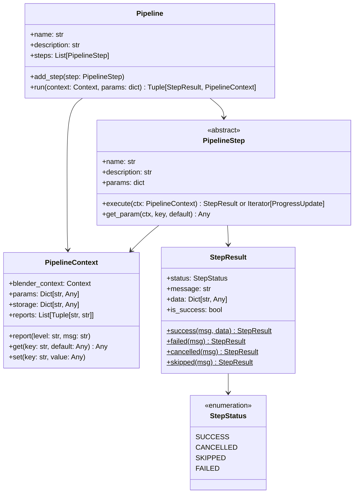

# 模块七：模块化流水线系统 (Modular Step Pipeline)

MoziToolKit 采用高度解耦的微内核流水线架构，所有复杂功能均拆解为标准化的原子步骤（`PipelineStep`），支持独立 Operator 触发、非阻塞 Modal Timer 步进调度及多步骤编排。

- **核心实现模块**：`pipeline/` ([`pipeline.py`](file:///Users/jaxlocke/Desktop/MoziToolKit/pipeline/pipeline.py), [`step.py`](file:///Users/jaxlocke/Desktop/MoziToolKit/pipeline/step.py), [`context.py`](file:///Users/jaxlocke/Desktop/MoziToolKit/pipeline/context.py), [`progress.py`](file:///Users/jaxlocke/Desktop/MoziToolKit/pipeline/progress.py), [`modal.py`](file:///Users/jaxlocke/Desktop/MoziToolKit/pipeline/modal.py), [`presets/presets.py`](file:///Users/jaxlocke/Desktop/MoziToolKit/pipeline/presets/presets.py))



---

## 1. Step ↔ Context ↔ Pipeline 契约模型

### 1.1 `PipelineContext` 运行时上下文
- **`blender_context`**：持有当前原生 Blender 上下文（`bpy.context`）。
- **`params`**：由 Operator 或 Preset 传入的配置参数字典（只读输入）。
- **`storage`**：跨 Step 共享数据的线程安全字典（供前置步骤向后置步骤传递中间结果，如解包路径、材质映射表等）。
- **`reports`**：结构化诊断报告收集器：
  ```python
  ctx.report("INFO", "Processed 128 faces successfully.")
  ctx.report("WARNING", "Texture not found, falling back to vanilla bedrock.")
  ```
  在 Pipeline 结束时统一分发给 Blender 消息报告系统 `self.report({level}, msg)`。

### 1.2 `PipelineStep` 原子步骤基类
- 步骤继承自 [`PipelineStep`](file:///Users/jaxlocke/Desktop/MoziToolKit/pipeline/step.py#L49-L80)，实现 `execute(self, ctx: PipelineContext)`。
- **生成器支持 (Progress Streaming)**：`execute` 可以返回单个 `StepResult`，亦可使用 `yield ProgressUpdate(...)` 流式返回执行进度，支持粒度到单方块的实时进度汇报。

### 1.3 `StepResult` 与 `StepStatus` 状态机
- **`StepStatus.SUCCESS`**：步骤成功完成，Pipeline 自动步进至下一步。
- **`StepStatus.FAILED`**：步骤异常失败，Pipeline 立即终止，并回滚或保留诊断日志。
- **`StepStatus.CANCELLED`**：用户通过 Modal 界面按 `ESC` 键安全取消。
- **`StepStatus.SKIPPED`**：条件不满足（如不需要烘焙法线通道）时主动跳过。

---

## 2. 非阻塞 Modal Timer 交互与响应式 UI (`modal.py`)

- **设计痛点**：大型材质栈烘焙（解压 500MB+ 材质包、生成 4K 图集）或海量多边形细分会阻塞 Blender 主线程，导致操作系统判定界面无响应（Spinning Wheel）。
- **Modal Timer 驱动机制**：
  1. 通过 `bpy.ops.wm.modal_timer_operator` 在主线程注册高频 Timer 回调（如 50ms）；
  2. 每一帧 Timer 触发时，Pipeline 执行一个迭代步进（`step.execute` 的一段子任务）；
  3. 在 3D View 顶部绘制半透明进度条（Progress Bar）、当前步骤名称与百分比；
  4. 支持监听用户 `ESC` 键盘事件，在两个 Step 的边界安全释放临时资源并优雅退出。

---

## 3. 预设流水线注册表 (Preset Pipelines Registry)

MoziToolKit 在 [`pipeline/presets/presets.py`](file:///Users/jaxlocke/Desktop/MoziToolKit/pipeline/presets/presets.py) 中预注册了全部核心功能的预设流水线：

| Preset Key | 包含原子步骤 | 主要用途 |
| :--- | :--- | :--- |
| **`adaptive_pixel_split`** | `AdaptivePixelSplitStep` | 基于有效像素分辨率的四边形自适应切分 |
| **`auto_extrude_repair`** | `AutoExtrudeRepairStep` | 挤出侧面 UV 塌陷智能修复与 Crease 保护 |
| **`clear_custom_normals`** | `ClearCustomNormalsStep` | 清理外部损坏的 Split Normals 与法线层 |
| **`random_extrude`** | `RandomExtrudeStep` | 随机法线高度挤出并自动串联 UV 修复 |
| **`select_hard_edges`** | `SelectHardEdgesStep` | 二面角与锐边标记过滤快速选边 |
| **`scale_uv`** | `ScaleUVStep` | Per-face 独立 UV 几何中心向心微距缩放抗渗色 |
| **`select_transparent_faces`**| `SelectTransparentFacesStep` | Alpha 贴图像素智能透光选面 |
| **`replace_material`** | `StepReplaceMaterial` | 资源包分层解析、图集烘焙与场景材质无损替换 |
| **`repair_fluid_uv`** | `RepairFluidUVStep` | 斜坡流体 UV 旋转与流动方向几何校正 |
| **`set_texture_interpolation_closest`** | `TextureInterpolationStep` | 一键切换材质节点图为 Closest 锐利像素模式 |

---

## 4. 流水线防回归不变量契约

> [!IMPORTANT]
> 1. **步骤执行幂等与状态隔离**：任何 `PipelineStep` 均不得将全局可变状态保存在类变量中，所有运行时数据必须存入 `PipelineContext.storage`。
> 2. **Modal Timer 取消时安全性**：若用户按下 `ESC` 取消流水线，正在写入的文件流必须妥善 `close()`，已构建的临时 BMesh 必须安全 `free()`，严禁发生内存泄漏。
> 3. **统一诊断分发**：所有用户可见的提示与警告必须通过 `ctx.report()` 收集，禁止在 Step 内部直接粗暴 print 或跳过汇报。
