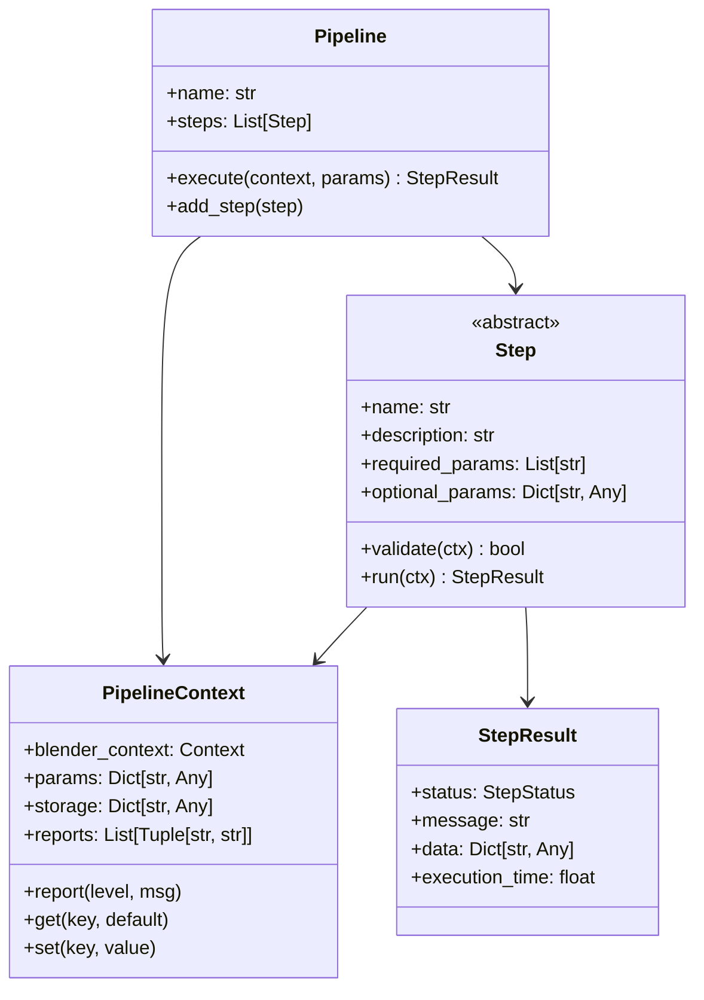

# 模块七：模块化流水线系统 (Modular Step Pipeline)

- **核心模块**：`pipeline/` (`pipeline.py`, `step.py`, `context.py`, `progress.py`, `modal.py`, `presets/presets.py`)

## 1. Step ↔ Context ↔ Pipeline 契约模型
MoziToolKit 采用高度解耦的流水线架构，所有复杂功能均拆解为原子步骤（Step）：

## 2. 结构化执行结果 (StepResult) 与多级诊断日志
- **`StepStatus`**：定义了 `SUCCESS`、`WARNING`、`FAILED`、`CANCELLED`、`SKIPPED` 状态枚举。
- **`PipelineContext.reports`**：收集执行过程中的多级诊断信息（`INFO`, `WARNING`, `ERROR`），在 Operator 结束时统一分发至 Blender 的 `self.report()` 系统。

## 3. 非阻塞 Modal 交互与进度报告系统
- **`modal.py` (`run_pipeline_modal`)**：
  - 在主线程以 Blender Modal Timer 驱动 Pipeline 步进执行。
  - 在 3D View 顶部或状态栏实时显示当前执行的步骤名、百分比进度条与取消按钮（支持按 `ESC` 安全中断）。
  - 避免耗时的大型材质烘焙或海量网格切分导致 Blender 界面出现假死（Spinning Wheel）。

## 4. 预设流水线编排 (Presets)
- **`pipeline/presets/presets.py`**：
  将原子 Step 装配为端到端的高级工作流（例如 `replace_material` 流水线、`adaptive_pixel_split` 流水线）。

## 5. 流水线架构防回归不变量契约
> [!IMPORTANT]
> 1. **Step 必须具备幂等性与参数显式契约**：每个 Step 必须通过 `required_params` 显式声明输入参数，不得依赖未声明的全局隐式状态。
> 2. **异常捕获与 Context 保护**：Step 执行发生未捕获异常时，必须由 Pipeline 捕获并打包为 `StepResult.fail(...)`，不得直接抛出导致 Blender 崩溃或处于中间未提交状态。
